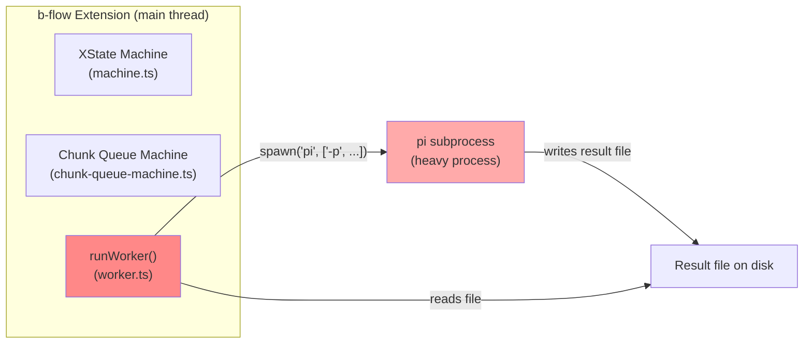
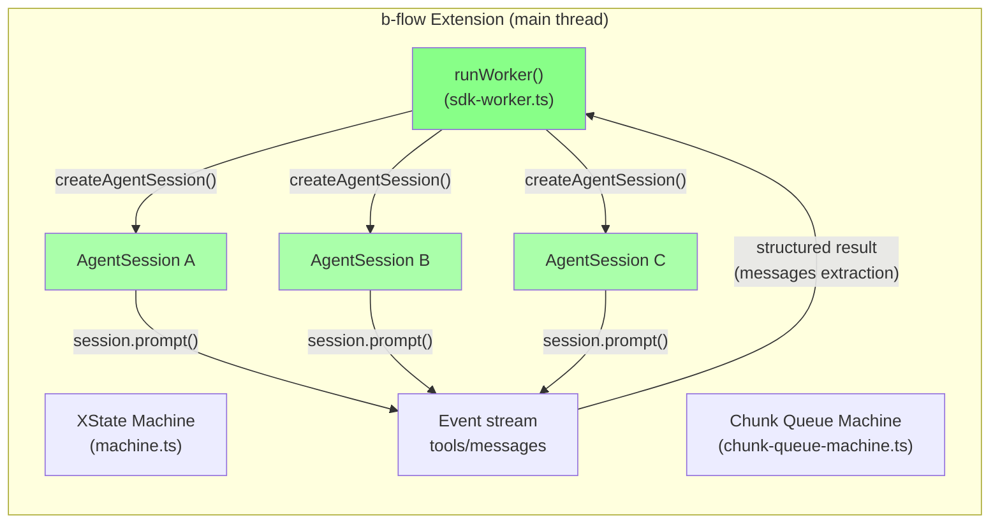
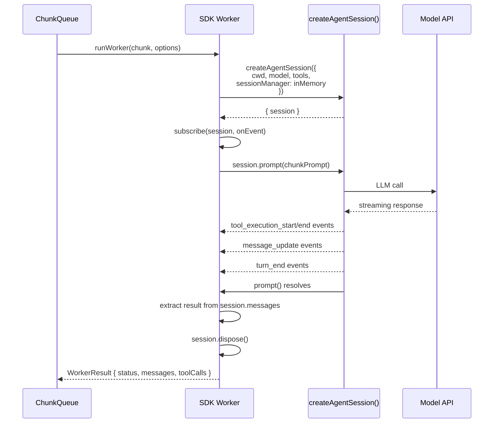

# Architecture Review: b-flow SDK-Driven Worker Redesign

## 1. Problem Statement

b-flow orchestration is wired but **never invoked in practice**. The root cause: the current worker model spawns `pi -p --no-session` as a subprocess for each chunk. This has five structural problems:

| Problem | Impact |
|---------|--------|
| Subprocess overhead (~2-5s startup per worker) | Makes sequential execution painful |
| CLI prompt file (`-p @promptFile`) | No programmatic control over context or tools |
| No streaming feedback to orchestrator | Blind during execution; only file-based result |
| SIGTERM-only abort | No graceful cancellation |
| One model for all workers | Can't optimize cost per chunk difficulty |

The proposal: replace `worker.ts` subprocess spawning with **in-process `createAgentSession()` calls** from the Pi SDK.

## 2. Architecture Overview

### Current Architecture (Subprocess)



### Proposed Architecture (SDK Sessions)



**Key differences:**
- Workers are **function calls**, not processes — near-zero startup overhead
- Each session is **fully isolated** (own messages, tools, model, event stream)
- Orchestrator receives **streaming events** in real-time
- `session.abort()` provides **graceful cancellation**
- Model selection is **per-chunk** based on difficulty

## 3. How It Works

### Worker Lifecycle



### Result Extraction (No More File Parsing)

Instead of writing a prompt file and reading a result file from disk:

```typescript
// After session.prompt() completes:
const assistantMessages = session.messages
  .filter(m => m.role === 'assistant');
  
const lastMessage = assistantMessages.at(-1);
const toolCalls = session.messages
  .filter(m => m.role === 'assistant' && m.toolCalls);

const result: WorkerResult = {
  type: "WORKER_COMPLETED",
  status: classifyResult(toolCalls),
  summary: extractSummary(lastMessage),
  changedFiles: extractChangedFiles(toolCalls),
  toolCallCount: toolCalls.length,
};

session.dispose();
```

## 4. Proposed File Changes

### New Files

| File | Purpose |
|------|---------|
| `extensions/b-flow/sdk-worker.ts` | New SDK-based worker implementation |
| `extensions/b-flow/__tests__/sdk-worker.test.ts` | Unit tests for SDK worker |

### Modified Files

| File | Changes | Risk |
|------|---------|------|
| `extensions/b-flow/worker.ts` | **Replace** entire `runWorker()` function body. Keep interface (WorkerOptions, WorkerResult) for backward compat. | Medium — core change |
| `extensions/b-flow/chunk-queue-machine.ts` | Update worker actor input/output types if WorkerResult shape changes. Minimal structural change. | Low |
| `extensions/b-flow/types.ts` | Add SDK-specific fields to WorkerResult (e.g., `sessionMessages`). Existing fields stay. | Low |
| `extensions/b-flow/index.ts` | No change needed — orchestrator interface unchanged. | None |
| `extensions/b-flow/machine.ts` | No change needed — state machine is independent of worker impl. | None |

### Potentially Deleted

| File | Condition |
|------|-----------|
| `extensions/b-flow/verify-result.ts` | May simplify if result is structured data instead of parsing markdown files |

## 5. Proposed Code: `sdk-worker.ts`

```typescript
import {
  createAgentSession,
  SessionManager,
  SettingsManager,
  getModel,
} from "@mariozechner/pi-coding-agent";
import type { ChunkQueueItem } from "./types.js";

export interface SDKWorkerOptions {
  projectRoot: string;
  subject: string | null;
  goal: string;
  timeoutMs?: number;
  model?: string;
  difficulty?: "easy" | "medium" | "hard";
}

// Map difficulty to array of model options (fallback chain)
const BUCK_MODEL_MAPPING: Record<string, string[]> = {
  easy:   ["anthropic/claude-haiku-4-20250414", "openai/gpt-4o-mini"],
  medium: ["anthropic/claude-sonnet-4-20250514", "openai/gpt-4o"],
  hard:   ["anthropic/claude-opus-4-20250514", "anthropic/claude-sonnet-4-20250514"],
} as const;

function selectModel(difficulty: "easy" | "medium" | "hard" | undefined, override?: string): Model | undefined {
  if (override) return getModel(override.split("/")[0], override.split("/")[1]);
  if (!difficulty) return undefined;
  const candidates = BUCK_MODEL_MAPPING[difficulty] ?? [];
  for (const id of candidates) {
    const m = getModel(id.split("/")[0], id.split("/")[1]);
    if (m) return m;  // first available wins
  }
  return undefined;  // fallback to default model
}

export interface SDKWorkerResult {
  type: "WORKER_COMPLETED" | "WORKER_FAILED";
  status?: string;
  error?: string;
  // New SDK-specific fields
  toolCalls?: Array<{ name: string; input: unknown }>;
  messageCount?: number;
  changedFiles?: string[];
}

export async function runSDKWorker(
  chunk: ChunkQueueItem,
  options: SDKWorkerOptions,
): Promise<SDKWorkerResult> {
  const { projectRoot, goal, timeoutMs = 600_000, difficulty } = options;

  // Select model by difficulty (array fallback chain)
  const model = selectModel(difficulty, options.model);

  const session = await createAgentSession({
    cwd: projectRoot,
    sessionManager: SessionManager.inMemory(projectRoot),
    settingsManager: SettingsManager.inMemory({
      compaction: { enabled: false },
      retry: { enabled: true, maxRetries: 2 },
    }),
    model,
    thinkingLevel: "off",
    tools: selectTools(chunk),
  });

  const toolCalls: Array<{ name: string; input: unknown }> = [];

  session.subscribe((event) => {
    if (event.type === "tool_execution_start") {
      toolCalls.push({ name: event.toolName, input: event.input });
    }
  });

  const prompt = buildChunkPrompt(chunk, goal);

  const timeout = new Promise<SDKWorkerResult>((_, reject) => {
    setTimeout(() => reject(new Error(`Worker timed out after ${timeoutMs}ms`)), timeoutMs);
  });

  try {
    await Promise.race([session.prompt(prompt), timeout]);

    const changedFiles = extractChangedFiles(toolCalls);
    const result: SDKWorkerResult = {
      type: "WORKER_COMPLETED",
      status: "completed",
      toolCalls,
      messageCount: session.messages.length,
      changedFiles,
    };
    
    return result;
  } catch (err) {
    await session.abort();
    return {
      type: "WORKER_FAILED",
      error: err instanceof Error ? err.message : String(err),
    };
  } finally {
    session.dispose();
  }
}

function selectTools(chunk: ChunkQueueItem): string[] {
  // Review chunks: read-only
  if (chunk.type === "iterate") {
    return ["read", "grep", "find", "ls"];
  }
  // Build chunks: full toolset
  return ["read", "bash", "edit", "write"];
}

function buildChunkPrompt(chunk: ChunkQueueItem, goal: string): string {
  return `# Buck Worker: Execute Chunk

## Goal
${goal}

## Chunk
- ID: ${chunk.id}
- Type: ${chunk.type}
- File: ${chunk.path}

Read the chunk file and execute the work. Report what you did and what files changed.`;
}

function extractChangedFiles(toolCalls: Array<{ name: string; input: unknown }>): string[] {
  return toolCalls
    .filter(t => t.name === "edit" || t.name === "write")
    .map(t => (t.input as any)?.path ?? "")
    .filter(Boolean);
}
```

## 6. Integration with XState

The XState state machine (`machine.ts`) and chunk queue machine need minimal changes. The worker invocation in `chunk-queue-machine.ts` swaps the actor source:

```typescript
// chunk-queue-machine.ts — change only the actor definition

// BEFORE:
actors: {
  runWorker: fromPromise(({ input }) =>
    runWorker(input.chunk, { projectRoot, subject, goal })),
}

// AFTER:
actors: {
  runWorker: fromPromise(({ input }) =>
    runSDKWorker(input.chunk, {
      projectRoot,
      subject,
      goal,
      difficulty: input.chunk.difficulty,
    })),
}
```

The **event flow is unchanged** — `WORKER_COMPLETED` and `WORKER_FAILED` events still fire, states still transition the same way. The XState machine doesn't care how work gets done.

## 7. Benefits

| Benefit | Before | After |
|---------|--------|-------|
| Worker startup | 2-5s (process spawn) | ~50ms (function call) |
| Context isolation | Separate process | Separate session object |
| Streaming feedback | None | Real-time events |
| Abort mechanism | SIGTERM | `session.abort()` |
| Per-chunk model | No (one CLI flag) | Yes (by difficulty) |
| Tool scoping | No | Yes (read-only for review) |
| Result parsing | File-based markdown | Structured data |
| Memory overhead | Process per worker | Session object per worker |

## 8. Risks & Mitigations

### Risk 1: Sequential Execution Bottleneck
**Decision**: Workers run sequentially (1 at a time). No concurrent `session.prompt()` calls.

**Mitigation**: This is intentional for Phase 1. Sequential execution avoids any shared-state race conditions. If throughput becomes a bottleneck, we can add a controlled concurrency pool later (e.g., `maxConcurrentWorkers: 2`).

### Risk 2: Session Cleanup Incompleteness
**Decision**: We assume `session.dispose()` releases all resources. This is the pattern shown in all SDK examples.

**Risk**: If `dispose()` does NOT fully clean up (e.g., lingering HTTP connections, open file handles, or retained memory), long-running b-flow sessions with many workers would accumulate leaked resources. This could manifest as:
- Growing memory usage over time
- "Too many open files" errors after many worker cycles
- Stale LLM connections causing auth/model errors

**Mitigation**:
1. Always call `session.dispose()` in `finally` block (guaranteed cleanup path)
2. Call `session.abort()` before `dispose()` on error/timeout to cancel in-flight requests
3. Monitor memory with a periodic health check in the orchestrator
4. If leaks appear, add explicit resource cleanup (close connections, clear caches) before dispose

This is the highest uncertainty risk — it depends on SDK internals we haven't verified.

### Risk 3: ResourceLoader Duplication
**Decision**: Each worker gets its own `DefaultResourceLoader` (via default `createAgentSession()`). No sharing.

**Mitigation**: This is safe but slightly redundant (each session discovers skills/extensions independently). Only optimize to a shared `ResourceLoader` if startup becomes a bottleneck. The redundancy is acceptable for correctness.

### Risk 4: Extension Inheritance Behavior
**Decision**: Workers inherit extensions from the parent session (default `DefaultResourceLoader` discovers the same extensions).

**Rationale**: Workers need the same custom tools and extension behavior as the parent. The use case for starting "clean" would be security sandboxing (preventing workers from accessing custom tools) — but b-flow workers are trusted, so inheritance is correct.

**Mitigation**: If a future need arises for clean workers, pass an explicit empty `resourceLoader` with `getExtensions: () => ({ extensions: [], ... })`.

### Risk 5: Breaking Backward Compatibility
**Risk**: Existing worker audit files and result files won't be generated.

**Mitigation**: Keep `WorkerResult` interface stable. Write audit records to the same location. Only add new fields; don't remove existing ones.

## 9. Migration Path

### Phase 1: Dual Implementation (Low Risk)
- Add `sdk-worker.ts` alongside existing `worker.ts`
- Add feature flag or toggle in `chunk-queue-machine.ts` to select worker impl
- Test both paths with existing unit tests

### Phase 2: SDK Default
- Switch default to SDK worker
- Keep subprocess worker as fallback for edge cases
- Run existing integration tests

### Phase 3: Remove Subprocess
- Remove `worker.ts` subprocess code
- Clean up file-based result handling
- Update tests

## 10. Resolved Decisions

| Question | Decision | Rationale |
|----------|----------|-----------|
| Concurrency | Sequential (1 at a time) | Avoids shared-state races; throughput can be added later |
| Session cleanup | Assume `dispose()` is sufficient | Matches SDK examples; risk monitored via health check |
| Extension inheritance | Inherit from parent | Workers need same tools; clean mode = security sandbox (not needed) |
| Auth reuse | Yes — shared `AuthStorage` | Workers use same credentials as parent |
| Model mapping | Array per difficulty tier | Fallback chain if primary model unavailable |

## 11. Recommended Implementation Order

1. **`sdk-worker.ts`** — standalone worker function, unit-testable
2. **`chunk-queue-machine.ts`** — swap worker actor source
3. **Integration test** — run existing b-flow test suite against SDK worker
4. **Feature flag** — toggle between subprocess and SDK
5. **Remove subprocess** — once SDK worker is proven
