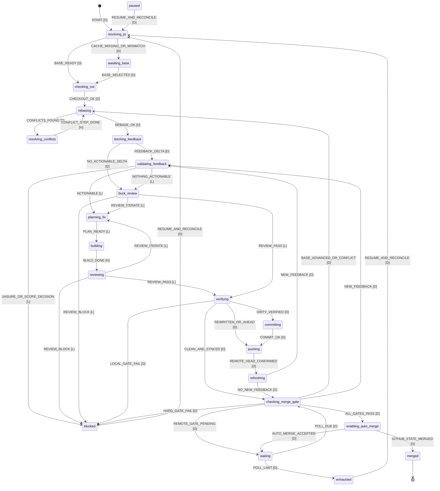

---
status: active
date: 2026-09-10
subject: 2026-09-10.b-pr-manager
topics:
  - omp-extension
  - pull-requests
  - review-feedback
  - state-machine
  - buck-workflow
research: []
iterations: []
spec: null
memory:
  - b-pr-manager-plan-2026-09-10.md
  - b-pr-manager-phase-1-2026-09-10.md
  - b-pr-manager-phase-2-2026-09-10.md

# Plan: Automated PR Feedback-to-Merge Manager

## User Goal

A developer can run one OMP command on an open pull request and have valid review feedback fixed, verified, rebased, pushed, and merged without babysitting.

## Status

Planning is complete when this document passes its acceptance review. Implementation remains active and must be decomposed with `/skill:b-phase` before `/skill:b-build` because the change spans command UX, GitHub integration, git safety, model orchestration, persistence, tests, and documentation.

## Inputs and Decisions

### Source context

- User-provided inline requirements are authoritative.
- Existing implementation inspected:
  - `extensions/b-pr-improved/index.ts`
  - `skills/b-pr/scripts/pr-preflight.ts`
  - `skills/fix-pr/SKILL.md`
  - `skills/fix-pr/scripts/fetch-feedback.sh`
  - `extensions/omp-models.ts`
  - `extensions/command-progress.ts`
  - deprecated `extensions/b-flow/` state-machine patterns
  - extension tests, `guardrails.json`, `README.md`, and workflow documentation
- No separate research or grill artifact was supplied.

### Capability probe

- `capability_state: full`
- `probe_source: system available-skills catalog`
- Available sentinels: `b-build`, `b-review`, `b-save`
- Missing sentinels: none

### User decisions

- Command surface: `/b-pr-manager`.
- Completion policy: enable GitHub auto-merge; never bypass repository protections.
- Review gate: exact-head Buck review pass, no actionable unresolved feedback, green required checks, and GitHub's branch-protection review decision. Do not invent an additional approval requirement.
- Poll defaults: eight total merge-gate observations, with the first observation performed immediately after a push or gate change and seven delayed polls at 30s, 60s, 120s, 240s, 480s, 600s, and 600s. This is 35m30s of delayed waiting. Backoff factor, cap, and poll count remain configurable.

### Planning decisions

- Build a narrow, explicitly invoked XState v5 machine. Do not revive the deprecated general-purpose `b-flow` runtime.
- Keep `/skill:fix-pr` as the portable/manual fallback. Reuse its feedback-validation contract; do not create a second conflicting taxonomy.
- Reuse the `.git/b-pr-base` cache established by `/b-pr-improved`.
- Persist manager run state under the worktree's git directory, not the working tree, so polling and recovery never dirty the PR.
- Model output never controls git, GitHub mutation, timing, persistence, state transitions, merge readiness, or success claims.
- Default merge-method resolution is: explicit flag, saved run configuration, existing auto-merge request, the repository's sole enabled method, otherwise one upfront selection persisted for the run. Never silently choose a history-rewriting policy when several methods are enabled.

## Scope

### In scope

- Register `/b-pr-manager [PR]` as an OMP extension command.
- Resolve an explicit PR number/URL or the current branch's open PR with `gh`.
- Read all paginated PR feedback: reviews, inline comments, conversation comments, and GraphQL review-thread resolution state.
- Validate feedback against current code and classify it with evidence.
- Run a bounded Buck plan/build/review/verify loop for actionable feedback.
- Reuse or request the cached base branch before any checkout/rebase mutation.
- Rebase onto the exact PR base, resolve conflicts through a bounded model-assisted loop, and continue the rebase deterministically.
- Commit and push only after local verification passes; use `--force-with-lease` only when rebase rewrote published commits.
- Poll GitHub with bounded exponential backoff for new feedback, check/review changes, base movement, auto-merge state, and final merge confirmation.
- Persist resumable state across cancellation, OMP restarts, and transient failures.
- Enable auto-merge only after all local and remote gates pass.
- Report completion only after GitHub reports `MERGED`.

### Out of scope

- Creating, retargeting, closing, or marking draft PRs ready.
- Posting replies, resolving reviewer threads, dismissing reviews, requesting reviewers, or using admin merge bypasses.
- Automatically converting large or out-of-scope feedback into GitHub issues.
- Fixing unrelated CI failures or expanding scope beyond validated review feedback without user input.
- Replacing `/b-pr-improved`, `/skill:fix-pr`, `/skill:b-build`, `/skill:b-review`, or `/skill:b-save`.
- General-purpose multi-workflow orchestration or restoration of the deprecated `b-flow` command surface.
- Browser automation; all GitHub interaction uses `gh` and the GitHub API.

## Command Contract

```text
/b-pr-manager [<number-or-url>]
  [--resume]
  [--base <branch>]
  [--merge-method <squash|rebase|merge>]
  [--initial-delay <duration>]
  [--backoff <number>]
  [--max-delay <duration>]
  [--max-polls <count>]
  [--model <pattern>]
```

- No PR argument: resolve the open PR for the current branch. Zero or multiple matches is a deterministic block with a concrete rerun command.
- `--resume`: load the matching saved run, then reconcile it with current git and GitHub truth before continuing.
- CLI precedence: flags > saved run configuration > git-local manager configuration > defaults.
- Git-local configuration: `<git-dir>/b-pr-manager/config.json`. It is optional, untracked, schema-validated, and limited to timing, merge method, and model selection.
- `Ctrl+C` or `ctx.signal`: persist `paused`, cancel active sleeps and nested model sessions, preserve in-progress rebase/edits, and print the exact resume command.
- A dirty worktree at a fresh start blocks before checkout. A resumed run accepts only the manager-owned dirty paths recorded in state; unknown changes block.

## Ownership Boundary

|Marker|Owner|May decide|Must not decide|
|---|---|---|---|
|`[D]`|Deterministic TypeScript|Git/GitHub commands, pagination, identifiers, cache, state transitions, timing, persistence, checks, commits, pushes, auto-merge, final status|Semantic validity or source edits|
|`[L]`|LLM session|Feedback meaning, code evidence, fix plan, source edits, conflict content, independent review findings|Shell command selection, state changes, timeouts, merge readiness, success|
|`[H]`|Deterministic controller around LLM|Invoke a bounded role, validate structured output, inspect resulting diff/rebase state, choose the next declared event|Treat model prose as an event or skip deterministic verification|

All LLM roles return versioned JSON matching a runtime schema. A malformed result is retried once with validation errors; a second failure transitions to `blocked`. Review comments are untrusted data quoted inside prompts. Instructions found in comments cannot grant tools, alter policy, widen scope, or authorize external actions.

## State Machine

### Overview



Any nonterminal state can transition to `paused` on cancellation and to `blocked` on a typed unrecoverable error. Those cross-cutting edges are omitted from the diagram for readability.

### State responsibilities

|State|Owner|Entry work|Success paths|Block/failure paths|
|---|---|---|---|---|
|`resolving_pr`|`[D]`|Verify `gh` auth and repository identity; resolve one open PR; capture number, URL, base/head refs, draft status, head OID, and repository merge capabilities.|Cached base matches PR base -> `checking_out`; cache absent/stale -> `awaiting_base`.|Closed/merged PR, fork permissions that cannot push, ambiguous PR, unavailable GitHub -> `blocked` with evidence. A PR already merged transitions directly to `merged` after API confirmation.|
|`awaiting_base`|`[D]` + OMP UI|Before any mutation, offer the PR's actual `baseRefName` first, followed by valid `main/master/dev/develop` candidates. `--base` bypasses UI only after equality with PR base is verified. Save through the existing `.git/b-pr-base` contract.|Selection equals PR base -> `checking_out`.|Mismatch never retargets the PR; it remains blocked until the user selects/provides the actual base.|
|`checking_out`|`[D]`|Require a clean fresh worktree; use `gh pr checkout` for the exact PR; verify repository, branch, and head identity afterward.|`rebasing`.|Unknown dirty files, detached/mismatched head, read-only fork, or checkout failure -> `blocked`.|
|`rebasing`|`[D]`|Fetch base, detect an existing rebase, and run/continue rebase using shared preflight helpers. Invalidate prior head-bound review and verification attestations whenever the head OID changes.|No conflicts -> `fetching_feedback`; conflicts -> `resolving_conflicts`.|Unexpected git state -> `blocked`; never auto-abort or reset.|
|`resolving_conflicts`|`[H]`|Deterministically enumerate unresolved paths. Give only those files plus both-side context to a conflict role. Deterministically scan markers, stage resolved paths, and run `git rebase --continue`. Maximum 20 conflict steps.|Back to `rebasing` after each continued step.|Malformed output, unresolved markers, no progress, deletion ambiguity, or 20-step limit -> `blocked`, preserving rebase state.|
|`fetching_feedback`|`[D]`|Paginate REST reviews/comments and GraphQL review threads. Normalize stable IDs, node IDs, authors, URLs, timestamps, resolution/outdated state, path/line, and original commit. Compute a version fingerprint and deterministic delta.|Unprocessed versions -> `validating_feedback`; none -> `buck_review`.|API/schema failure -> retry bounded transient errors, then `blocked`.|
|`validating_feedback`|`[L]`|Inspect current code and call sites. Classify each item as `valid`, `invalid`, `already_done`, `unsure`, `nit`, or `out_of_scope`; group semantic duplicates; cite file/line evidence. Valid local nits are actionable. Resolved, outdated, duplicate, invalid, and already-done versions are nonactionable.|Actionable -> `planning_fix`; none -> `buck_review`.|Any `unsure`, large valid scope expansion, or unresolved ownership/product decision -> `blocked` after finishing independent reachable classifications.|
|`planning_fix`|`[L]`|Write/update the round's Buck iteration artifact with feedback IDs, evidence, bounded changes, acceptance criteria, and verification commands. No implementation occurs here.|`building` after schema and artifact validation.|Missing traceability or expanded scope -> one retry, then `blocked`.|
|`building`|`[H]`|Run a nested build role with the iteration artifact and bounded code tools. Record expected paths before execution; inspect actual diff after execution.|`reviewing` when the role exits and a coherent diff exists.|No progress, unrelated edits, placeholders, destructive operations, or role failure -> `blocked`. Preserve edits.|
|`reviewing` / `buck_review`|`[H]`|Use a separate read-only review role. `reviewing` checks a fix round; `buck_review` performs the required holistic "nothing else needs work" pass even when no comment is actionable. Bind verdict to exact head OID plus worktree diff digest.|`pass` -> `verifying`; in-scope finding -> `planning_fix`.|Out-of-scope finding, uncertainty, or structural blocker -> `blocked`.|
|`verifying`|`[D]`|Resolve and run the target repository's deterministic check contract plus plan-specific checks. Reject any changed head/diff after review by returning to review. Record commands, exit codes, and exact head/diff digest.|Dirty verified diff -> `committing`; clean rewritten/ahead head -> `pushing`; clean synchronized head -> `checking_merge_gate`.|Any required local gate failure -> `blocked`; never weaken checks or push partial work.|
|`committing`|`[H]`|Use extracted deterministic commit plumbing. The model may draft Conventional Commit text; deterministic code validates sentinels, stages only manager-owned paths, commits once, and records SHA.|`pushing`.|Unexpected staged files, empty/placeholder message, commit-hook failure -> `blocked`.|
|`pushing`|`[D]`|Standard push when fast-forwardable. After a verified rebase only, use `--force-with-lease`; never `--force`. Read remote head OID afterward.|Exact remote OID match -> `refreshing`.|Lease rejection or remote mismatch -> `blocked`/reconcile; never retry with weaker safety.|
|`refreshing`|`[D]`|Immediately refetch feedback and merge state after push to close the comment-arrival race.|New feedback -> `validating_feedback`; otherwise `checking_merge_gate`; merged -> `merged`.|Transient failure follows bounded retry policy, then `blocked`.|
|`checking_merge_gate`|`[D]` with exact-head Buck attestation|Reconcile PR state, remote head, base ancestry, feedback fingerprints/verdicts, Buck review digest, required checks, `reviewDecision`, mergeability, and draft status.|All gates -> `enabling_auto_merge`; pending remote state -> `waiting`; new feedback -> `validating_feedback`; moved base/conflict -> `rebasing`.|Draft PR, hard check failure, changes-requested that policy cannot currently satisfy, missing push permission, or merge conflict that cannot rebase -> `blocked`.|
|`enabling_auto_merge`|`[D]`|Resolve an allowed merge method, call `gh pr merge --auto`, then reread PR state. Never pass `--admin`.|Merged -> `merged`; request accepted but pending -> `waiting`.|Unsupported method, disabled auto-merge, policy/API rejection -> `blocked`.|
|`waiting`|`[D]`|Abort-aware timer. Poll immediately on entry/state progress; otherwise apply bounded backoff. Reset poll index on a new feedback version, head/base OID, check conclusion, review decision, successful push, or auto-merge status change.|`checking_merge_gate` when due.|No progress after configured total observations -> `exhausted`.|
|`blocked`|`[D]` terminal/resumable|Persist typed reason, evidence, manager-owned changes, and exact resume command.|Explicit resume -> reconcile at `resolving_pr`.|No automatic scope expansion or destructive cleanup.|
|`exhausted`|`[D]` terminal/resumable|Persist the last remote snapshot and explain that the PR is not merged.|Explicit resume resets only the polling budget, then reconciles.|Never report success.|
|`paused`|`[D]` terminal/resumable|Cancel sleep/model actor, persist state, preserve worktree and rebase.|Explicit resume -> reconcile.|Never abort rebase/reset edits automatically.|
|`merged`|`[D]` terminal|Require GitHub `state=MERGED`; record URL, merge commit OID, method, and timestamp; release lock.|Terminal success.|Auto-merge enabled or checks green alone is not success.|

### Primary paths

1. **No actionable feedback:** resolve -> base -> checkout -> rebase -> fetch -> validate/no delta -> Buck review -> local verification -> merge gate -> auto-merge -> confirm merged.
2. **Valid feedback:** resolve -> rebase -> fetch -> validate -> plan -> build -> review/iterate -> verify -> commit -> push -> immediate refresh -> merge gate.
3. **Conflict during initial or late rebase:** rebase -> conflict actor loop -> continue rebase -> invalidate exact-head attestations -> refetch -> review -> verify -> push.
4. **New review after push:** immediate refresh or waiting poll -> version delta -> validate -> next bounded fix round. Previously processed comment IDs are reconsidered only when their version fingerprint changes.
5. **Pending GitHub review/check:** merge gate -> waiting/backoff -> merge gate. Progress resets decay; absence of progress consumes the bounded polling budget.
6. **Cancellation/failure:** any state -> paused/blocked with atomic snapshot -> `/b-pr-manager <PR> --resume` -> reconcile remote/local truth -> safest valid state.

## Deterministic Merge Gate

All conditions must hold for the same observed head OID:

1. GitHub still reports the PR open, non-draft, and targeting the cached base.
2. Local head, remote PR head, and recorded verified head match.
3. PR head contains the latest fetched base head; otherwise return to rebase.
4. Every fetched feedback version has a stored verdict; no current verdict is `valid`, actionable `nit`, or `unsure` without a completed fix/review cycle.
5. The latest Buck review is `pass` for the exact head OID and clean diff digest.
6. The deterministic local check contract passed for the same head/diff.
7. All required GitHub checks are terminal-success according to GitHub semantics; pending returns to waiting, hard failure blocks.
8. GitHub's `reviewDecision` satisfies the repository's branch-protection rules. No extra approval is invented when none is required.
9. GitHub reports the PR mergeable, or auto-merge explicitly accepts the request without policy bypass.

A state change between gate read and mutation invalidates the gate and forces reconciliation.

## Persistence and Recovery

### Files

- Runtime state: `<git-dir>/b-pr-manager/pr-<number>.json`
- Mutual-exclusion lock: `<git-dir>/b-pr-manager/pr-<number>.lock`
- Optional git-local config: `<git-dir>/b-pr-manager/config.json`
- Buck round artifacts: `.context/<date>.pr-<number>-feedback/iterate-pr-<number>-round-<n>.md` and review artifacts following existing Buck conventions.

### State schema

Persist a versioned `RunState` containing:

- repository owner/name, PR number/URL, head/base refs, worktree identity;
- current machine state and last deterministic event;
- cached base and cache provenance;
- observed local, remote-head, base-head, merge-commit OIDs;
- whether a rebase rewrote published commits;
- polling options, poll index, no-progress count, next poll time;
- normalized feedback versions, fingerprints, verdicts, evidence, and round association;
- active iteration/review artifact paths;
- expected/owned dirty paths and diff digest;
- latest build/review/verification head and verdicts;
- created commit SHAs and verified push OID;
- required-check and review-decision snapshot;
- auto-merge request status and selected method;
- typed block/pause/exhaustion reason;
- bounded transition history and timestamps.

Write a temporary file, flush/close it, then rename atomically after every successful transition and immediately before sleep or external mutation. Acquire a per-PR lock before reconciliation; stale locks require PID/session validation, not blind deletion.

On resume, treat persisted data as a checkpoint rather than truth. Re-read git state and GitHub state, compare identities and OIDs, detect active rebase, identify unknown dirty paths, invalidate stale exact-head attestations, then emit the safest legal event. Never replay a commit, push, or auto-merge call solely because the snapshot says it was pending; first inspect the actual outcome.

## Affected Files

### New extension modules

- `extensions/b-pr-manager/types.ts` — versioned state, event, feedback, config, verdict, and role schemas.
- `extensions/b-pr-manager/machine.ts` — pure XState machine and guards; no shell/model calls.
- `extensions/b-pr-manager/persistence.ts` — gitdir paths, atomic checkpoints, lock lifecycle, migrations.
- `extensions/b-pr-manager/github.ts` — `gh` transport, pagination, GraphQL thread normalization, checks/review/merge snapshots.
- `extensions/b-pr-manager/git.ts` — manager-specific worktree ownership and reconciliation around shared PR git helpers.
- `extensions/b-pr-manager/model.ts` — schema-bound validator/planner/builder/reviewer/conflict actors.
- `extensions/b-pr-manager/buck-loop.ts` — iteration artifact lifecycle and exact-head review/verification attestations.
- `extensions/b-pr-manager/index.ts` — command parsing, actor runner, progress rendering, cancellation, and resume UX.

### Shared code changes

- `extensions/pr-git.ts` — extract base-cache access, rebase/resume/conflict, push, and remote-OID primitives currently embedded in `/b-pr-improved`.
- `extensions/b-pr-improved/index.ts` — migrate every caller to shared PR git primitives without changing command behavior.
- `skills/b-pr/scripts/pr-preflight.ts` — expose machine-readable cache/base/rebase results, recognize active rebase as resumable state, and retain its CLI contract.
- `extensions/omp-models.ts` — accept `AbortSignal`, add schema-validated structured sessions, and guarantee child-session disposal.
- `extensions/index.ts` — register `/b-pr-manager` and dispose active actors on session shutdown.
- `skills/fix-pr/SKILL.md` — document the shared validation taxonomy and point OMP users needing autonomous convergence to `/b-pr-manager`; preserve portable fallback behavior.

### Tests

- `extensions/b-pr-manager/__tests__/machine.test.ts`
- `extensions/b-pr-manager/__tests__/persistence.test.ts`
- `extensions/b-pr-manager/__tests__/github.test.ts`
- `extensions/b-pr-manager/__tests__/model.test.ts`
- `extensions/b-pr-manager/__tests__/wire.test.ts`
- `extensions/b-pr-manager/__tests__/integration.test.ts`
- Existing `/b-pr-improved` and preflight tests updated for shared helpers and unchanged behavior.

### Living documentation

- `README.md` — command purpose, safe default behavior, resume invocation, and explicit non-goals.
- `docs/buck-workflow.md` — narrow orchestration boundary and relation to the deprecated general `b-flow` runtime.
- `docs/extension-loading.md` — command registration/runtime lifecycle if required by current documentation structure.
- `docs/adr/<next>-narrow-pr-manager-orchestration.md` — record why a dedicated invoked state machine is justified while general workflow orchestration remains deprecated.

## Implementation Steps

1. **Freeze contracts and fixtures.** Define CLI options, state/event unions, feedback/verdict schemas, role result schemas, merge-gate snapshot, persistence version, and representative `gh` payload fixtures. Keep every transition and guard pure and exhaustively typed.
2. **Extract shared PR git primitives.** Move cache reads/writes, base discovery, rebase detection/continuation, conflict enumeration, safe push selection, and remote OID verification out of `/b-pr-improved`. Migrate all existing callers in the same change; preserve `.git/b-pr-base` and current command output/exit semantics.
3. **Build deterministic GitHub inventory.** Implement paginated REST/GraphQL queries, normalization, stable version fingerprints, required-check reduction, review-decision capture, repository merge capabilities, auto-merge request, and final merged-state confirmation. Separate read snapshots from mutations so every mutation can be preceded by reconciliation.
4. **Add atomic persistence and resume.** Resolve the worktree gitdir, lock one PR/run, checkpoint transitions atomically, migrate known schema versions, and reconcile saved state with active rebase, worktree dirt, branch/OIDs, and GitHub state. Make cancellation abort-aware through command runner, sleeps, `gh`, and nested sessions.
5. **Implement schema-bound model actors.** Add validator, planner, builder, reviewer, and conflict roles with minimum tools. Validate JSON at runtime, retry malformed results once, bind review results to exact head/diff, and enforce prompt-injection boundaries for comment content.
6. **Implement Buck fix rounds.** Materialize one traceable iteration artifact per feedback round, run build then independent review, return in-scope review findings to planning, and route uncertainty/large scope to `blocked`. Resolve and run the target repository's guardrails contract before any commit/push.
7. **Wire the XState runner and command UX.** Connect invoked actors to deterministic events, register `/b-pr-manager`, render progress through `CommandProgress`, ask for missing/mismatched base before mutation, resolve merge method safely, implement poll decay/reset/exhaustion, and emit exact resume instructions.
8. **Prove safety and convergence.** Add pure transition tests, mocked GitHub pagination/gate tests, temporary-git integration tests, malformed-model tests, command wiring tests, and end-to-end fake-`gh` scenarios for every primary path. Keep machine/service functions below the repository complexity threshold rather than adding another hotspot.
9. **Document the deliberate boundary.** Update user/workflow docs and add the ADR distinguishing this narrow, user-invoked PR lifecycle from deprecated general orchestration. Explain state location, cancellation, backoff timing, merge-method/base prompts, blockers, and the requirement that only GitHub `MERGED` is success.
10. **Run project verification and smoke the command.** Run the authoritative guardrails contract, then execute the actual extension command in a temporary repository with a fake GitHub transport and deterministic role fixtures. Exercise fix/push/new-comment/review/check/auto-merge/resume paths without mutating a real PR.

## Acceptance Criteria

- `/b-pr-manager` resolves exactly one open PR from a number, URL, or current branch and reports the exact target before mutation.
- Missing/stale `.git/b-pr-base` causes an upfront base selection; cached base is reused only when it equals the PR's actual base.
- The manager checks out and rebases the PR, resumes an already-active rebase, and never auto-aborts or resets conflict work.
- Conflict resolution is model-assisted but deterministically bounded, marker-checked, staged, and continued.
- All review, inline, conversation, and review-thread feedback is paginated and versioned; resolved/outdated/duplicate state is represented explicitly.
- Every actionable verdict cites current-code evidence. `unsure` and large/out-of-scope valid feedback block rather than being guessed away.
- Each fix round follows plan -> build -> independent review -> deterministic verification. A passing comment-specific review is not a substitute for the final holistic Buck review.
- No commit or push occurs before exact-head/diff review and local checks pass.
- A rewritten published branch uses only `--force-with-lease`; a normal branch uses a normal push; `--force` cannot be produced by the implementation.
- Feedback is refreshed immediately after each push and during bounded polling; changed comment versions re-enter validation.
- Default polling performs one immediate gate observation plus seven delayed observations totaling 35m30s, with decay reset only on real progress.
- Poll exhaustion, cancellation, model/schema failure, dirty-worktree ambiguity, check failure, and policy failure persist a resumable non-success state.
- Auto-merge is requested only when the deterministic merge gate passes and never uses admin bypass.
- The command does not claim completion until a fresh GitHub read returns `state=MERGED` and records the merge commit OID.
- Restarting with `--resume` neither duplicates commits/pushes/merge requests nor trusts stale checkpoints over git/GitHub truth.
- `/b-pr-improved` retains its existing external behavior after shared-helper extraction.
- Added code satisfies the repository's lint, test, coverage, patch-coverage, and complexity guardrails without overrides or relaxed thresholds.

## Verification Contract

### Pure state-machine tests

- Assert every declared event has a legal source state and every state has explicit success/block/cancel handling.
- Cover no-feedback, valid-feedback, review-iterate, conflict, base-advanced, new-feedback-after-push, pending-check, hard-check-fail, auto-merge, merged, exhausted, paused, and resume/reconcile paths.
- Prove polling intervals, total delayed wait, progress reset, and max-observation behavior with a fake clock.
- Prove exact-head changes invalidate review and verification attestations.

### GitHub adapter tests

- Paginated fixtures for all feedback sources, resolved threads, outdated inline comments, edited comments, duplicate semantics, review decision changes, required-check rollups, mergeability, auto-merge enabled, and final merged state.
- Verify mutation calls are idempotent and never include `--admin`.
- Verify a new comment arriving between push and gate is detected by the immediate refresh.

### Git integration tests

- Temporary repositories for cache hit/miss/mismatch, dirty start, checkout identity, clean rebase, multi-step conflict, active-rebase resume, moved base, normal push, lease-protected force push, lease rejection, and remote OID confirmation.
- Assert no git mutation occurs before missing-base selection.
- Assert no `--force` path exists and unknown dirty files always block.

### Model boundary tests

- Runtime-schema acceptance/rejection, one malformed-output retry, second-failure block, cancellation/disposal, tool allowlists, exact-head review binding, and prompt-injection text treated as inert comment data.
- Build-role fixtures that edit expected files, edit unrelated files, make no progress, or leave placeholders.

### Functional command scenarios

- Valid feedback -> fix -> review -> verify -> commit -> push -> new comment -> second round -> green gates -> auto-merge -> confirmed merged.
- No actionable comments -> holistic Buck review -> checks/gates -> confirmed merged.
- Invalid/already-done comments -> no source edit, but still holistic review and verification.
- Conflict -> bounded resolution -> continued rebase -> re-review/reverify -> safe push.
- Check failure, draft PR, required changes-requested, disabled auto-merge, poll exhaustion, cancellation, and restart.

### Repository gates and smoke proof

1. Run `/b-guardrails-check` because `guardrails.json` is authoritative in this repository.
2. Require lint, Vitest/Bun tests, coverage, patch coverage, and complexity to pass under the existing thresholds.
3. Run the registered extension command in a temporary repo against fake `gh` and deterministic role fixtures; inspect its live progress, persisted checkpoint, git history, remote head, and terminal merged record.
4. Do not use a real PR merge as an automated test. A live GitHub canary requires separate explicit authorization at the point of merge.

## Risks and Mitigations

|Risk|Consequence|Mitigation|
|---|---|---|
|A stale checkpoint replays a side effect|Duplicate commit/push/merge request|Reconcile actual git/GitHub outcome before every resumed mutation; persist idempotency keys/OIDs.|
|Review comments contain prompt injection|Model widens authority or runs attacker-requested actions|Treat comments as quoted data, restrict tools by role, validate schemas, keep all side effects deterministic.|
|Base moves while waiting|Previously reviewed head is stale|Observe base OID at every gate; rebase and invalidate exact-head attestations.|
|Reviewer edits an existing comment|ID-only dedupe misses new feedback|Fingerprint stable ID plus updated timestamp/content digest and reprocess changed versions.|
|The model says "done" without proof|Unsafe push/merge|Exact-head independent review, deterministic local checks, remote gates, and GitHub merged-state confirmation.|
|Polling runs forever or hammers GitHub|Unbounded cost/rate-limit pressure|Immediate observation plus bounded exponential decay, progress-sensitive reset, transient-error handling, and resumable exhaustion.|
|Rebase rewrites published history|Lost collaborator commits|Verify expected remote OID and use `--force-with-lease` only; block on lease failure.|
|Run state dirties the PR|Self-generated changes contaminate fixes|Keep runtime/config under gitdir; only intentional Buck artifacts enter the working tree.|
|General orchestration returns through a side door|Maintenance repeats deprecated `b-flow` failure|Narrow command, explicit state graph, no generic workflow DSL, documented ADR, no automatic activation.|
|State machine becomes a complexity hotspot|Guardrail failure and hard-to-review behavior|Pure machine/guards, small actor modules, schema reducers, and explicit complexity checks from the first phase.|

## Handoff

Run `/skill:b-phase .context/2026-09-10.b-pr-manager/plan-b-pr-manager.md` before implementation. The phase split should preserve vertical, testable slices and keep the deterministic/LLM ownership boundary intact.