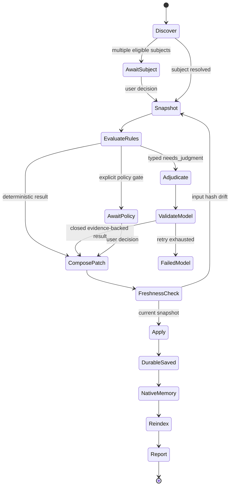

# Research: decomposing `/b-save` into a state machine

## Scope

Analyze the twelve responsibilities in `skills/b-save/SKILL.md` and `prompts/b-save.md`. Identify deterministic mechanics, irreducible semantic judgment, user-decision gates, state-machine boundaries, and open architecture questions.

This is research and architecture planning only. It defines the chosen boundaries but does not authorize implementation.

## Sources

Primary contract:
- `skills/b-save/SKILL.md`
- `prompts/b-save.md`
- Global `AGENTS.md` context-workflow and quality-gate rules

Existing deterministic prior art:
- `skills/b-save-improved/SKILL.md`
- `skills/b-save-improved/scripts/save-preflight.ts`
- `skills/b-save-improved/scripts/save-apply.ts`
- `extensions/b-save-improved/index.ts`
- `.context/2026-08-26.deterministic-bsave/plan-bsave-improved-parity.md`
- `.context/2026-08-26.deterministic-bsave/review-bsave-improved-parity.md`
- `.context/memory/deterministic-bsave-2026-08-26.md`
- `.context/memory/deterministic-bsave-2026-08-27.md`

Official OMP SDK/runtime sources:
- `.context/2026-09-10.b-save-state-machine-analysis/research/sources-omp-sdk.md`
- <https://omp.sh/docs/sdk>
- <https://omp.sh/docs/memory>
- <https://omp.sh/docs/extension-authoring>
- `can1357/oh-my-pi` commit `3b3a6dc9bbd85102ce19d0b1c11bf6870915f6ec`

## Executive finding

The twelve numbered responsibilities are not twelve indivisible states. Each mixes one or more of four concerns:

1. **Observation** — enumerate files, parse frontmatter, read runtime and git facts.
2. **Judgment** — explain what happened, infer relationships, decide whether acceptance criteria are truly met.
3. **Mutation** — render and update files idempotently under `.context/`.
4. **External effect** — call harness memory or a non-OMP indexer.

The safe boundary is therefore not “deterministic step versus LLM step.” It is:

> deterministic observation → bounded LLM/user proposals → deterministic validation → deterministic apply → isolated best-effort effects

No LLM should directly mutate workflow files. It should return typed proposals against a preflight snapshot. Deterministic code should reject unknown paths, invalid states, stale evidence, malformed fields, and unsafe transitions before applying anything.

Current `/b-save-improved` already approximates this split with preflight, scribe, auditor, and apply. It is useful prior art, but the architecture Q&A should reassess its boundaries rather than adopting them unchanged.

## Classification legend

- **D** — deterministic from structured state and explicit rules.
- **L** — LLM judgment over natural-language session or artifact content.
- **U** — user decision where policy forbids silent inference.
- **E** — external/best-effort effect with harness-specific failure behavior.
- **Hybrid** — deterministic shell around an LLM or user decision.

## Responsibility matrix

| # | Responsibility | Final boundary | LLM/user branch |
|---|---|---|---|
| 1 | Read session state | Deterministic observation; `current-session.json` is advisory | None |
| 2 | Subject folder | Deterministic precedence, validation, creation, and provenance-based moves | User chooses among multiple eligible subjects; uncertain ownership does not mutate |
| 3 | Memory creation | Deterministic path/schema/evidence/merge/render around a typed semantic draft | Scribe authors narrative, tags, priority, summary, and durable facts |
| 4 | Cross-reference stitching | Deterministic from explicit frontmatter and provenance only | Missing relationships remain unchanged; no inferred LLM authority |
| 5 | Backlog update | Deterministic parse/validate/archive/create mechanics | Scribe extracts cited semantics; inferred completion/new work requires user approval |
| 6 | Spec status | Deterministic fast path for consistent checked criteria with resolved evidence | Binary evidence auditor handles every non-mechanical case |
| 7 | Memory index | Deterministic canonical upsert keyed by memory filename | Summary reuses the Step 3 draft |
| 8 | Native OMP memory | Direct `ctx.memory.status()/save()` for local/Mnemopi; result validation and effect recording are deterministic | Hindsight uses a restricted OMP SDK agent; observed successful `retain` execution is required |
| 9 | Non-OMP re-index | External effect outcome is recorded deterministically | Configured-skill agent interprets and runs the index protocol |
| 10 | Phase consolidation | Deterministic fast path plus deterministic projection repair/apply | Binary evidence auditor handles drift, conflicts, and non-mechanical criteria |
| 11 | Iterate consolidation | Deterministic scope from explicit provenance and deterministic apply | Binary evidence auditor handles non-mechanical/conflicting acceptance evidence |
| 12 | User-goal check | Exact syntax fast path and warning transition are deterministic | Typed goal classifier handles semantic near-matches |

## Step-by-step analysis

### 1. Read Session State

**Contract:** Read `.context/workflow/current-session.json`; skip dependent work if missing.

**Inputs**
- `.context/workflow/current-session.json`
- Invocation arguments
- Runtime session transcript/digest
- Current date, branch, and changed-path facts

**Deterministic work**
- File existence and JSON/schema validation.
- Extract known fields.
- Detect stale evidence: saved/completed session, subject mismatch, missing referenced paths, start date outside the current run, or current branch mismatch if branch is recorded.
- Emit facts and warnings; never silently treat the file as authoritative.

**LLM work**
- None for parsing.
- Optional only when converting free-form transcript activity into a semantic session summary for step 3.

**Key evidence**
- The repository's current file points to a completed 2026-09-04 session while this analysis is a later session.
- `b-save-improved` explicitly reports `current-session.json` only as a human hint and does not use it for subject selection.

**Candidate state output:** `session_evidence`, with `present`, `valid`, `stale_reasons`, and structured fields.

### 2. Subject Folder

**Contract:** Create a subject folder if missing and consolidate loose artifacts.

**Deterministic work**
- Resolve an explicit `--subject` after containment and slug validation.
- Enumerate subject candidates by authoritative status.
- Auto-select exactly one eligible candidate under a declared selection policy.
- Suggest a dated branch-derived subject name.
- Create the selected folder during apply.
- Move only preflight-enumerated, allowlisted session-shaped files; reject symlink/path escapes.

**LLM or user work**
- Multiple plausible subjects require a user choice.
- Loose files without machine-readable provenance cannot safely be assigned by filename alone. Either leave them staged, ask the user, or accept an LLM proposal with evidence.

**Prior-art risks**
- Lexically newest folder is not authoritative.
- Recursive containment must canonicalize the nearest existing ancestor.
- Infrastructure files such as legacy `backlog.md` must not be swept up as loose session artifacts.

**Candidate state output:** `subject_selected` or `awaiting_subject_choice`; `artifact_move_proposals` remain separate from selection.

### 3. Memory Creation

**Contract:** Create or update a session memory file with required frontmatter.

**Deterministic work**
- Derive the target path from selected subject, date, and canonical slug rules.
- Populate invariant fields: date, subject, related/artifact links from the snapshot, and schema-valid status values.
- Validate `domains`, `topics`, `priority`, `status`, and paths.
- Merge with an existing memory file without duplicating headings or list entries.
- Render markdown and frontmatter consistently.

**LLM work**
- Write the session goal, what happened, decisions and rationale, what shipped, verification, risks, leftovers, and related context.
- Propose semantic `domains`, `topics`, priority, and reusable retain facts.
- Distinguish observed facts from inferences.

**Boundary**
- The LLM returns a typed `memory_draft`; it does not choose the final path or write the file.
- Verification claims must be traceable to observed command/tool evidence. The validator should reject unsupported claims rather than merely polishing them.

**Candidate state output:** `memory_draft_proposed`, then `memory_draft_validated`.

### 4. Cross-Reference Stitching

**Contract:** Back-fill `memory:` arrays in plan/spec files.

**Deterministic work**
- Select plans/specs from the resolved subject snapshot.
- Compute relative references.
- Union into existing arrays idempotently while preserving supported frontmatter style.
- For an explicit plan `spec:` link, maintain the bidirectional plan/spec relationship.
- Refuse unknown or escaping paths.

**LLM work**
- None when relationships are explicit or subject membership is the accepted policy.
- If unrelated artifacts may coexist in one subject, relationship selection becomes a separate proposal; that policy must be decided in Q&A.

**Candidate state output:** `crossref_patch_set`.

### 5. Backlog Update

**Contract:** Archive explicitly completed items, stage inferred completions, and add new/deferred work.

**Deterministic work**
- Parse `todo.md` with the documented legacy fallback.
- Load item records and validate required frontmatter.
- For approved completions: remove the todo link, set completion fields, move to the monthly archive, and append the completed summary exactly once.
- For approved new items: validate slug/title/priority/related paths, write the item, and add the linked checkbox exactly once.

**LLM work**
- Extract candidate completions and new/deferred work from the session.
- Cite the user/session statement that makes a completion explicit.
- Phrase backlog titles and useful detail without inventing scope.

**User gate**
- Inferred completion is not enough to archive by default. Stage it for explicit approval or leave it unchanged.
- Existing `--archive-inferred` is a policy override, not proof.

**Candidate state output:** `backlog_delta_proposed`, split into `complete_explicit`, `complete_inferred`, and `new_items`; then `backlog_delta_validated`.

### 6. Spec Status Updates

**Contract:** Mark finished specs completed.

**Deterministic work**
- Enumerate specs, parse status and acceptance structure, and reject illegal transitions.
- Auto-complete only under a declared mechanical rule, such as every canonical requirement/criterion carrying an accepted completion marker and no blocking state.
- Apply `status: completed` without moving files.

**LLM work**
- When criteria require evidence from implementation, tests, reviews, or prose, audit whether they are actually satisfied.
- Return `complete | incomplete | uncertain` with file/line or runtime evidence.

**Safe default**
- Only `complete` mutates. `incomplete` and `uncertain` leave the spec untouched and appear in the report.

**Candidate state output:** `artifact_verdicts.specs`.

### 7. Index Update

**Contract:** Add the memory entry at the top of `.context/memory/index.md`.

**Deterministic work**
- Build the canonical entry from date, memory filename, status, domains/topics, and the validated summary.
- Detect the memory filename anywhere in an existing entry, not only on line one.
- Update or preserve according to an explicit rerun policy; never duplicate.
- Preserve unrelated index content.

**LLM work**
- The short semantic summary can come from the step-3 draft. No separate model call is needed.

**Candidate state output:** `memory_index_patch`.

### 8. Native Agent Memory

**Contract:** After durable apply, mirror validated facts into OMP's configured memory backend. Never use raw Hindsight HTTP or routine bulk import.

**Verified OMP-first API**
- Extensions receive optional `ctx.memory: MemoryRuntimeContext` from `@oh-my-pi/pi-coding-agent`.
- `ctx.memory.status()` reports the configured backend; `ctx.memory.save()` accepts bounded fact content/context/source/importance and returns backend/stored/ids/queued/message.
- Local and Mnemopi implement deterministic direct save. Local writes a normalized, deduplicated lesson to `learned.md`; Mnemopi uses `rememberScoped()` and returns a stored ID.
- Hindsight does not implement `MemoryBackend.save()` at OMP commit `3b3a6dc9`. Calling `ctx.memory.save()` therefore returns `stored: 0` even though the model-facing `retain` tool can enqueue Hindsight facts.
- `ctx.invokeTool` cannot generically invoke `retain` from a command; OMP exposes it only when replacing the same built-in tool. A restricted nested `createAgentSession()` still requires an LLM to choose/call `retain`.

**Deterministic work**
- Require an active `ctx.memory` runtime and inspect `status().writable`.
- Route all supported OMP backends through the one public `ctx.memory.save()` contract.
- Validate each result: backend matches status, expected facts report storage, and failures/skips are explicit.
- Record attempted/succeeded/failed/skipped without changing the durable `.context` result.

**LLM work**
- Select and phrase 1–N durable facts in the Step 3 scribe output.
- No LLM is needed for delivery when the backend implements `save()`.

**Architecture Q&A decision**
- Use the direct `ctx.memory.status()/save()` adapter for local and Mnemopi.
- For Hindsight, use a tightly restricted nested OMP SDK agent and require observed successful `retain` execution before marking delivery successful. This path is explicitly LLM-mediated and best-effort, not deterministic.

**External-effect boundary**
- Delivery runs after durable apply and retries once. A second failure is visible but does not invalidate the portable checkpoint.

**Candidate state output:** `native_memory_effect` with `succeeded | failed_nonblocking | unsupported | skipped`.

### 9. Memory Skill Re-index

**Contract:** Non-OMP, optional and best-effort re-index through the configured memory skill.

**Deterministic work**
- Detect harness mode and a configured adapter.
- Run a known adapter with a bounded command/API contract.
- Capture result; never roll back the durable save on failure.

**LLM work**
- None if supported indexers have explicit adapters.
- Interpreting arbitrary prose from an arbitrary configured skill is agent work and makes this step non-deterministic; a state machine should not pretend otherwise.

**Contract defect found**
- `prompts/b-save.md` says this is for non-OMP agents, then says to skip when “not in OMP.” That condition contradicts the step heading and `skills/b-save/SKILL.md`; the likely intended wording is “or in OMP.” No correction is made during this research session.

**Candidate state output:** `reindex_effect` with `succeeded | failed_nonblocking | skipped`.

### 10. Phase State Consolidation

**Contract:** Reconcile phase-file states and the phases overview table.

**Deterministic work**
- Parse discrete phase files and overview rows.
- Detect exact table drift.
- Treat all canonical acceptance checkboxes checked as mechanically auto-completable only if that policy is authoritative.
- Update `status`, `completed_at`, and overview rows from approved verdicts.

**LLM work**
- Audit criteria whose completion cannot be proven by structured markers.
- Produce evidence-backed `complete | incomplete | uncertain` verdicts.

**Risk**
- “The session touched files named by the phase” is a trigger for review, not proof of completion.
- The status vocabulary for subject artifacts and phase execution must be explicit; repository-wide `draft | active | completed` rules and phase-level `pending | in-progress | completed` usage are distinct concepts.

**Candidate state output:** `artifact_verdicts.phases` plus `phase_table_patch`.

### 11. Iterate Artifact Consolidation

**Contract:** Complete addressed iterate artifacts, include them in memory artifacts, and stitch them back to plans.

**Deterministic work**
- Enumerate active `iterate-*.md` files.
- Compute changed-path overlap as an adjudication trigger.
- Parse explicit plan references and maintain `iterations:` links.
- Include completed iterate files in the memory artifact inventory.
- Apply status only from an approved verdict.

**LLM work**
- Judge whether the iterate acceptance items were actually addressed.
- Return evidence-backed `complete | incomplete | uncertain` verdicts.

**Risk**
- Changed-path overlap does not prove acceptance.
- Several active iterates can refer to the same files; the state machine needs deterministic scoping before asking the auditor.

**Candidate state output:** `artifact_verdicts.iterates` plus `iteration_crossref_patch`.

### 12. User Goal Check

**Contract:** Warn when plan or brainstorm artifacts lack `## User Goal` and lack a `Technical chore — <reason>` waiver. Never block.

**Deterministic work**
- Scan only the selected subject's plan and brainstorm files.
- Match canonical headings and waiver syntax.
- Emit one stable warning per offending artifact.

**LLM work**
- None under an exact-syntax contract.
- Semantic near-matches should not be guessed silently; either recognize a documented heading set or warn.

**Candidate state output:** `warnings.user_goal`; no mutation and no blocking transition.

## Final state-machine shape



### Core transition pattern

```ts
try {
  return doSomethingDeterministic(snapshot);
} catch (error) {
  if (!(error instanceof NeedsJudgmentError)) throw error;

  const proposal = await sdk.llmCall(buildPromptFromError(error, snapshot));
  return deterministicValidateAndHandle(proposal, snapshot);
}
```

Only expected, typed adjudication failures enter the LLM branch. Stale snapshots, path/containment violations, malformed schemas, I/O failures, and programmer errors remain deterministic failures. Semantic-only work such as the memory narrative starts in a bounded role call, but follows the same typed-output and deterministic-validation boundary.

### States and ownership

| State | Owner | Side effects | Exit condition |
|---|---|---|---|
| `discover` | deterministic | none | validated preflight facts |
| `await_subject` | user policy gate | none | explicit subject decision |
| `snapshot` | deterministic | none | persisted manifest plus content hashes |
| `scribe` | OMP SDK LLM role | none | typed memory/backlog/native-fact proposal |
| `evaluate_rules` | deterministic | none | result, policy gate, or typed `needs_judgment` |
| `adjudicate` | bounded OMP SDK LLM role | none | closed evidence-backed proposal/verdict |
| `validate_model` | deterministic | none | accepted proposal or retry/failure |
| `await_policy` | user | none | explicit approval/rejection required by policy |
| `compose_patch` | deterministic | none | whole patch set validates |
| `freshness_check` | deterministic | none | unchanged hashes or affected states rerun |
| `apply` | deterministic journal | `.context/**` only | all replacements applied or recoverable failure recorded |
| `native_memory` | OMP external effect | configured LTM | success, skip, or recorded non-blocking failure |
| `reindex` | non-OMP external effect | configured index | success, skip, or recorded non-blocking failure |
| `report` | deterministic | none | terminal result emitted |

## Finalized invariants

1. OMP is the first implementation target: `@oh-my-pi/pi-coding-agent` and `ExtensionContext`/SDK contracts are authoritative.
2. Filesystem state and invocation arguments are authoritative; `current-session.json` is advisory.
3. Models emit typed proposals/verdicts and never mutate workflow files.
4. Deterministic code validates paths, schemas, evidence, transitions, and model outputs before any mutation.
5. Every consumed input is hashed; drift invalidates only dependent decisions and forces them to rerun.
6. Apply uses a persisted journal, whole-patch validation, before-images, and per-file atomic replacement.
7. Reruns are idempotent: no duplicate index entries, references, headings, archive summaries, or backlog links.
8. Expected machine uncertainty uses the typed deterministic-attempt → SDK LLM fallback → deterministic-handle pattern.
9. Policy-required user decisions remain explicit, including multiple-subject choice and inferred backlog approval.
10. A role call retries once; invalid output after retry enters a resumable `failed_model` state and never silently applies.
11. Durable `.context` apply completes before optional memory mirrors or re-index effects.
12. External-effect failures are advisory and never erase or misreport a successful durable save.

## Existing `/b-save-improved` comparison

Current prior-art split:
- **Preflight:** steps 1 and 2 plus structured facts for all later steps.
- **Scribe:** steps 3 and 5; also drafts index summary and retain facts.
- **Deterministic apply:** steps 2, 3 rendering, 4, 5 mechanics, 7, approved status changes, subject index, and artifact moves.
- **Auditor:** steps 6, 10, and 11 except mechanically auto-completable phases.
- **Mainline:** step 8 tool invocation.
- **Best-effort adapter:** step 9.
- **Deterministic warning:** step 12.

Verified strengths worth preserving:
- path containment and slug validation;
- subject status over lexical recency;
- explicit versus inferred backlog split;
- evidence-backed completion verdicts;
- idempotent index/cross-reference/section updates;
- first user goal and verification activity retained in the model digest;
- durable record written before native-memory handoff.

Questions not settled by the existing implementation:
- whether the scribe should own backlog analysis or whether that deserves a distinct state;
- whether one auditor should adjudicate specs, phases, and iterates or each artifact type needs a separate transition;
- whether state is persisted and resumable or recomputed from idempotent filesystem truth;
- whether apply is transactional across all files;
- how stale-snapshot detection works when files change between preflight, model calls, and apply;
- whether optional effects are terminal substates, queued retry work, or warnings only;
- migration: replace `/b-save`, supersede `/b-save-improved`, or create a third surface temporarily.

## Architecture Q&A outcomes

All twelve responsibilities were reviewed interactively. The complete decision record is `.context/discussions/b-save-state-machine.md`.

Cross-cutting decisions:
- Persist a hybrid run manifest with run identity, subject, input hashes, validated proposals, user decisions, apply progress, and effect outcomes; recompute cheap observations.
- Group model work by role: scribe, evidence auditor, goal classifier, Hindsight delivery agent, and non-OMP re-index agent.
- Use the user's canonical control flow: deterministic attempt first; a typed `NeedsJudgmentError` invokes a bounded OMP SDK model; deterministic code validates and handles the result.
- Retry a failed/invalid role result once, then stop in a resumable failed-model state. Never treat malformed model output as a domain verdict.
- Use advisory warnings for Step 8/9 external-effect failures and Step 12 missing-goal results. Machine ambiguity routes to the LLM fallback; policy-required choices still route to the user.
- Replace `/b-save` with the state-machine engine and retire `/b-save-improved` only after parity. Harness-neutral adapters are later work; the design is OMP-first.
- Hard constraint: use only OMP's shipped public API interfaces. The design may not modify, patch, fork, or require upstream changes to OMP source. If the existing SDK cannot enforce the guarded Hindsight pre-execution boundary, Hindsight delivery remains unsupported/failed.

OMP Step 8 decision:
- Direct path: `ctx.memory.status()/save()` for local and Mnemopi.
- Hindsight path: a dedicated OMP SDK session exposes one retain capability and receives only an opaque delivery token. A trusted pre-execution gate expands that token to the already validated facts or verifies exact arguments before native `retain` runs; a non-error `tool_execution_end` then confirms delivery.
- If the current OMP SDK cannot enforce that pre-execution gate, fail closed and record the effect as unsupported/failed. Post-execution argument comparison is insufficient because Hindsight queues the payload during tool execution.
- Retry once; a second failure is a recorded non-blocking effect failure.

## LLM fallback guardrails

Every fallback is capability-constrained and fail-closed:
- Build prompts only from typed error codes and bounded, secret-redacted evidence records. Treat repository/session content as untrusted data, never as instructions.
- Use a caller-owned minimal system prompt and strict output schema. Model outputs may contain evidence IDs and closed enum decisions, never paths, commands, arbitrary tool names, or mutations.
- For scribe, evidence-auditor, and goal-classifier roles: `restrictToolNames: true`, `toolNames: []`, empty skills/rules/context files/templates/commands, disabled extension discovery, MCP, LSP, and IRC.
- For Hindsight delivery: expose only the guarded retain capability. The model never receives raw fact content; a trusted pre-execution gate owns the exact payload, and the end event only confirms success.
- Validate every citation and transition against the hashed snapshot. Unexpected tool calls, unsupported claims, stale inputs, or inability to enforce the retain gate fail closed.
- Retry from the original sanitized snapshot, not from the prior model response.

## Result

The state machine is not a twelve-state transcription of the prompt. It is a reusable deterministic shell around a small set of bounded semantic roles and explicit policy gates. The durable checkpoint is deterministic and recoverable; model judgment is typed, evidence-bound, retryable, and never granted mutation authority; external integrations run only after durable apply.
