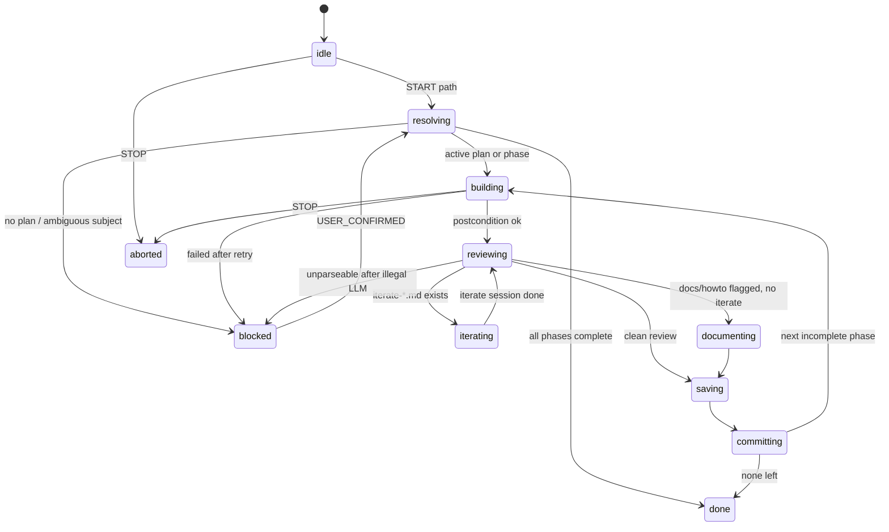

---
status: completed
date: 2026-09-18
subject: 2026-09-18.buck-loop-extension
topics: [buck-loop, autonomous-loop, state-machine, omp-sdk, nested-sessions]
research: []
iterations:
  - iterate-buck-loop-artifact-state.md
  - iterate-buck-loop-artifact-state-2.md
  - iterate-buck-loop-nested-work-sessions.md
  - iterate-buck-loop-loop-supervisor.md
  - iterate-buck-loop-loop-supervisor-2.md
  - iterate-buck-loop-live-feedback.md
  - iterate-buck-loop-streaming-output.md
spec: []
memory:
  - buck-loop-extension-phasing-2026-09-18.md
  - buck-loop-phase1-build-2026-09-18.md
  - buck-loop-phase2-build-2026-09-18.md
  - buck-loop-phase2-review-2026-09-18.md
  - buck-loop-remaining-phases-2026-09-18.md
  - buck-loop-live-feedback-2026-09-18.md
  - buck-loop-streaming-output-2026-09-19.md

# Plan: buck-loop extension (scrap XState, happy-path runner)

## User Goal

An operator can leave a well-scoped Buck plan running unattended through build → review → iterate-if-needed → docs-if-needed → save → commit → next phase, without XState. Every transition is either a deterministic disk/git check or a closed-set LLM choice the machine validates.

## Goal

Ship `extensions/buck-loop/` as an observably invoked OMP command (`/buck-loop`) that drives that mini-cycle with nested `createAgentSession` workers. Scrap the XState parent/child machines. Do not revive `extensions/b-flow/`.

## Light Grill

- Q1: User goal → resolved: Unattended happy-path runner
- Q2: Envelope → resolved: Existing plan only (no auto `b-plan` / `b-phase`)
- Q3: Who runs steps → resolved: Nested OMP sessions (decision calls tool-less + schema-parsed; work steps are longer skill-loaded sessions)

## Context used / assumptions

- User-provided context: XState is unreliable; recreate from scratch; few decision points; mark deterministic vs LLM edges; LLM via OMP SDK must return a choice the machine already declared legal.
- Session context: this worktree (`autonomous-loop.wt`); `b-flow` is the only XState consumer and is unwired; `skills/b-loop` is advisory+stamp only.
- Artifacts used: `extensions/b-flow/machine.ts` (broken graph), `extensions/b-flow/classifier.ts` (stub, never called a model), `.context/2026-06-01.deprecate-b-flow/`, `extensions/code-review-iteration/loop.ts`, `extensions/omp-models.ts`, `extensions/b-save-improved/index.ts` (parse-then-reject), `skills/b-review/SKILL.md` (iterate file = in-plan issues).
- Assumptions:
  - Command name is `/buck-loop`. Do not steal `/b-loop` (deferred slash mirror for the advisory skill).
  - New directory `extensions/buck-loop/`. Do not import `extensions/b-flow/`.
  - Leave `extensions/b-flow/` on disk, unwired. Deletion is a later pass.
  - This **reverses** `docs/buck-workflow.md` “Does not write a new b-flow-style extension” for this one observably invoked command. ADR required.
  - No new FSM library (not XState, not robot3). Hand-rolled transition table, same family as `code-review-iteration/loop.ts`.
  - Artifacts win over the projection file on resume.

### What the old machine was trying to do

`extensions/b-flow/machine.ts` is a supervisor for “keep processing Buck work across context limits”:

```
idle → recovering → planning → decomposing → executingChunks → reviewing → saving → done
         ↘ blocked / paused / aborted
```

Nested `chunk-queue-machine` was supposed to spawn one worker per chunk. Classifier was supposed to pick a `RouteAction` when guards were ambiguous.

Why it is unreliable (evidence, not vibe):

- Snapshot restore re-invokes XState actors (git child processes). `index.ts` therefore never restores on `session_start`.
- `recovering.onDone` always targets `planning` unless reconciliation returns `block`. Scan result does not route.
- `planning.onDone` falls through to `decomposing` even when a phase is already active (the `hasActivePhase` arm exists, then an unguarded arm to `decomposing`).
- `reviewing` / `saving` wait for `REVIEW_COMPLETE` / `SAVE_COMPLETE`. Nothing in the machine sends them.
- `evaluateModelGuard` is a deterministic stub (`confidence: 0.6`) wrapped in `fromPromise`. No OMP SDK call, no closed enum.
- Child queue is `createActor` stuffed into `fromPromise`. Errors and blocked chunks are easy to swallow.

Keep the *intent* (durable happy-path supervisor, artifacts as truth, classifier cannot mutate). Drop the runtime (XState, chunk queue, planning/decomposing, main-session injection).

## Scope

- Pure transition table + snapshot type.
- Disk scan of an existing plan/phase (phased or not).
- Projection file `.context/workflow/buck-loop.json` (no XState snapshot).
- Nested work sessions for `b-build` / `b-build-hard` / `b-review` / `b-iterate` / `b-docs` / `b-howto` / `b-save` / `b-commit`.
- Nested tool-less choice sessions only when deterministic guards cannot fire.
- `/buck-loop` command: start (path), `--resume`, `--status`, `--stop`.
- Wire through `extensions/index.ts`.
- Tests for table, illegal LLM choice, artifact-wins resume.
- ADR + living-doc correction distinguishing `/buck-loop` (runner) from `/skill:b-loop` (stamper).

## Out of scope

- Auto `b-plan` / `b-phase` / brainstorm.
- Deleting `extensions/b-flow/` or dropping the `xstate` dependency (still used there).
- Changing `skills/b-loop` behavior (one cross-link sentence only).
- Driving the live main session (`before_agent_start` injection).
- Parallel phases, chunk queues, worker RPC, compaction/new-session routing.
- OMP `orchestrate` / `workflow` / `/goal set` auto-enable.
- Main-chat transcripts as source of truth.

## Affected files

**New**

- `extensions/buck-loop/types.ts` — `LoopState`, `Snapshot`, `Choice`, `Effect`
- `extensions/buck-loop/table.ts` — legal edges + `next(snapshot)` (no I/O)
- `extensions/buck-loop/scan.ts` — plan/phase/iterate/docs/git snapshot
- `extensions/buck-loop/persist.ts` — read/write `.context/workflow/buck-loop.json`
- `extensions/buck-loop/choice.ts` — OMP SDK closed-set call, parse, reject, audit
- `extensions/buck-loop/run-step.ts` — long nested work session, skill text in prompt
- `extensions/buck-loop/loop.ts` — supervisor while-loop
- `extensions/buck-loop/index.ts` — `wire()`, arg parse
- `extensions/buck-loop/__tests__/*.test.ts`
- `docs/adr/0002-observably-invoked-happy-path-loop.md`

**Edit**

- `extensions/index.ts` — `wireBuckLoop(pi)` next to the other wires
- `docs/buck-workflow.md` — replace the blanket “no new orchestrator extension” sentence; document `/buck-loop` vs `b-loop` skill
- `docs/extension-loading.md` — add to wired surface
- `skills/b-loop/SKILL.md` — one sentence: this skill does not run the loop; `/buck-loop` does

**Do not touch**

- `extensions/b-flow/**` (except it stays unwired)

## State graph

User-visible states only. Scanning, classifying, verifying are functions inside a state, not states.



## Deterministic vs LLM edges

**Rule:** `legalChoices(state, snapshot)` is pure. The supervisor never transitions on a raw model string.

| Situation | Kind | Next |
|---|---|---|
| No plan / no subject / multiple subjects and no path | deterministic | `blocked` |
| Active incomplete phase or non-phased plan | deterministic | `building` |
| All phases `status: completed` | deterministic | `done` |
| Nested work session threw / empty / timeout | deterministic | retry once, then `blocked` |
| After review: `iterate-*.md` exists | deterministic | `iterating` |
| After review: no iterate, report has Documentation/How-to Impact | deterministic | `documenting` |
| After review: no iterate, no docs impact | deterministic | `saving` |
| After save sidecar/memory written | deterministic | `committing` |
| After commit: next incomplete phase | deterministic | `building` |
| After commit: none left | deterministic | `done` |
| `loopCount >= maxLoops` or iterate-cycles ≥ 3 on one phase | deterministic | `blocked` |
| Review finished, **no** iterate file **and** report unparseable | **LLM** | enum `iterate \| document \| save \| block` ∩ current legal set |
| Work session finished, **postcondition scan ambiguous** (files changed but phase status unchanged, etc.) | **LLM** | enum `retry \| advance \| block` ∩ current legal set |

Priority when several deterministic guards fire: iterate > document > save. Not an LLM tie-break.

### LLM call contract

Use `runOmpModelSession` from `extensions/omp-models.ts` (already: `agentDir`, `modelPattern` from `modelRoles.smol` then `default`, `toolNames: []`, `restrictToolNames: true`, `disableExtensionDiscovery: true`, `enableMCP: false`).

Prompt includes **only** the legal enum for this snapshot. Ask for JSON:

```json
{ "choice": "<one of legal>", "reason": "..." }
```

Then:

1. Extract JSON (reuse the b-save-improved extract/parse style).
2. If `choice` ∉ legal set → retry once with “illegal, pick from …”.
3. Still illegal / empty / non-JSON → `blocked` (never default-advance).
4. Write `.context/<subject>/transition-audits/<id>.json` (`legal`, `raw`, `accepted` or `rejected`).
5. Machine applies `accepted` only.

Do **not** let the model invent a `RouteAction` type. Do **not** wrap this in XState `fromPromise`.

### Work-session contract

Separate helper (`run-step.ts`). Do not reuse the 60s b-save timeout.

- `disableExtensionDiscovery: true` so `/buck-loop` cannot recurse.
- Inject the target skill body (`skills/b-build/SKILL.md` etc.) into the prompt plus the plan/phase path.
- Tools: coding set for build/iterate (`read`, `edit`, `write`, `grep`, `bash`); read-heavy for review; match existing improved-command practice.
- Model: `mappingFromOmpRoles` by phase `difficulty` (`easy→smol`, `medium→slow`, `hard→default`), same as `DIFFICULTY_TO_ROLE`.
- Timeout: 15 minutes (code-review-iteration precedent). Abort → failed step.
- Postcondition is a **rescan**, not the model's last sentence.

## Persistence

`.context/workflow/buck-loop.json`:

```ts
{
  version: 1,
  state: LoopState,
  subject: string,
  planPath: string,
  phasePath: string | null,
  loopCount: number,
  iterateCyclesOnPhase: number,
  lastChoice?: { choice: string; reason: string },
  history: Array<{ from: LoopState; to: LoopState; at: string; why: string }>,
}
```

No `orchestration.snapshot.json`. On `--resume`: read projection, **rescan artifacts**, if they disagree artifacts win; if the disagreement is unsafe (projection says `done` but an incomplete phase exists, or subject folder vanished) → `blocked`.

## Command surface

```
/buck-loop <path-to-plan|phase|subject>
/buck-loop --resume
/buck-loop --status
/buck-loop --stop
```

Missing path and no resumable projection → print usage and stop. Do not guess among multiple active subjects.

## Implementation steps

1. **Table first (red).** `types.ts` + `table.ts` + tests with fixture snapshots. No I/O, no SDK. Cover: missing plan → blocked; incomplete phase → build; iterate file → iterate not save; docs flag → document; all complete → done; loop limit → blocked; LLM-needed case returns `effect: { kind: "choose", legal: [...] }`.
2. **Scan + persist.** New `scan.ts` (copy useful predicates from b-flow `scan-context` / `guards`, do not import b-flow). Projection read/write. Resume tests: stale `building` + all phases completed → `done`.
3. **Choice helper.** `choice.ts` on top of `runOmpModelSession`. Tests with mocked session: legal accepted; illegal rejected then blocked; audit file written.
4. **Work-session runner.** `run-step.ts` loads skill markdown, runs nested session, returns `{ ok, text }` without interpreting next state. Tests mock `createAgentSession`.
5. **Supervisor.** `loop.ts` `while` over `next(scan(state))` → run effect → persist. Safety counters. `--stop` writes `aborted`.
6. **Wire.** `index.ts` `registerCommand("buck-loop", …)` and `wireBuckLoop` in `extensions/index.ts`. Arg-parse tests.
7. **Docs.** ADR 0002 (observably invoked runner is allowed; XState is not; `b-loop` skill stays advisory). Patch `docs/buck-workflow.md` § “What the workflow does NOT do” and the b-flow deprecation note. One sentence in `skills/b-loop/SKILL.md`. `docs/extension-loading.md` wired-surface row.

## Acceptance criteria

- [x] `/buck-loop` is registered from `extensions/index.ts`. `b-flow` remains unwired. No `xstate` import under `extensions/buck-loop/`.
- [x] Given a fixture phased plan with phase 1 incomplete, `next(scan())` is `building` with no LLM call.
- [x] After a review artifact that includes `iterate-*.md`, next is `iterating`, not `saving`.
- [x] After a clean review (no iterate, no docs section), next is `saving`.
- [x] Mocked LLM returning a choice outside `legal` is rejected; second failure blocks; machine does not advance.
- [x] Mocked LLM returning a legal choice is the transition taken; audit file records `legal` + `accepted`.
- [x] Resume: projection `state: building` but all phase files `status: completed` → `done` (artifacts win).
- [x] Missing plan → `blocked` with a reason, not a nested `b-plan`.
- [x] Nested work sessions set `disableExtensionDiscovery: true`.
- [x] Living docs name `/buck-loop` (runner) vs `/skill:b-loop` (stamper). ADR 0002 exists.

## Verification

- Vitest on `table.ts`, `choice.ts`, `persist.ts`, `loop.ts` with mocked `createAgentSession` / `runOmpModelSession`. No live model in CI.
- `npm run guardrails:check` after the edit batch (code-touching).
- Smoke (manual, not CI): `/buck-loop` `--status` on a repo with no projection prints idle; `--stop` with no run is a no-op message.

## Risks

- Nested agents may ignore injected skill text. Mitigate: prompt leads with the skill, names the exact plan/phase path, and the supervisor trusts **postcondition scan**, not the model's claim.
- `disableExtensionDiscovery` means slash commands inside the worker do not exist — skill text is mandatory.
- Reversing the 2026-06-01 “no orchestrator extension” rule without an ADR leaves the next agent to rip this out. ADR 0002 is in scope.
- Long build sessions vs abort timer: 15 min may be tight for `b-build-hard`. Make timeout a constant; do not block this plan on a config UI.
- `b-review` report shape is prose. Prefer file existence (`iterate-*.md`) over regex on the report. LLM choice is only the unparseable remainder.

## Execution Instructions

Phased on 2026-09-18 into seven discrete sessions. Use [plan-buck-loop-extension-phases.md](plan-buck-loop-extension-phases.md) as the execution map and start with [Phase 1: Transition Contract](phase-1-transition-contract.md).

After Phase 1, Phases 2–4 may run in parallel. Phase 5 is their integration join; Phases 6 and 7 then run sequentially. Each phase owns its build → review → iterate-if-needed → docs-if-needed → save → commit mini-cycle.

`omp_execution` remains omitted. Run `/skill:b-loop` later if you want to stamp `orchestrate`; phasing alone does not enable an OMP execution loop.
