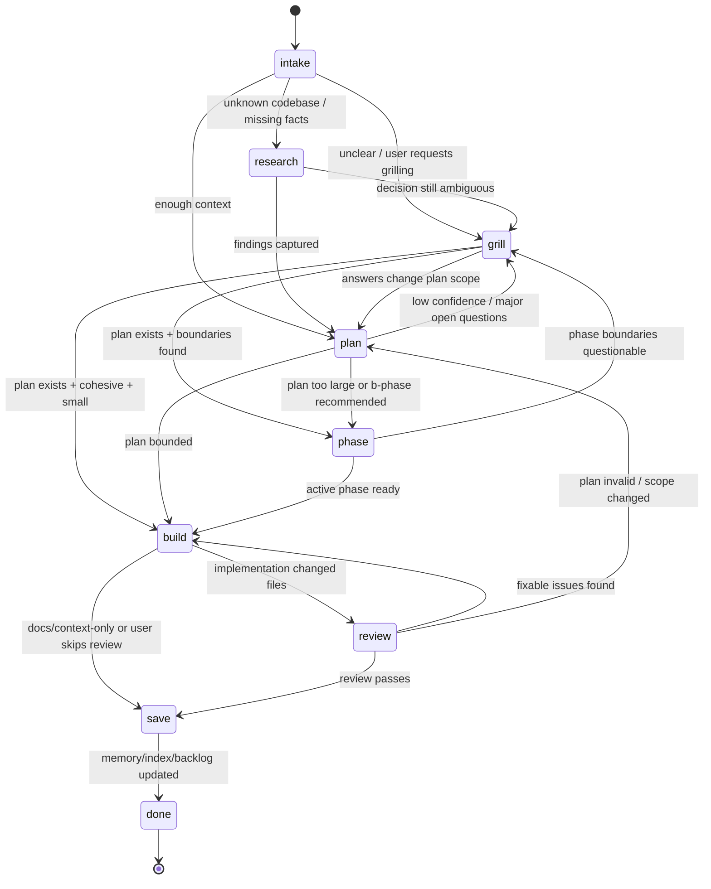

# Brainstorm: Buck Workflow Orchestration Extension

## Problem

Running the Buck workflow manually breaks down because of **context limits and model degradation**, not merely because the commands are uncoordinated.

Current failure mode:

- A Buck step works well while context is focused.
- The session grows; model effectiveness drops.
- The user must manually save/clear/restart context.
- The user must remember the next `/b-*` command and reconstruct state from artifacts.
- Transitions like `plan → phase`, `review → build`, and `build → save` are conversational suggestions, not executable durable state.
- Existing pieces (`b-grill-me`, `b-plan`, `b-phase`, `b-build`, `b-review`, `b-save`) work, but no supervisor keeps the workflow moving across fresh contexts.

## Goal

Build a Pi extension that acts as a **durable workflow supervisor** for Buck:

> Given a user goal, run one Buck state at a time, persist the result, reset/compact/fork context when useful, then continue from durable artifacts until the workflow reaches `done` or needs user input.

This should feel like a controlled state-machine loop: autonomous enough to keep processing across context resets, but still bounded by safety guards, loop limits, and user-confirmation policies.

## Non-goals

- Do not replace existing prompt templates or skills.
- Do not hide artifacts from the user.
- Do not make implementation changes without a visible Buck state and user-approved transition policy.
- Do not make `b-grill-me` mandatory for every workflow.
- Do not require every project to use the entire Buck workflow.

## Naming Candidates

- `/b-orchestrate` — explicit, accurate, a little long.
- `/b-flow` — short, good command UX.
- `/b-next` — best as a subcommand/action, not the whole extension.

Recommended user surface:

```text
/b-flow start <goal>
/b-flow next
/b-flow status
/b-flow pause
/b-flow resume
/b-flow jump <state>
/b-flow stop
```

Alias later if wanted:

```text
/b-orchestrate → /b-flow
```

## Core Concept

The extension owns the durable loop. Existing Buck commands own each unit of work.

```text
Extension: state machine, context rollover, transition guards, persistence
Prompts/skills: single-state workers that read artifacts and write artifacts
User: sets policy, answers blockers, approves dangerous transitions if required
```

Important design shift:

- Do **not** rely on one long chat context to complete the workflow.
- Treat each Buck state as a resumable job.
- After a state completes, persist artifacts and state.
- Then either continue in the same session, compact, or start a fresh session with a small bootstrap prompt.

The extension can queue the next Buck command with `pi.sendUserMessage(...)`, or use command-context session replacement (`ctx.newSession(...)`) to start the next state from a clean context. It inspects `agent_end`, tool events, session state, and `.context/` artifacts to decide what transition is available.

## XState Applicability

XState v5 appears to fit this extension well.

Why:

- Built-in guarded transitions for route selection.
- Invoked actors for awaited async work such as artifact scans, model guard evaluation, and worker subprocesses.
- `onDone` / `onError` paths for worker success/failure.
- Actor persistence via persisted snapshots and restore.
- Strong TypeScript support for events, context, guards, actions, and actors.

Recommended architecture:

```text
XState controls lifecycle and routing.
Buck artifacts control truth.
Pi workers perform work.
```

Important caveat: XState guards should remain pure/synchronous. Programmatic scans and model checks should run as invoked actors that update machine context; guards then route based on that prepared context.

See research: `.context/2026-05-08.b-orchestration-extension/research-xstate-for-b-flow.md`.

## State Machine

Prefer semantic states over command names. Commands are actions used to advance states.



## Initial Transition Table

```ts
type BuckState =
  | "intake"
  | "research"
  | "grill"
  | "plan"
  | "phase"
  | "build"
  | "review"
  | "save"
  | "done";

const transitions = {
  intake: ["research", "grill", "plan"],
  research: ["plan", "grill"],
  grill: ["plan", "phase", "build"],
  plan: ["grill", "phase", "build"],
  phase: ["grill", "build"],
  build: ["review", "save"],
  review: ["build", "plan", "save"],
  save: ["done"],
  done: [],
} as const;
```

## Transition Guards and Routing

The state machine is not just a graph. Every transition must be evaluated against the current durable context, then routed to an action. If using XState, this should be modeled as invoked scanner/evaluator actors feeding pure guarded transitions.

```text
current state + context snapshot
  → evaluate guards
  → rank valid transitions
  → choose route action
  → execute action
  → verify result
  → update state
```

### Context Snapshot

Before each transition, build a compact context snapshot from disk and runtime state:

```ts
interface TransitionContext {
  goal: string;
  current: BuckState;
  subject: string | null;
  mode: "guided" | "auto-confirm-safe" | "autonomous" | "manual";
  artifacts: {
    latestPlan?: ArtifactRef;
    phasesOverview?: ArtifactRef;
    activePhase?: ArtifactRef;
    tasksMd?: ArtifactRef;
    activeIterate?: ArtifactRef;
    memoryFile?: ArtifactRef;
    backlogItems: ArtifactRef[];
    workerResults: ArtifactRef[];
  };
  git: {
    hasDiff: boolean;
    changedFiles: string[];
    sourceFilesChanged: boolean;
    contextOnlyChanged: boolean;
  };
  review: {
    passed?: boolean;
    issuesFound?: boolean;
    requiresReplan?: boolean;
    iterateFile?: string;
  };
  worker: {
    active: boolean;
    lastStatus?: "completed" | "failed" | "blocked";
    lastResultFile?: string;
  };
  safety: {
    loopCount: number;
    maxLoops: number;
    workerTasksThisRun: number;
    maxWorkerTasksPerRun: number;
  };
}
```

### Guard Result

Each possible transition returns a structured result:

```ts
type GuardKind = "programmatic" | "model" | "hybrid";

type RouteAction =
  | { type: "run-command"; command: string; prompt?: string }
  | { type: "spawn-worker"; state: BuckState; taskFile: string; mode: "build" | "review" | "save" }
  | { type: "ask-user"; question: string; options: string[] }
  | { type: "block"; reason: string; missing?: string[] }
  | { type: "retry"; reason: string; maxAttempts: number }
  | { type: "compact"; then: RouteAction }
  | { type: "new-session"; bootstrap: string; then: RouteAction }
  | { type: "mark-done"; reason: string };

interface GuardResult {
  from: BuckState;
  to: BuckState;
  allowed: boolean;
  confidence: number; // 0..1
  kind: GuardKind;
  reason: string;
  evidence: string[]; // artifact paths, git facts, model judgement summary
  action: RouteAction;
}
```

### Programmatic vs Model Guards

Use deterministic/programmatic guards first. Use a model only when the decision needs semantic judgement.

| Guard type | Use for | Examples |
|---|---|---|
| Programmatic | File/status facts | plan exists, phase pending, git diff present, memory index updated |
| Model | Semantic judgement | plan is too vague, review implies replan, task boundary unclear |
| Hybrid | Facts + judgement | plan has 9 steps and model says cross-domain; review issues are architectural |

### Routing Examples

| From | Candidate To | Guard evaluation | Route action |
|---|---|---|---|
| `plan` | `phase` | Programmatic: plan text recommends `b-phase`, or thresholds exceeded | `run-command: /skill:b-phase` |
| `plan` | `build` | Programmatic: plan exists and no phase needed | if chunks exist: `spawn-worker`; else `run-command: /b-build` |
| `phase` | `build` | Programmatic: active `phase-N-*.md` is pending/in-progress | `spawn-worker` with active phase file |
| `build` | `review` | Programmatic: source diff exists or worker result says completed | `spawn-worker` in review mode or `/b-review` |
| `review` | `build` | Programmatic/model: iterate file exists or review found fixable issues | `spawn-worker` with iterate file |
| `review` | `plan` | Model/hybrid: issues invalidate architecture/scope | `run-command: /b-plan` with replan prompt |
| `review` | `save` | Programmatic: review passed | `run-command: /b-save` |
| `save` | `done` | Programmatic: memory/index/backlog/spec/phase state reconciled | `mark-done` |
| any | same/next | Safety guard fails | `block` or `ask-user` |

### Guard Table

| From | To | Guard / signal | Preferred evaluator |
|---|---|---|---|
| `intake` | `research` | target codebase is unfamiliar, architecture unknown, or docs/code lookup needed | model/hybrid |
| `intake` | `grill` | user asks for grilling or goal has major decision ambiguity | model |
| `intake` | `plan` | enough context exists to write a bounded plan | hybrid |
| `research` | `plan` | `research-*.md` written or findings summarized | programmatic |
| `grill` | `plan` | Q&A produced decisions that should alter plan/scope | model/hybrid |
| `grill` | `phase` | grill metadata reports boundary crossings and a plan exists | hybrid |
| `grill` | `build` | plan exists, grill says cohesive, no phasing needed | hybrid |
| `plan` | `phase` | plan exceeds b-phase thresholds or plan recommends `b-phase` | programmatic/hybrid |
| `plan` | `build` | plan is bounded and not phase-worthy | hybrid |
| `phase` | `build` | active `phase-N-*.md` exists and is `pending` or `in-progress` | programmatic |
| `build` | `review` | source/config files changed or phase completed | programmatic |
| `build` | `save` | only `.context/`/docs changed, or user explicitly skips review | programmatic/user |
| `review` | `build` | review created/points to active `iterate-*.md` or lists fixable issues | programmatic/hybrid |
| `review` | `plan` | review found scope/architecture mismatch requiring replanning | model/hybrid |
| `review` | `save` | review passes | programmatic |
| `save` | `done` | memory index and session memory updated, backlog/spec/phase state reconciled | programmatic |

## What Happens to Deprecated Commands?

`b-build-hard` and `b-iterate` should probably stop being **states**.

Recommended direction:

- `b-build-hard` becomes a **build mode** selected by phase difficulty, model hints, or user override.
  - Future shape: `/b-build --hard` or internal `buildMode: "hard"`.
  - Keep `/b-build-hard` as a compatibility alias for now.
- `b-iterate` becomes a **build input mode** when an active `iterate-*.md` exists.
  - Future shape: `/b-build --iterate` or normal `/b-build` auto-detects the iterate artifact.
  - Keep `/b-iterate` as a compatibility alias for now.

This keeps the orchestration graph smaller:

```text
build(state) + { mode: standard | hard | iterate }
```

## Context Rollover Model

The orchestrator should support explicit context rollover between states.

### Why

Model quality degrades when the session accumulates too much mixed context. Buck already writes durable artifacts; the extension should exploit that by restarting from artifacts instead of dragging the whole chat forward.

### Rollover strategies

| Strategy | When | Mechanism |
|---|---|---|
| Continue same session | short safe transition | `pi.sendUserMessage(nextCommand)` |
| Compact current session | useful context, but too large | `ctx.compact(...)` then continue |
| New session per state | useful for visible Pi session continuity | `ctx.newSession({ setup, withSession })` |
| External subagent per task | default for chunked autonomous loop | spawn isolated `pi` subprocess/RPC worker |
| Stop and ask user | guard failed / ambiguity / loop limit | status becomes `blocked` or `paused` |

### Fresh-session bootstrap

When starting a new session, inject only the small durable state needed:

```markdown
# Buck Flow Resume

Goal: <goal>
Current state: <state>
Next command: <command>
Subject: <subject folder>
Artifacts to read:
- .context/workflow/orchestration.json
- .context/workflow/current-session.json
- .context/<subject>/plan-*.md
- .context/<subject>/phase-N-*.md, if active

Do not rely on previous chat context. Read artifacts first, execute this state, then stop.
```

This is one mechanism that removes the user's current manual clear/restart work.

## External Subagent Task Loop

Once a plan is phased or decomposed into tasks, the preferred loop should run chunks through a **subagent outside the main Pi context**.

### Key idea

```text
Main Pi session: supervisor / control plane only
Subagent Pi process: isolated worker / data plane for one task chunk
Disk artifacts: source of truth between iterations
```

The main context should not absorb every implementation detail. It should only track:

- current task/phase
- worker result summary
- changed files
- verification status
- next transition
- blocker reason, if any

### Task sources

The orchestration loop can pull work from any durable chunk list:

| Source | When used | Unit of work |
|---|---|---|
| `phase-N-*.md` | after `b-phase` | one phase file |
| `.context/<subject>/tasks.md` | subject-local tasks | one unchecked task |
| `.context/backlog/todo.md` | backlog mode | one linked backlog item |
| `iterate-*.md` | review-fix mode | one review issue/fix bundle |

Recommended priority in an active subject:

```text
active phase → iterate artifact → subject tasks.md → backlog item
```

### Worker contract

Each subagent invocation gets exactly one chunk and a strict contract:

```markdown
# Buck Worker Task

You are a Buck subagent worker running outside the main context.

Goal: <global goal>
State: <build|review|save>
Task file: <phase/task/backlog/iterate file>
Subject: <subject folder>

Rules:
1. Read `.context/workflow/orchestration.json` first.
2. Read the task file and linked plan/spec/research artifacts.
3. Execute only this chunk.
4. Update the task/phase artifact status.
5. Update session memory or draft notes as required by the Buck state.
6. Write a compact worker result file.
7. Stop. Do not start the next task.
```

### Worker result file

Each worker writes a durable result, for example:

```text
.context/<subject>/worker-results/<timestamp>-<state>-<slug>.md
```

Suggested content:

```markdown
---
status: completed | failed | blocked
state: build | review | save
chunk: phase-1-api-contract.md
started_at: ...
completed_at: ...
changed_files: []
verification: []
blockers: []
---

# Worker Result: <chunk>

## Summary
...

## Files Changed
...

## Verification
...

## Next Recommendation
...
```

The main orchestrator reads this file, not the full worker transcript.

### Subagent implementation options

Best fit for this idea:

1. Spawn `pi` subprocess in RPC/JSON/print mode with isolated session and a generated prompt.
2. Allow tools based on state:
   - build worker: normal coding tools
   - review worker: read-only tools
   - save worker: `.context/**` write-only intent
3. Stream minimal status to the main UI.
4. Persist stdout/stderr/session file path in orchestration state.
5. Kill worker on abort/timeout.

This mirrors the existing Pi subagent example and the `b-grill-auto` RPC-worker pattern, but the worker is task-oriented rather than Q&A-oriented.

### Loop shape over chunks

```text
load state
find next chunk
spawn worker for chunk
wait for worker exit
read worker result
verify chunk completion
update orchestration state
if more chunks: spawn next worker
else transition to review/save/done
```

Important: the main session should not receive the full worker transcript by default. It receives a short event/result summary and links to artifacts.

## State Persistence

Write durable state to:

```text
.context/workflow/orchestration.json
```

Suggested schema:

```ts
interface OrchestrationState {
  version: 1;
  id: string;
  started_at: string;
  updated_at: string;
  status: "active" | "paused" | "blocked" | "completed" | "aborted";
  mode: "guided" | "auto-confirm-safe" | "autonomous" | "manual";
  current: BuckState;
  goal: string;
  subject: string | null;
  artifacts: {
    brainstorm?: string[];
    research?: string[];
    plans?: string[];
    phases?: string[];
    active_phase?: string | null;
    iterate?: string[];
    memory?: string | null;
  };
  history: Array<{
    at: string;
    from: BuckState;
    to: BuckState;
    command: string;
    reason: string;
    confirmed_by_user: boolean;
  }>;
  pending: {
    suggested_next: BuckState | null;
    command: string | null;
    reason: string | null;
    requires_confirmation: boolean;
  };
  runtime: {
    rollover: "same-session" | "compact" | "new-session-per-state" | "external-subagent-per-chunk";
    worker_mode: "none" | "pi-subprocess" | "pi-rpc";
    active_worker: {
      pid: number | null;
      task_file: string | null;
      state: BuckState | null;
      started_at: string | null;
      session_file: string | null;
      result_file: string | null;
    } | null;
    last_session_file: string | null;
    current_session_file: string | null;
    last_context_tokens: number | null;
  };
  queue: {
    source: "phase-files" | "tasks-md" | "backlog" | "iterate" | null;
    items: Array<{
      id: string;
      file: string;
      title: string;
      status: "pending" | "running" | "completed" | "failed" | "blocked";
      worker_result?: string;
    }>;
    active_item_id: string | null;
  };
  safety: {
    max_loops: number;
    loop_count: number;
    max_states_per_run: number;
    max_worker_tasks_per_run: number;
    worker_timeout_ms: number;
    stop_on_review_failure: boolean;
    require_confirm_before_build: boolean;
    require_confirm_before_save: boolean;
  };
}
```

Also append compact custom entries with `pi.appendEntry("buck-orchestration", ...)` so Pi session restore can recover high-level state even if files move.

## Extension Responsibilities

1. Register `/b-flow` command with subcommands.
2. Persist orchestration state to `.context/workflow/orchestration.json`.
3. Read current Buck session state from `.context/workflow/current-session.json`.
4. Track command outputs indirectly through `agent_end`, workflow state, git diff, worker result files, and artifacts.
5. Build a `TransitionContext` snapshot before every transition.
6. Evaluate candidate transitions through guard functions: programmatic first, model/hybrid when semantic judgement is needed.
7. Route based on the winning `GuardResult.action` (`run-command`, `spawn-worker`, `ask-user`, `block`, `retry`, `compact`, `new-session`, `mark-done`).
8. Ask user to confirm transitions unless the selected mode allows auto-run.
9. Queue selected action via `pi.sendUserMessage(...)`, start a fresh session via `ctx.newSession(...)`, or spawn an external worker subagent for one chunk.
10. Show status/footer: current state, next state, active phase/task, worker status, loop count, rollover mode.
11. Inject orchestration state into compaction.
12. Stop safely on loops, missing artifacts, failed guards, user pause/abort, unresolved questions, worker failure, or timeout.
13. Ensure every state writes/updates durable artifacts before continuing.
14. Keep main-session context lean: summarize worker results; link to files; do not paste full transcripts.

## Command UX

### `/b-flow start <goal>`

Creates orchestration state and asks the user for mode:

```text
Mode?
- Guided: run loop, but confirm each transition
- Auto-confirm safe: auto-run read/planning/review states, confirm before build/save
- Autonomous: keep processing with configured guards and loop limits
- Manual: only show status and next recommendation

Execution isolation?
- Same session
- Compact when context is high
- New session per state
- External subagent per chunk (recommended once plan/tasks are decomposed)
```

Then chooses initial state:

- `research` if code understanding is missing.
- `grill` if the goal is decision-heavy or user requested grilling.
- `plan` otherwise.

### `/b-flow next`

Runs or confirms the pending next transition.

Example UI copy:

```text
Suggested next: plan → phase
Reason: plan has 11 steps and touches 7 files.
Run /skill:b-phase against .context/2026-05-08.foo/plan-foo.md?
```

### `/b-flow status`

Shows:

- current state
- goal
- subject folder
- artifacts found
- pending next transition
- loop count
- last command run

### `/b-flow jump <state>`

Manual escape hatch. Requires confirmation if jumping into `build` or `save`.

### `/b-flow stop`

Marks state as `aborted`, clears status UI, does not delete artifacts.

## Loop Execution Model

A loop iteration is one state transition:

1. Load `.context/workflow/orchestration.json`.
2. Scan artifacts and current session state.
3. Determine `suggested_next`.
4. Check guard and safety policy.
5. Start the next state or chunk:
   - same session: queue command directly
   - new session: create a fresh session with bootstrap context, then queue command
   - external subagent: spawn one worker for one task/phase/iterate chunk
6. Wait for `agent_end` or worker exit.
7. Re-scan artifacts and worker result file to verify completion.
8. Update orchestration state, queue state, and history.
9. If more chunks remain and safety allows, start the next worker.
10. If chunk queue is exhausted, transition to review/save/done.
11. Stop when `done`, `blocked`, `paused`, worker failure, timeout, or loop limit reached.

The extension should expose an internal continuation command, for example:

```text
/b-flow continue --from-extension
```

This command should be idempotent: if no active orchestration exists, it exits; if a state is already running, it exits; if the next transition is blocked, it reports the block.

## Running Existing Commands

The extension should call current Buck surfaces, not duplicate their prompt bodies.

Examples:

```ts
const commandForState = {
  research: "/b-research",
  grill: "/skill:b-grill-me",
  plan: "/b-plan",
  phase: "/skill:b-phase",
  build: "/b-build",
  review: "/b-review",
  save: "/b-save",
};
```

When using `pi.sendUserMessage`, guard against self-trigger loops:

- Ignore `input` events with `event.source === "extension"` unless they match the currently queued action.
- Store `pending.command` before sending.
- Clear `pending.command` only after `agent_end` and transition evaluation.

## Decision Sources

Use this order:

1. Explicit user choices.
2. Deterministic artifact scans.
3. Existing Buck session state.
4. Assistant output markers / known phrases.
5. Small classifier model, only when deterministic signals disagree. In XState, run this as an invoked actor before guarded routing, not inside a guard.

Important deterministic checks:

- Latest plan exists?
- Latest plan recommends `b-phase`?
- Phases overview exists?
- Active phase file exists?
- Phase status complete?
- Git diff / tracked modified files non-empty?
- Review produced `iterate-*.md`?
- Memory file written and indexed?

## MVP Scope

Build the smallest useful looping version using XState v5 as the supervisor engine:

1. Add `xstate` as a runtime dependency if implementation proceeds.
2. `/b-flow start <goal>` creates state and selects rollover mode.
3. `/b-flow status` displays state.
4. `/b-flow run` starts the loop.
5. `/b-flow continue --from-extension` sends a machine event and advances one state/chunk when safe.
6. Support states: `plan`, `phase`, `build`, `review`, `save`, `done`.
7. Persist both a human-readable projection `.context/workflow/orchestration.json` and an XState snapshot `.context/workflow/orchestration.snapshot.json`.
8. Use `external-subagent-per-chunk` as the recommended mode once phase/task files exist.
9. Status UI shows `Buck: build | phase 2/5 | worker running | loop 2/8`.
10. Stop after review failure, worker failure, timeout, or max loop count instead of auto-looping forever.

Defer:

- `research` state.
- `grill` state.
- classifier model.
- auto-confirm safe mode.
- branch/fork session management.
- parallel worker pools. MVP should run one external worker at a time.

## Open Questions

1. Should the primary command be `/b-flow` or `/b-orchestrate`?
2. Should the MVP run the next command automatically after each state, or only suggest until user types `/b-flow next`?
3. Should `b-grill-me` be an optional gate before `plan`, or a normal state available after every major artifact?
4. How strict should review be? Always required before save, or skippable for docs/context-only changes?
5. Should `b-build-hard` remain a visible command or become an alias/model mode immediately?
6. Should orchestration state live only in `.context/workflow/orchestration.json`, or also be mirrored into Pi custom session entries?
7. What loop limit is safest for `review → build → review`? Suggested default: 2.
8. What is the first worker transport: `pi --mode rpc`, print/json mode, or a small wrapper around the existing subagent example?
9. Should worker transcripts be stored under `.context/<subject>/worker-results/` or outside `.context/` with only summaries in `.context/`?

## Recommended Next Step

Create an MVP plan for `/b-flow` with just:

```text
plan → phase? → build → review → save → done
```

But implement it as a **persistent loop with context rollover**, not a one-session wizard.

Keep grilling/research as future states once the basic supervisor loop is reliable.
