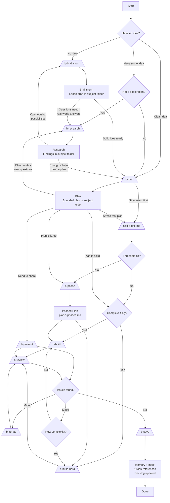
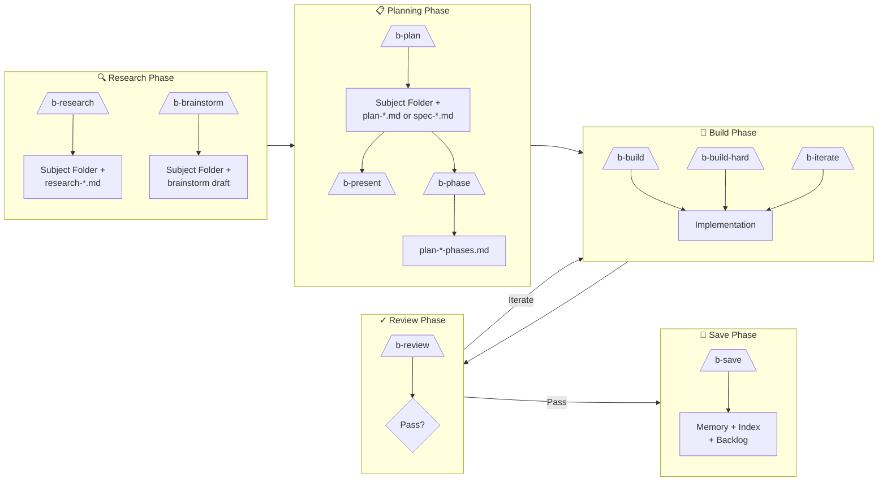

# Buck Workflow

A structured, discoverable workflow for AI-assisted software development with durable context management.

## Philosophy

The Buck workflow is built on one principle: **don't lose work**. It separates **intent** (plans in subject folders) from **record** (history in memory), creating a durable paper trail that survives chat context limits.

**Key Concepts:**
- **Subject Folders**: Group related work (research, plans, specs) by topic and date
- **Cross-References**: Link artifacts so agents can cold-start with full context
- **Plugin Tracking**: Automatic session state tracking prevents lost work
- **b-prefix Discoverability**: Type `/b-` to find Buck workflow commands exposed by prompt templates and extension commands

## Pi-native package mapping

Pi does not use the same custom command model as OpenCode. In this package, the Buck workflow surface is assembled from Pi primitives:

| Buck concept | Pi primitive | Current implementation |
|---|---|---|
| Most `/b-*` workflow entrypoints | Prompt templates | `prompts/b-*.md` |
| Reusable helper capabilities | Skills | `skills/*/SKILL.md` |
| Session/runtime automation | Extension | `extensions/index.ts` |
| `/b-save` orchestration | Extension command | `extensions/index.ts` via `pi.registerCommand("b-save", ...)` |
| `/b-mode` control | Extension command | `extensions/index.ts` via `pi.registerCommand("b-mode", ...)` |

Practical translation rules:
- Use a **prompt template** when the main job is to expand a workflow prompt.
- Use a **skill** when the behavior is a reusable helper, not the primary workflow entrypoint.
- Use an **extension** when you need hooks, state, notifications, or command registration.

**Important:** The sections below describe workflow behavior. Implementation details are in the Pi-native mapping table above.

---

## Visual Workflow Overview

### Complete Flow Diagram

**All transitions are loose and context-dependent. The paths shown represent likely transitions, but the workflow is intentionally flexible.**



### Ideation Phase Transitions

**Brainstorm → Research**
When brainstorming reveals questions that need real-world answers before continuing.

**Brainstorm → Plan**
When the brainstorm solidifies into a clear idea that can be turned into a plan (even a first draft).

**Research → Plan**
When research has answered enough questions to form a plan or draft plan.

**Research → Brainstorm**
When research opens up or shuts down possibilities, requiring more ideation.

**Plan → Research**
When the plan surfaces new questions that need investigation before hardening.

**Plan → Build**
When the plan is solid enough to implement.

**Plan → Present**
When you need a human-shareable explanation of the plan for stakeholder review or handoff.

### Command-Only Flow



### Pi Implementation Matrix

```mermaid
flowchart TD
    subgraph Commands["User Commands (/b-*)"]
        C1["/b-research"]
        C2["/b-brainstorm"]
        C3["/b-plan"]
        C4["/b-build"]
        C5["/b-build-hard"]
        C6["/b-iterate"]
        C7["/b-review"]
        C8["/b-save"]
        C9["/skill:b-phase"]
        C10["/skill:b-grill-me"]
        C11["/skill:b-grill-with-docs"]
    end

    subgraph PiPrimitives["Pi Package Primitives"]
        P1["prompts/b-research.md"]
        P2["prompts/b-brainstorm.md"]
        P3["prompts/b-plan.md"]
        P4["prompts/b-build.md"]
        P5["prompts/b-build-hard.md"]
        P6["prompts/b-iterate.md"]
        P7["prompts/b-review.md"]
        P8["skills/b-phase/SKILL.md"]
        P9["skills/b-grill-me/SKILL.md"]
        P10["skills/b-grill-with-docs/SKILL.md"]
        E1["extensions/index.ts<br/>registers b-save"]
    end

    C1 --> P1
    C2 --> P2
    C3 --> P3
    C4 --> P4
    C5 --> P5
    C6 --> P6
    C7 --> P7
    C8 --> E1
    C9 --> P8
    C10 --> P9
    C11 --> P10
```



---

## Workflow Components Reference

### Quick Reference Table

| Component | Pi primitive | Slash entrypoint | Backing file | Purpose |
|-----------|--------------|------------------|--------------|---------|
| [**b-research**](#1-research-phase) | Prompt template | `/b-research` | `prompts/b-research.md` | Explore code, trace architecture, capture findings |
| [**b-brainstorm**](#b-brainstorm--interview-style-intake) | Prompt template | `/b-brainstorm` | `prompts/b-brainstorm.md` | Interview-style intake, loose draft plan |
| [**b-grill-me**](#b-grill-me--complexity-tracked-grilling) | Skill | `/skill:b-grill-me` | `skills/b-grill-me/SKILL.md` | Stress-test plan via interview, track complexity for phasing |
| [**b-grill-with-docs**](#b-grill-with-docs--domain-aware-grilling) | Skill | `/skill:b-grill-with-docs` | `skills/b-grill-with-docs/SKILL.md` | Grill against domain docs (CONTEXT.md, ADRs), track complexity |
| [**b-plan**](#2-planning-phase) | Prompt template | `/b-plan` | `prompts/b-plan.md` | Create bounded implementation plan |
| [**b-phase**](#b-phase--plan-phasing) | Skill | `/skill:b-phase` | `skills/b-phase/SKILL.md` | Break large plans into sequential phases |
| [**b-present**](#b-present--presentation-package) | Prompt template + Skill | `/b-present` | `prompts/b-present.md` + `skills/b-present/` | Generate async-readable presentation package from plan/phase/brainstorm/spec/grill-session |
| [**b-build**](#3-build-phase) | Prompt template | `/b-build` | `prompts/b-build.md` | Standard implementation + model auto-switch |
| [**b-build-hard**](#b-build-hard--complexrisky-implementation) | Prompt template | `/b-build-hard` | `prompts/b-build-hard.md` | Complex, ambiguous, or risky implementation |
| [**b-iterate**](#b-iterate--quick-follow-up-fixes) | Prompt template | `/b-iterate` | `prompts/b-iterate.md` | Quick fixes, polish, review-loop edits |
| [**b-review**](#4-review-phase) | Prompt template | `/b-review` | `prompts/b-review.md` | Review + model auto-switch for phased plans |
| [**b-save**](#5-save-phase) | Extension command | `/b-save` | `extensions/index.ts` | Record completed work to history |
| [**b-mode**](#buck-workflow-mode) | Extension command | `/b-mode on\|off\|status` | `extensions/index.ts` | Control Buck workflow mode |

**[↑ Back to Quick Reference Table](#quick-reference-table)**

**Implementation note:** this Pi package exposes a unified `/b-*` workflow surface, but that surface is backed by both prompt templates and extension commands (`/b-save`, `/plan`).

---

## Detailed Component Documentation

---

## Plan Mode

#### `/b-plan` — Auto-Enables Plan Mode

**Purpose**: Plan mode creates a read-only planning environment that allows writing only to documentation and workflow files.

**Pi primitive**: Extension command (`extensions/index.ts`)

**Behavior**:
- `/b-plan`, `/b-brainstorm`, and `/b-research` automatically enable plan mode
- `/b-build`, `/b-build-hard`, and `/b-iterate` automatically disable plan mode
- When enabled:
  - **Allows** writes to `.context/` and `docs/` paths only
  - **Blocks** writes to source code, config files, and any `.md`/`.txt` outside allowed paths
  - **Allows** safe bash commands (ls, cat, grep, find, etc.)
  - **AI-reviews** non-whitelisted bash commands (asks for confirmation if mutating)
  - **Blocks** mutating git commands (commit, push, pull, merge, etc.)
  - Shows "⚠️ planning" status indicator
- State persists across session resume

**To disable plan mode**: Run `/b-build`, `/b-build-hard`, or `/b-iterate` (auto-disables the write guard but keeps Buck mode active), or run `/b-mode off` to disable the full Buck workflow envelope.

**Status indicators**: When Buck mode is active, shows `🦌 buck`; when the write guard is active, also shows `📝 planning`.

**Session persistence**: Buck mode and plan mode state are saved to `.context/workflow/current-session.json` and restored on session resume.

**Allowed paths**:
- `.context/` — plans, specs, research, memory files
- `docs/` — documentation

**Blocked paths**:
- Source code files (`.ts`, `.js`, `.py`, etc.)
- Config files (`.json`, `.yaml`, `.toml`, etc.)
- `.md` or `.txt` files outside `.context/` and `docs/`

**Bash restrictions**:
- Whitelisted: `cat`, `ls`, `grep`, `find`, `head`, `tail`, `wc`, `pwd`, `echo`, `git status`, `git log`, `git diff`, etc.
- Blocked: `git commit`, `git push`, `git pull`, `git merge`, file redirects (`>`, `>>`)
- Non-whitelisted commands are AI-reviewed; mutating ones prompt for confirmation

**Typical use**:
```
/b-brainstorm  # Auto-enables plan mode
/b-research    # Plan mode stays active
/b-plan        # Create plan in .context/
/b-build       # Auto-disables plan mode, enters implementation
```

**[↑ Back to Quick Reference Table](#quick-reference-table)**

---

## Buck Workflow Mode

Buck workflow mode is an extension-owned session state that provides a broader behavioral envelope around the existing plan-mode write guard. It is designed to make Buck workflow mechanics implicit when the conversation is clearly workflow-shaped, without requiring explicit `/b-*` commands for every step.

### What It Owns

Buck workflow mode encompasses and extends the existing plan-mode behavior:

| Feature | Current implementation |
|---------|------------------------|
| Write guards (`.context/`, `docs/` only) | `plan_mode_active` remains the write-guard sub-mode |
| Broad workflow mode | `buck_workflow_mode_active` in `.context/workflow/current-session.json` |
| Auto-enable on planning/research commands | `/b-plan`, `/b-research`, `/b-brainstorm`, grill planning commands enable Buck + plan mode |
| Auto-disable write guard on build commands | `/b-build`, `/b-build-hard`, `/b-iterate` keep Buck mode active but disable `plan_mode_active` |
| Manual control | `/b-mode on|off|status` and `alt+p` toggle |
| Narrow auto-enable | Intent detection from user messages (disabled by default, opt-in only) |
| Session latching | Mode stays active until manually disabled; `/b-mode off` suppresses auto-enable |
| Implicit session bootstrap | Restores status from `.context/workflow/current-session.json` |
| Durable artifact prompting | Buck-aware system prompt when mode is active |

### Activation

**Manual control**:
```
/b-mode on      — Enable Buck workflow mode and the planning write guard
/b-mode off     — Disable Buck workflow mode and suppress auto-enable for the session
/b-mode status  — Show current mode state, source, reason, and intent count
```

`alt+p` toggles the same Buck workflow/planning mode envelope.

**Narrow auto-enable** (disabled by default): Previously activated when the user's intent matched workflow-shaped asks. Now opt-in only — users must explicitly enable via `/b-mode on`, `/b-plan`, etc.

**Latching**: Once enabled, Buck mode stays active until manually disabled via `/b-mode off` or `alt+p`. Build commands disable only the planning write guard, not the broader Buck workflow mode.

**State split**: `buck_workflow_mode_active` is the broad workflow envelope. `plan_mode_active` is only the write-guard sub-mode. This separation allows workflow-shaped implementation requests to enable Buck guidance without blocking source edits.

### What Mode Does NOT Do

- **Does not create files immediately** — file creation waits until a clear threshold is crossed or the user explicitly invokes a skill (`/b-plan`, `/b-research`, etc.).
- **Does not replace explicit commands** — `/b-plan`, `/b-build`, `/b-review`, etc. remain the primary entrypoints. Mode provides implicit scaffolding around them.
- **Does not change write guards** — plan mode's `.context/` + `docs/` write boundary remains unchanged.
- **Does not generalize beyond Buck** — the mode is extension-owned and Buck-specific. Global Pi agent guidance remains Buck-agnostic.

### Relationship to Global AGENTS.md

The global `~/.pi/agent/AGENTS.md` file:
- **Mentions Buck directly** and recommends it for most non-trivial work.
- **Keeps the durable-artifact principle** — always prefer `.context/` artifacts.
- **Does not encode Buck substructure** — memory frontmatter, backlog layout, and subject folder taxonomy live in Buck docs and `docs/context-workflow.md`.
- **Does not implement mode behavior** — mode is extension-owned runtime state.

This split makes Buck workflow portable: the global AGENTS file provides a lightweight baseline, while Buck owns the detailed semantics.

### Implementation Status

| Component | Status |
|-----------|--------|
| Ownership split documented | ✅ Complete |
| Global AGENTS.md trimmed | ✅ Complete |
| Buck-mode semantics documented | ✅ Complete (this section) |
| Plan mode allowed paths corrected | ✅ Complete |
| `/b-mode` command | ✅ Complete |
| Narrow auto-enable heuristics | ⚠️ Disabled (opt-in only, per user request) |
| Session state model extension | ✅ Complete |
| Generic routing entrypoint | 🔲 Deferred |

---

### 1. Research Phase

#### `/b-research` — Explore and Discover

**[↑ Back to Quick Reference Table](#quick-reference-table)**

**Purpose**: Understand unfamiliar code, trace architecture and data flow, save findings for reuse.

**Pi primitive**: Prompt template (`prompts/b-research.md`)

**Behavior**:
- Creates **subject folder** automatically: `.context/YYYY-MM-DD.<subject-name>/`
- Writes `research-<topic>.md` with `informs: []` for cross-referencing
- Uses jcodemunch-mcp for symbol search and code lookup
- Read-only outside `.context/` (no source changes)

**Output Structure**:
```yaml
---
status: active
date: YYYY-MM-DD
subject: YYYY-MM-DD.subject-name
topics: [keyword, list]
informs: []  # Plans/specs this research fed into
---
```

**Next Steps**: `/b-plan` (findings → plan), `/b-build` (if already clear), `/b-build-hard` (if complex)

---

#### `/b-brainstorm` — Interview-Style Intake

**[↑ Back to Quick Reference Table](#quick-reference-table)**

**Purpose**: Capture initial thinking through one-question-at-a-time interview, save loose first-draft plan.

**Pi primitive**: Prompt template (`prompts/b-brainstorm.md`)

**Behavior**:
- **Creates subject folder immediately**: `.context/YYYY-MM-DD.<subject-name>/`
- Maintains sidecar state: `.context/YYYY-MM-DD.<subject>/brainstorm-state-<slug>.json`
- Asks ~4 questions max before drafting
- Saves loose draft (not formal plan)
- Never auto-invokes `/b-plan` — user must explicitly ask to formalize

**Resume Behavior**:
- Detects matching subject folders
- Checks sidecar hash for external edits
- Summarizes changes if draft was edited outside the agent

**Output**: Brainstorm draft in subject folder (e.g., `brainstorm-add-oauth-login.md`)

**Next Step**: `/b-plan` to formalize into bounded plan

---

### 2. Planning Phase

#### `/skill:b-grill-me` — Complexity-Tracked Grilling

**[↑ Back to Quick Reference Table](#quick-reference-table)**

**Purpose**: Interview the user relentlessly about a plan, tracking decision-tree complexity. When questions exceed a configurable threshold (default 20), identifies natural break points for phasing.

**Pi primitive**: Skill (`skills/b-grill-me/SKILL.md`)

**When to Use**: Before or after `/b-plan`, when the user wants to stress-test a plan or design through rapid-fire questions.

**Behavior**:
- Asks questions one at a time, walking the decision tree
- Tracks: question count, decision domains, question types, resolutions
- Creates `grill-session-<topic>.md` in the subject folder
- When threshold exceeded: pauses, identifies break points, recommends `/skill:b-phase`
- Model determines break points based on decision tree shape

**Output**: `grill-session-<topic>.md` with frontmatter metadata:
- `total_questions`, `threshold`, `phasing_recommended`
- `decision_domains` with question ranges and resolution counts
- `break_points` at natural domain boundaries

**Next Steps**: `/b-plan` (to formalize findings), `/skill:b-phase` (if phasing recommended)

---

#### `/skill:b-grill-with-docs` — Domain-Aware Grilling

**[↑ Back to Quick Reference Table](#quick-reference-table)**

**Purpose**: Same as `b-grill-me`, but also challenges the plan against existing domain documentation (CONTEXT.md, ADRs). Updates documentation inline as decisions crystallize.

**Pi primitive**: Skill (`skills/b-grill-with-docs/SKILL.md`)

**When to Use**: When the project has domain documentation (CONTEXT.md, ADRs) and the user wants to stress-test a plan against established terminology and decisions.

**Additional Behavior** (beyond `b-grill-me`):
- Challenges terms against CONTEXT.md glossary
- Proposes precise canonical terms for fuzzy language
- Updates CONTEXT.md inline when terms are resolved
- Offers ADRs for hard-to-reverse, surprising, trade-off-driven decisions
- Cross-references user claims with actual code

**Output**: Same `grill-session-<topic>.md` plus inline updates to CONTEXT.md and new ADRs.

**Next Steps**: `/b-plan` (to formalize), `/skill:b-phase` (if phasing recommended)

---

#### `/b-plan` — Create Bounded Plan

**[↑ Back to Quick Reference Table](#quick-reference-table)**

**Purpose**: Turn research or task request into bounded implementation plan with scope, risks, verification.

**Pi primitive**: Prompt template (`prompts/b-plan.md`)

**Behavior**:
- **Creates subject folder**: `.context/YYYY-MM-DD.<subject-name>/`
- Writes either:
  - `plan-<topic>.md` — tactical, single-session work
  - `spec-<milestone>-<topic>.md` — strategic, multi-session epic/PRD

**Cross-Reference Stitching**:
1. Checks for existing `research-*.md` in subject folder
2. If found: populates plan's `research:` field + back-fills research's `informs:` field
3. If implementing a spec: populates plan's `spec:` field

**Plan Frontmatter**:
```yaml
---
status: active
date: YYYY-MM-DD
subject: YYYY-MM-DD.subject-name
topics: [keyword, list]
research: [research-file.md]  # If research informed this plan
spec: spec-file.md            # If this plan implements a spec
memory: []                    # Filled by b-save after execution
---
```

**Plan Contents**:
- Goal
- Scope / Out of scope
- Affected files
- Implementation steps
- Verification
- Risks

**Next Steps**: `/b-build` (straightforward), `/b-build-hard` (complex), `/b-review` (critique plan first), `/b-present` (shareable presentation)
- **Also**: `/skill:b-phase` if plan exceeds ~8 steps, ~5 files, or multiple domains

---

#### `/skill:b-phase` — Plan Phasing

**[↑ Back to Quick Reference Table](#quick-reference-table)**

**Purpose**: Break large plans into sequential, independently-verifiable phases when a single session would be risky or cramped.

**Pi primitive**: Skill (`skills/b-phase/SKILL.md`)

**Trigger**: Manual (`/skill:b-phase`) or recommended by `/b-plan` when the plan is large.

**When to Phase**:
- More than ~8 implementation steps
- Touches more than ~5 distinct files or directories
- Spans multiple architectural layers (DB + API + UI)
- Involves high-risk paths (auth, billing, migrations)
- Contains significant unknowns or research spikes
- Verification alone would exhaust a single session

**Behavior**:
- Reads the most recent `plan-*.md`
- Maps dependencies between plan steps (HARD, SOFT, NONE)
- Groups steps into phases (~equal size, vertical slices)
- Assigns each phase a simple difficulty/model hint: `easy`, `medium`, or `hard`
- Flags parallel opportunities (phases with NO dependency)
- Creates:
  - `plan-<topic>-phases.md` — **overview/index** with summary table, dependency matrix, and links to discrete phase files
  - `phase-N-<slug>.md` — **one per phase** with full implementation details, acceptance criteria, and status tracking

**Dependency Types**:
- **HARD**: Phase N cannot start until Phase N-1 completes
- **SOFT**: Phase N can start with stubs/mocks
- **NONE**: Phases are independent, could be parallel

**Difficulty / Model Hint Rubric**:
- **easy** — bounded, local, mostly mechanical work; smaller/faster general model is fine; usually `/b-build`
- **medium** — some cross-file reasoning or moderate verification; capable general model preferred; usually `/b-build`
- **hard** — ambiguous, failure-sensitive, or architecture-touching work; strongest reasoning model available; use `/b-build-hard`

**Output**: Two types of files:

1. **Phases overview** (`plan-<topic>-phases.md`): lightweight index with:
   - Summary table: phase name, status, difficulty, link to phase file
   - Dependency matrix and diagram
   - Parallel opportunities section
   - Execution order notes

2. **Discrete phase files** (`phase-N-<slug>.md`): one per phase with:
   - Frontmatter: `status`, `phase`, `difficulty`, `depends_on`, `acceptance_criteria`, `completed_at`
   - Body: implementation details, context, risks, verification steps
   - Status flow: `pending` → `in-progress` → `completed`

**Resume Behavior**:
Any b-* command can pick up where work left off:
1. Read the phases overview → find the first non-completed phase in the summary table
2. Read that discrete phase file → get full implementation details
3. Execute

This works even with zero conversation history — a cold-start agent gets full context from the phase file.

**Backwards Compatibility**: Legacy single-file `plan-*-phases.md` plans (without `format: discrete` frontmatter) continue to work. The extension and b-build/b-build-hard prompts detect format automatically.

**Next Steps**: Execute Phase 1 via `/b-build` or `/b-build-hard`, guided by the phase's difficulty/model hint

---

#### `/b-present` — Presentation Package

**[↑ Back to Quick Reference Table](#quick-reference-table)**

**Purpose**: Generate an async-reading-first presentation package (small static site) from plans, phases, brainstorms, specs, grill sessions, or research. The package includes a primary overview page, optional detail pages, rendered source views, and a manifest.

**Pi primitives**: Prompt template (`prompts/b-present.md`) + Skill (`skills/b-present/SKILL.md`)

**Supported Sources**:
- Plans (`plan-*.md`)
- Phased plans (`plan-*-phases.md` + `phase-N-*.md`)
- Brainstorms (`brainstorm-*.md`)
- Specs (`spec-*.md`)
- Grill sessions (`grill-session-*.md`)
- Research (`research-*.md`)

**Input Resolution Order**:
1. Explicit path argument
2. Phased plan overview
3. Single plan in active subject folder
4. Brainstorm output
5. Spec
6. Grill session
7. Research
8. If multiple plausible sources at same precedence, stop and ask
9. Newest artifact in subject folders
10. Fail with clear error if nothing found

**Output Location**:
```
presentations/<slug>/
├── index.html          # Primary overview (required)
├── architecture.html   # Optional detail page
├── phases.html         # Optional detail page
├── verification.html   # Optional detail page
├── appendix.html       # Optional detail page
├── assets/             # CSS, JS, shared resources
├── sources/            # Copied markdown source artifacts
└── manifest.json       # Semi-public package metadata
```

**Package Features**:
- Primary overview page with sticky sidebar navigation (responsive)
- Optional detail pages for phases, architecture, verification, or appendix
- Rendered source views via client-side markdown renderer
- Mermaid diagrams generated from source content (never invented)
- Tiered styling: overview most polished, detail pages simpler, source views utilitarian
- manifest.json for regeneration cleanup
- Local preview server started automatically

**Detail Page Rules**:
- `phases.html` — when phased plan adds significant detail or complexity would clutter overview
- `architecture.html` — when architecture needs more than a compact overview
- `verification.html` — when detailed checks would distract from main narrative
- `appendix.html` — non-essential supporting material, never core narrative

**Typical Next Step**: `/b-review` for accuracy review, `/b-build` after approval

#### Session-scoped model persistence

`/b-build`, `/b-iterate`, and `/b-review` can persist model selection within a session. Behavior:

- First use in a fresh session uses the default model.
- Manual model changes made during the active Buck session become sticky for later runs.
- Starting a new session clears overrides and restores defaults.
- Overrides are session-scoped only.

---

### Model Auto-Switch Configuration

Buck can automatically switch the active model based on the difficulty of the current phased plan phase. When a mismatch is detected between the active model's tier and the phase's difficulty, it switches to the mapped model and switches back after the phase completes.

**Triggers**: `/b-build`, `/b-build-hard`, `/b-iterate`, `/b-review`

**Configuration**: Add `buckModelMapping` to your Pi settings file:

```json
// Global: ~/.pi/agent/settings.json
// Project override: .pi/settings.json (takes precedence)
{
  "buckModelMapping": {
    "easy":   "zai-glm/glm-4.7-flash",
    "medium": "anthropic/claude-sonnet-4-6",
    "hard":   "anthropic/claude-opus-4-7"
  }
}
```

**Model IDs**: Use the `provider/model-id` format shown in Pi's model selector (e.g., `zai-glm/glm-4.7-flash`, `anthropic/claude-opus-4-7`).

**Behavior without mapping configured**:
- First trigger fires an **interactive model picker** built with Pi's custom TUI components — shows all available models (those with API keys configured), groups them by tier (easy/medium/hard based on current config), and prompts the user to pick one model per tier
- Picks are written directly to `~/.pi/agent/settings.json` as `buckModelMapping`
- Picker shows explicit controls on screen: `↑↓ navigate • Enter select • Esc cancel`
- User is notified to run `/reload` to activate
- If user cancels the picker, the offer is skipped for the rest of that session
- For non-phased plans after setup: sends a soft info notification suggesting a model tier based on plan complexity

**Behavior with mapping configured**:
- Reads the active phase's `**Difficulty**` label from `plan-*-phases.md`
- Compares current model tier to required tier
- If mismatched → auto-switches to the mapped model
- After the agent turn ends → switches back to the original model
- If the user manually switches models mid-phase → respects the change and cancels the switch-back

**Phase difficulty tiers** (from `/skill:b-phase`):
- **easy** — bounded, mechanical work → mapped `easy` model
- **medium** — moderate cross-file reasoning → mapped `medium` model
- **hard** — ambiguous, architecture-touching → mapped `hard` model

**Non-phased plans** (no `plan-*-phases.md` found): a soft info notification suggests a tier based on complexity heuristics. No auto-switch.

### 3. Build Phase

#### `/b-build` — Standard Implementation

**[↑ Back to Quick Reference Table](#quick-reference-table)**

**Purpose**: Implement well-defined work with smallest safe code change.

**Pi primitive**: Prompt template (`prompts/b-build.md`)

**Resolution Order** (for finding plans):
1. Active subject folder: `.context/YYYY-MM-DD.[:subject]/plan-*.md`, `spec-*.md`
2. All subject folders: `.context/*/plan-*.md`, `*/spec-*.md`
3. Flat directories (legacy): `.context/plans/*.md`, `.context/specs/active/*.md`
4. Backlog: `.context/backlog/todo.md` (legacy fallback: `.context/backlog.md`)

**Cross-Reference Following**:
- Reads plan's `research:` files for context
- Reads plan's `spec:` file to verify requirements
- If building ad-hoc (no subject folder), `b-save` will create one at session end

**Session Awareness Protocol**:
1. Read `.context/workflow/current-session.json` at start
2. Update living memory file at each natural stop
3. Tell user "Run /b-save to finalize" at completion

**Model Routing + Auto-Switch** (b-build):
- If no `buckModelMapping` configured → soft suggestion notification (based on plan step/file count)
- If `buckModelMapping` configured:
  - Phased plan active phase → auto-switch to mapped model for that difficulty tier
  - Mismatch detected → switches automatically, switches back after agent_end
  - User manually switches mid-phase → respects the change, cancels switch-back
- Without phased plan → uses default model

**Escalate To**: `b-build-hard` if task becomes ambiguous, architectural, or spreads beyond expected files — or if the active phase is rated **hard**.

**Next Step**: `/b-review` for validation

---

#### `/b-build-hard` — Complex/Risky Implementation

**[↑ Back to Quick Reference Table](#quick-reference-table)**

**Purpose**: Handle ambiguous, multi-file, or higher-risk implementation work.

**Pi primitive**: Prompt template (`prompts/b-build-hard.md`)

**Same resolution order and cross-reference following as b-build.**

**Key Differences from b-build**:
- Think through trade-offs before editing
- Break changes into safe steps
- Preserve behavior unless change is required
- Surface risks and migration concerns clearly
- Run stronger verification
- **Phased plan awareness**: if a `plan-*-phases.md` exists, read it, surface the active phase's difficulty/model hint, and scope work to that phase only

**Escalation Trigger**: When `/b-build` encounters ambiguity, architectural changes, or scope growth.

**Next Step**: `/b-review` for validation

---

#### `/b-iterate` — Quick Follow-Up Fixes

**[↑ Back to Quick Reference Table](#quick-reference-table)**

**Purpose**: Handle review feedback, polish, cleanup — keep momentum without reopening full implementation cycle.

**Pi primitive**: Prompt template (`prompts/b-iterate.md`)

**Context Resolution**:
1. **Explicit argument** — user-provided path or description
2. **Iteration artifact** — scans for `iterate-*.md` in subject folders; auto-picks if exactly one exists
3. **Review findings in memory** — checks most recent memory file
4. **User request** — falls back to inline description

**Best For**:
- Rename and string fixes
- Lint or formatting cleanup
- Small follow-up edits from review
- Lightweight diagnostics or logging

**Behavior**:
- Prefer tiny, focused changes
- Escalate to `b-build` if work spreads
- Re-run lightweight verification
- Hand back to `b-review` when done
- When working from an `iterate-*.md` artifact, marks it `status: completed` on finish

**Model Routing** (b-iterate):
- Fresh session → default model
- Manual model change during active Buck session → sticky session override
- New session → reset to default

**Escalation Trigger**: When fix grows beyond "small iteration" scope.

**Next Step**: `/b-review` to re-check changes

---

### 4. Review Phase

#### `/b-review` — Implementation Validation

**[↑ Back to Quick Reference Table](#quick-reference-table)**

**Purpose**: Review implementation changes for correctness, scope adherence, regressions, and workflow compliance.

**Pi primitive**: Prompt template (`prompts/b-review.md`)

**Important**: `b-review` is **read-only**. It should not modify files.

**Use After**:
- `/b-build` — standard implementation review
- `/b-build-hard` — complex implementation review
- `/b-iterate` — small follow-up changes review

**Scope Review** (same resolution order as build agents):
1. Active subject folder → plan-*.md, spec-*.md
2. All subject folders
3. Flat directories (legacy)
4. Backlog

**Cross-Reference Following**:
- Read plan's `research:` files for context
- Read plan's `spec:` file to verify requirements
- Read spec's `plans:` array to verify coverage

**What It Reviews**:
- Implementation changes (staged or committed code)
- **Not plans** — plan review happens implicitly during build when builder reads plan
- Correctness, edge cases, regressions
- Security issues and risky assumptions

**Model Routing + Auto-Switch** (b-review):
- Triggers the same auto-switch logic as build agents when working with phased plans
- If reviewing a `hard` phase → auto-switches to the mapped hard-tier model
- Soft suggestion notification for non-phased plans when mapping is configured

**Output Structure**:
```text
Summary
Critical issues
Warnings
Suggested next step
```

**Iteration Artifact** (when issues are found):
- Writes `iterate-<subject>.md` to the active subject folder
- Captures critical issues, warnings, file paths, and proposed fixes
- Enables fresh-session iteration: run `/b-iterate` to pick up where review left off
- Only written when there are actual issues — clean reviews skip this

**Recommendations**:
- `/b-iterate` — for small follow-up fixes
- `/b-build` — for normal-sized revisions
- `/b-build-hard` — for larger or riskier rework

**History Check**: After accepted work, recommends `/b-save` to record completed work in history.

### 5. Save Phase

#### `/b-save` — Record History

**[↑ Back to Quick Reference Table](#quick-reference-table)**

**Purpose**: Checkpoint session state and record completed work to the canonical history ledger.

**Pi primitive**: Extension command (`extensions/index.ts`)

`/b-save` is an **extension-registered command**, not a prompt template. The extension reads workflow state, sends a structured follow-up save prompt to the model, and marks the session as saved.

**Usage**:
```
/b-save [--quick]
```

- **Interactive mode** (default): Confirm each section
- **Quick mode** (`--quick`): Auto-apply defaults

**10 Core Responsibilities**:

1. **Read Session State** — Read `.context/workflow/current-session.json` for context
2. **Subject Folder** — Create if missing; consolidate loose artifacts
3. **Memory Creation** — Create/update session memory file with proper frontmatter
4. **Cross-Reference Stitching** — Back-fill `memory:` arrays in plan/spec files
5. **Backlog Update** — Mark completed tasks (remove from `todo.md`, archive item file), add deferred items (create item file + `todo.md` entry). Legacy fallback: `.context/backlog.md`
6. **Spec Status Updates** — Set `status: completed` (no file moves)
7. **Index Update** — Update `.context/memory/index.md`
8. **QMD Re-index** — Make new memory searchable (if QMD available)
9. **Phase State Consolidation** — Verify discrete phase file states match reality; update overview table if stale
10. **Iterate Artifact Consolidation** — Scan for `iterate-*.md` files; verify completion, update status if work was done, include in memory `artifacts:` list, back-fill plan with `iterations:` reference

**Memory Frontmatter**:
```yaml
---
date: YYYY-MM-DD
domains: [tooling, refactor]
topics: [b-save, session-persistence]
subject: YYYY-MM-DD.subject-name        # Subject folder linkage
artifacts: [plan-oauth.md]              # Files touched this session
related: []
priority: high
status: active
---
```

**When to Use**:
- After completing any significant work
- Before `/new` to start fresh
- Before context compaction
- End of work session
- Switching tasks mid-session

**Key Principle**: Plans live in subject folders (intent). History lives in `.context/memory/` (record). `/b-save` turns intent into record.

---

## Subject Folder System

### Folder Structure

```
.context/
├── YYYY-MM-DD.subject-name/           # Subject folder (date-prefixed)
│   ├── research-<topic>.md             # Research findings
│   ├── plan-<topic>.md                 # Implementation plan
│   ├── plan-<topic>-phases.md          # Phases overview (if phased)
│   ├── phase-1-<slug>.md               # Discrete phase files (if phased)
│   ├── phase-2-<slug>.md
│   ├── spec-<milestone>-<topic>.md    # Strategic spec (multi-session)
│   ├── iterate-<subject>.md            # Review findings + proposed fixes
│   └── brainstorm-state-<slug>.json     # Sidecar state (if brainstormed)
│
├── memory/                             # Session history
│   ├── index.md                        # History ledger
│   └── <topic>-YYYY-MM-DD.md           # Session notes
│
├── workflow/                           # Plugin state
│   └── current-session.json            # Active session tracking
│
├── backlog/                         # Active queue + per-item detail
│   ├── todo.md                       # Active items (linked checkboxes)
│   ├── items/<slug>.md              # Per-item detail
│   └── archive/                      # Completed items
├── plans/                              # Legacy (backward compat)
└── specs/                              # Legacy (backward compat)
    ├── active/
    └── archive/
```

### Naming Convention

**Subject Folders**: `YYYY-MM-DD.<kebab-case-subject>/`
- Date prefix keeps folders chronologically sortable
- Subject name describes the work
- Example: `2026-04-08.auth-feature/`

**Files Within**:
- `research-<topic>.md` — Research artifacts
- `plan-<topic>.md` — Tactical plans
- `spec-<milestone>-<topic>.md` — Strategic specs
- `iterate-<subject>.md` — Review findings and proposed fixes

### Resolution Order

All b-* agents search for artifacts in this order:

1. **Active subject folder** (from session context): `.context/YYYY-MM-DD.[:subject]/`
2. **All subject folders**: `.context/*/{plan,spec,research}-*.md`
3. **Flat directories** (legacy): `.context/plans/`, `.context/specs/active/`
4. **Backlog**: `.context/backlog/todo.md` (legacy fallback: `.context/backlog.md`)

This ensures **zero breaking changes** for existing projects.

---

## Cross-Reference System

### Link Map

```
                    ┌─────────────┐
                    │   Memory    │
                    │ (session)   │
                    └──────┬──────┘
                           │ subject: → folder
                           │ artifacts: → [plan, spec, research]
                           │
        ┌──────────────────┼──────────────────┐
        ▼                  ▼                  ▼
  ┌───────────┐    ┌─────────────┐    ┌─────────────┐
  │ Research   │    │    Plan     │    │    Spec     │
  │            │───▶│             │───▶│             │
  │ informs:[] │    │ research:[] │    │ plans:[]    │
  └───────────┘    │ spec:       │    │ memory:[]   │
                   │ memory:[]   │    └─────────────┘
                   └─────────────┘
```

### Frontmatter Link Fields

| Entity | Field | Points To | Example |
|--------|-------|-----------|---------|
| **Research** | `informs:` | Plans/specs this research fed into | `[plan-oauth-login.md]` |
| **Plan** | `research:` | Research files that informed this plan | `[research-oauth-providers.md]` |
| **Plan** | `spec:` | Spec this plan implements | `spec-v1-auth-mvp.md` |
| **Plan** | `memory:` | Memory files recording execution | `[auth-impl-2026-04-08.md]` |
| **Spec** | `plans:` | Plans that implement this spec | `[plan-oauth-login.md]` |
| **Spec** | `memory:` | Memory files recording work on this spec | `[auth-research-2026-03-15.md]` |
| **Memory** | `subject:` | Subject folder this session relates to | `2026-04-08.auth-feature` |
| **Memory** | `artifacts:` | Specific files touched this session | `[plan-oauth-login.md, research-oauth-providers.md]` |

### Link Rules

- Links use **filenames only** (not full paths) for files within the same subject folder
- Links to memory files use the memory filename
- All link fields are arrays (except `spec:` which is single file)
- Empty arrays `[]` are valid
- **b-save is responsible for stitching**: back-fills `memory:` links after creating memory files

---

## Buck Workflow Plugin

### Purpose

Tracks b-* command usage, file edits, and session state to enforce the one rule: **don't lose work**.

### State File

**Location**: `.context/workflow/current-session.json`

**Structure**:
```json
{
  "started_at": "2026-04-13T10:00:00.000Z",
  "mode": "freeform",
  "commands_run": [
    { "command": "b-research", "at": "2026-04-13T10:05:00.000Z" },
    { "command": "b-plan", "at": "2026-04-13T10:15:00.000Z" }
  ],
  "implementation_happened": false,
  "save_completed": false,
  "memory_file": ".context/memory/topic-2026-04-13.md",
  "files_modified": ["src/auth.ts", "tests/auth.test.ts"],
  "active_buck_agent": "b-build",
  "model_overrides": {
    "b-build": "openai/gpt-5.4"
  },
  "last_seen_session_model": "openai/gpt-5.4",
  "guided_workflow": null,
  "guided_stage": null
}
```

### Events Handled

| Event | Purpose |
|-------|---------|
| `session.created` | Bootstrap session state if `.context` exists |
| `tui.command.execute` | Apply stored Buck model override before command runs |
| `command.executed` | Track b-* commands, set implementation/save flags |
| `session.updated` | Capture manual model changes for the active Buck agent |
| `file.edited` | Track modified files (deduplicated) |
| `tool.execute.after` | Supplementary tracking for write/edit/bash |
| `session.idle` | Toast warning if implementation unsaved |
| `experimental.session.compacting` | Inject session state into compaction context |

### Idle Warning

If `implementation_happened=true` and `save_completed=false`, plugin shows:
```
⚠️ Implementation work unsaved. Run /b-save to record this session.
```

---

## Historical Reference: OpenCode Configuration

The Buck workflow was originally developed for OpenCode. The configuration model differed significantly from Pi. This section is retained for historical context only.

### OpenCode Config Model (Historical)

| Concept | OpenCode | Pi equivalent |
|---------|----------|---------------|
| Custom commands | `command/b-*.md` files | Prompt templates (`prompts/b-*.md`) |
| Agent definitions | `opencode.json` agent blocks | N/A (prompt templates serve this role) |
| Agent roles | `primary` / `subagent` modes | N/A |
| Agent persona files | `agent/*.md` / `agents/*.md` | N/A (prompt content is inline) |
| Plugin system | `plugins/buck-workflow.ts` | Extension (`extensions/index.ts`) |
| Model configuration | Per-agent in `opencode.json` | Per-project in Pi config |

### OpenCode File Locations (Historical)

These paths were used in the OpenCode deployment (managed via chezmoi):

| Config | Deployed Path |
|--------|---------------|
| Main config | `~/.config/opencode/opencode.json` |
| Buck workflow plugin | `~/.config/opencode/plugins/buck-workflow.ts` |
| Commands | `~/.config/opencode/command/b-*.md` |
| Prompts | `~/.config/opencode/prompts/b-*.md` |
| Agent personas | `~/.config/opencode/agent/*.md` |

---

## Recommended Workflows

### New Work (Standard)

```
/b-research → /b-plan → /b-present → /b-build → /b-review → /b-save
```

### New Work (with brainstorming)

```
/b-brainstorm → /b-plan → /b-present → /b-build → /b-review → /b-save
```

### Complex/Risky Work

```
/b-research → /b-plan → /b-build-hard → /b-review → /b-save
```

### Large Plan (Multi-Session)

```
/b-research → /b-plan → /skill:b-phase → /b-build → /b-review → /b-save
                                              ↺ (repeat per phase)
```

### Quick Fix Loop

```
/b-iterate → /b-review
```

### Review Fix Loop

```
/b-review → /b-iterate → /b-review → (repeat until pass) → /b-save
```

### Ad-Hoc Work (no planning)

```
/b-build → /b-review → /b-save
(Subject folder created automatically by b-save)
```

---

## Discoverability

Type `/b-` in Pi to see all Buck workflow commands:
- `/b-brainstorm`
- `/b-build`
- `/b-build-hard`
- `/b-iterate`
- `/b-plan`
- `/b-present`
- `/b-research`
- `/b-review`
- `/b-save`

Also available:
- `/skill:b-phase` — Break large plans into phases (use after `/b-plan` when plan is large)
- `/skill:b-grill-me` — Stress-test a plan via interview with complexity tracking
- `/skill:b-grill-with-docs` — Same as b-grill-me, plus domain doc awareness (CONTEXT.md, ADRs)

---

## Version

Last updated: 2026-05-06
