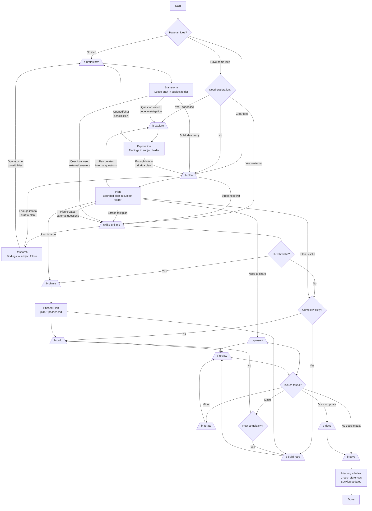
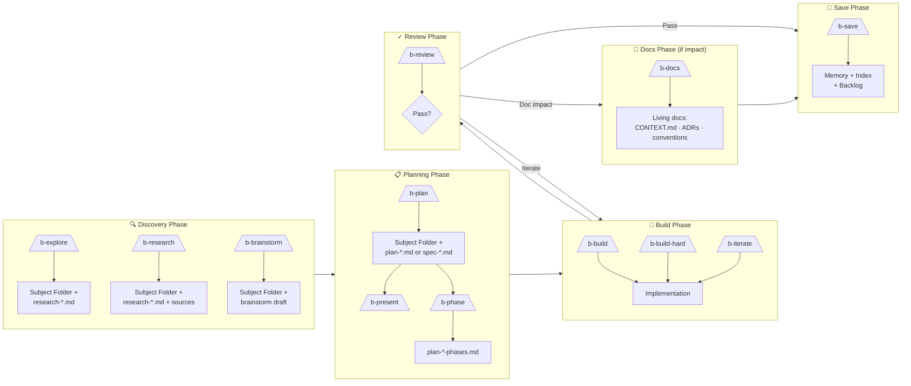

# Buck Workflow

A structured, discoverable workflow for AI-assisted software development with durable context management.

## Philosophy

The Buck workflow is built on one principle: **don't lose work**. It separates **intent** (plans in subject folders) from **record** (history in memory), creating a durable paper trail that survives chat context limits.

**Key Concepts:**
- **Subject Folders**: Group related work (research, plans, specs) by topic and date
- **Cross-References**: Link artifacts so agents can cold-start with full context
- **Prompt/Command Mirrors**: Pi reads `prompts/`; OMP reads `commands/` symlinks to the same prompt bodies
- **Minimal Runtime Hooks**: The wired extension handles model auto-switch and TPS tracking only
- **b-prefix Discoverability**: Type `/b-` to find Buck workflow prompt commands in Pi or OMP

## Runtime package mapping

Pi and OMP discover slash commands differently. This package keeps one
source of truth for command bodies and mirrors only the registration surface:

| Buck concept | Pi primitive | OMP primitive | Current implementation |
|---|---|---|---|
| Most `/b-*` workflow entrypoints | Prompt templates | Slash commands | `prompts/b-*.md`; `commands/b-*.md` symlinks |
| Reusable helper capabilities | Skills | Skills | `skills/*/SKILL.md` |
| Runtime hooks | Extension | Extension | `extensions/index.ts` |
| `/b-save` | Prompt template | Slash command symlink | `prompts/b-save.md`; `commands/b-save.md`; `skills/b-save/SKILL.md` |
| `/b-docs` | Prompt template | Slash command symlink | `prompts/b-docs.md`; `commands/b-docs.md`; `skills/b-docs/SKILL.md` |
| `/b-commit` | Prompt template | Slash command | `prompts/b-commit.md`; `commands/b-commit.md`; `skills/git-commit/SKILL.md` |

Practical translation rules:
- Use a **prompt template** when the main job is to expand a workflow prompt.
- Mirror each prompt into **`commands/`** with a symlink when it must be visible as an OMP slash command.
- Use a **skill** when the behavior is reusable helper logic, not the primary workflow entrypoint.
- Use an **extension** only for runtime hooks that cannot be expressed as prompts or skills. Current wired hooks are model auto-switch and TPS tracking.

**Important:** Historical extension subsystems still exist under `extensions/`, but the package manifest wires only `extensions/index.ts`. See `docs/extension-loading.md` for the loading truth table.

---

## b-flow — Deprecated / Unwired Historical Subsystem

`extensions/b-flow/` remains in the repository as historical code and tests,
but it is **not wired by `package.json`** and should not be documented as the
current autonomous workflow surface. The deprecation lesson is deliberate:
extension-based orchestration that is not observably invoked becomes dead
weight.

Current autonomous-loop guidance lives in prompt/skill surfaces instead:

- Use `b-plan` and `b-phase` for normal phase decomposition.
- Use OMP's user-toggled primitives (`/goal set`, `orchestrate`, `workflow`)
  only when the plan/phase recommends `omp_execution`.
- Use `/b-save` as a pure prompt/skill for durable session recordkeeping.

Detailed b-flow internals are preserved in [docs/b-flow.md](b-flow.md) as an
archival reference, not as active user-facing setup.

---

## OMP Autonomous Loops

buck-workflow plans and phase files are omp-aware. When run inside an
omp session, the workflow can opt into omp's three autonomous-loop
primitives. **None of these are auto-enabled by the workflow** — the
primitives are user-toggled, and the workflow only *recommends* them.
See `skills/cross-platform-pi-omp-loading/SKILL.md` for the
package-level pattern, and `.context/2026-06-06.omp-integration-buck-workflow/`
for the decision log.

### The three primitives

| Primitive | Triggered by | Effect on the workflow |
|---|---|---|
| **`/goal set <objective>`** | User-invoked slash command — **persistent runtime state** | Adds a `goal` tool; injects `goal-mode-active.md`; tracks a token+time budget; enforces a 6-step completion-audit protocol on every active-goal turn. |
| **`orchestrate` keyword** | User types `orchestrate` as a standalone lowercase prose word | Injects a hidden `orchestrate-notice`; switches the model into the orchestrator contract (parallel `task` subagents, no-yield between phases, verify-after-every-phase). |
| **`workflow` keyword** | User types `workflow` or `workflows` as a standalone lowercase prose word | Injects a hidden `workflow-notice`; steers the model to author Python in the `eval` tool, fanning out via `agent()` / `parallel()` / `pipeline()` with a per-turn budget ceiling. |

### How buck-workflow surfaces them

- **Slash-command stubs** at `prompts/omp-orchestrate.md`,
  `prompts/omp-workflow.md`, and `prompts/omp-goal.md` (each
  symlinked into `commands/` for OMP discovery). These are observation
  only — they make the primitives discoverable in the agent's slash
  menu and document the contract.
- **`omp_execution` field on phase files.** When a phase file carries
  `omp_execution: orchestrate | workflow | goal` in its frontmatter,
  `b-phase` writes a "Ralph Mini-Cycle Instructions" expansion that
  tells the user to drop the keyword on the first turn of the phase.
  `omp_execution: none` (the default) is omitted from frontmatter and
  means "standard / no opt-in."
- **Optional `omp_goal_budget: <tokens>` companion field.** When
  `omp_execution: goal`, this hints at the recommended `token_budget`
  to set on the `/goal` session. The user sets the actual budget when
  they run `/goal set`.
- **`b-plan` recommendation rules.** When a plan is large, multi-phase,
  or contains review/audit/sweep/migrate language, `b-plan` recommends
  the field in the plan's Ralph Instructions. It does **not** auto-set
  the field.
- **Eval-cell template for `workflow` plans.** When
  `omp_execution: workflow` is selected, `b-plan` writes a starter
  `.context/<subject>/eval-<topic>.py` (Python) that fans one
  `agent()` per phase. The cell is a **deliverable artifact** the user
  edits before invoking the keyword.
- **`b-review` 6-step completion audit.** The goal-mode completion-audit
  protocol (see `prompts/omp-goal.md`) is mirrored by `b-review`'s
  completion matrix — every unchecked acceptance criterion requires
  direct current-state evidence, uncertainty is treated as not-achieved.

### What the workflow does NOT do

- **Does not auto-insert the magic keywords.** omp's `agent-session.ts:4274`
  guards `if (!options?.synthetic)` — synthetic / agent-initiated turns
  never trigger the notices. The user must say the keyword.
- **Does not auto-`/goal set` for the user.** Goal mode is a
  user-toggled runtime state. The plan can recommend, not enable.
- **Does not write a new b-flow-style extension.** The b-flow
  deprecation (2026-06-01, see `.context/2026-06-01.deprecate-b-flow/`)
  is the lesson: extension-based orchestration that is not observably
  invoked is dead weight. All omp-integration surfaces are
  **prompt-level or skill-level changes** the user runs from the TUI.
- **Does not break on non-OMP harnesses.** Each OMP slash-command stub
  (`prompts/omp-*.md`) opens with a "Harness note" blockquote that
  declares itself a no-op on Pi / Claude Code / OpenCode / Codex. The
  `b-plan` "OMP Execution Recommendation" table has a top-row guard
  that returns `none` on non-OMP, and the eval-cell template prelude
  is wrapped in `try / except ImportError` so the cell degrades to a
  no-op instead of crashing when the omp prelude is missing. Together
  these are the cross-harness safety net — the workflow stays
  authoritative-looking on OMP and silent on every other harness.

### Recommended workflow variations

```
# Standard phased plan with no omp opt-in (default)
/b-explore or /b-research → /b-plan → /skill:b-phase → /b-build → /b-review → /b-docs → /b-save → /b-commit
#                                                            ↺ (repeat per phase)

# Large multi-phase plan that should fan out parallel work
/b-explore or /b-research → /b-plan → /skill:b-phase (omp_execution: orchestrate)
#                                       → drop "orchestrate" on phase 1 turn
#                                       → /b-build / /b-review / /b-docs / /b-save

# Audit / review / migration plan that benefits from eval-cell fan-out
/b-plan → set omp_execution: workflow → b-plan writes eval-<topic>.py
#       → edit cell → drop "workflow" → review outputs

# Single persistent objective across an entire plan
/b-plan → set omp_execution: goal → /goal set "<plan User Goal>" --budget <omp_goal_budget>
#       → b-build works under the active goal → b-review 6-step audit on completion
```

### Cross-references

- **In-repo skill**: `skills/cross-platform-pi-omp-loading/SKILL.md` —
  cross-platform package loading (Pi + OMP), slash-command mirror
  pattern, extension API shim gaps.
- **In-repo skill**: `skills/cross-platform-pi-omp-loading/slash-command-mirror/SKILL.md` —
  the `prompts/` ↔ `commands/` per-file symlink pattern.
- **Research**: `.context/2026-06-06.omp-integration-buck-workflow/research-omp-integration.md` —
  full source-verified analysis of the three primitives.
- **Decision log**: `.context/2026-06-06.omp-integration-buck-workflow/follow-ups.md` —
  follow-ups F1–F9 with the "do not" list and open decisions.
- **Stubs**: `prompts/omp-orchestrate.md`, `prompts/omp-workflow.md`,
  `prompts/omp-goal.md`.


---

## Visual Workflow Overview

### Complete Flow Diagram

**All transitions are loose and context-dependent. The paths shown represent likely transitions, but the workflow is intentionally flexible.**



### Ideation Phase Transitions

**Brainstorm → Research**
When brainstorming reveals questions that need real-world answers before continuing.

**Brainstorm → Plan**
When the brainstorm solidifies into a clear idea that can be turned into a plan (even a first draft).

**Research → Plan**
When research has answered enough questions to form a plan or draft plan.

**Research → Brainstorm**
When research opens up or shuts down possibilities, requiring more ideation.

**Plan → Research**
When the plan surfaces new questions that need investigation before hardening.

**Plan → Build**
When the plan is solid enough to implement.

**Plan → Present**
When you need a human-shareable explanation of the plan for stakeholder review or handoff.

### Command-Only Flow



### Pi Implementation Matrix

```mermaid
flowchart TD
    subgraph Commands["User Commands (/b-*)"]
        C0["/b-explore"]
        C1["/b-research"]
        C2["/b-brainstorm"]
        C3["/b-plan"]
        C4["/b-build"]
        C5["/b-build-hard"]
        C6["/b-iterate"]
        C7["/b-review"]
        C13["/b-docs"]
        C12["/b-commit"]
        C8["/b-save"]
        C9["/skill:b-phase"]
        C10["/skill:b-grill-me"]
        C11["/skill:b-grill-with-docs"]
    end

    subgraph PiPrimitives["Pi Package Primitives"]
        P0["prompts/b-explore.md"]
        P1["prompts/b-research.md"]
        P2["prompts/b-brainstorm.md"]
        P3["prompts/b-plan.md"]
        P4["prompts/b-build.md"]
        P5["prompts/b-build-hard.md"]
        P6["prompts/b-iterate.md"]
        P7["prompts/b-review.md"]
        P13["prompts/b-docs.md<br/>+ skills/b-docs/SKILL.md"]
        P8["skills/b-phase/SKILL.md"]
        P9["skills/b-grill-me/SKILL.md"]
        P10["skills/b-grill-with-docs/SKILL.md"]
        P11["prompts/b-save.md<br/>+ skills/b-save/SKILL.md"]
        P12["prompts/b-commit.md<br/>+ skills/git-commit/SKILL.md"]
    end

    C0 --> P0
    C1 --> P1
    C2 --> P2
    C3 --> P3
    C4 --> P4
    C5 --> P5
    C6 --> P6
    C7 --> P7
    C13 --> P13
    C8 --> P11
    C9 --> P8
    C10 --> P9
    C11 --> P10
    C12 --> P12
```



---

## Workflow Components Reference

### Quick Reference Table

| Component | Runtime primitive | Slash entrypoint | Backing file | Purpose |
|-----------|-------------------|------------------|--------------|---------|
| [**b-explore**](#1-discovery-phase) | Prompt template | `/b-explore` | `prompts/b-explore.md` | Explore codebases, trace architecture, map data flows |
| [**b-research**](#1-discovery-phase) | Prompt template | `/b-research` | `prompts/b-research.md` | External/web research, source collection, evidence capture |
| [**b-brainstorm**](#b-brainstorm--interview-style-intake) | Prompt template | `/b-brainstorm` | `prompts/b-brainstorm.md` | Interview-style intake, loose draft plan |
| [**b-grill-me**](#b-grill-me--complexity-tracked-grilling) | Skill | `/skill:b-grill-me` | `skills/b-grill-me/SKILL.md` | Stress-test plan via interview, track complexity for phasing |
| [**b-grill-with-docs**](#b-grill-with-docs--domain-aware-grilling) | Skill | `/skill:b-grill-with-docs` | `skills/b-grill-with-docs/SKILL.md` | Grill against domain docs (CONTEXT.md, ADRs), track complexity |
| [**b-plan**](#2-planning-phase) | Prompt template | `/b-plan` | `prompts/b-plan.md` | Create bounded implementation plan |
| [**b-phase**](#b-phase--plan-phasing) | Skill | `/skill:b-phase` | `skills/b-phase/SKILL.md` | Break large plans into sequential phases |
| [**b-present**](#b-present--presentation-package) | Prompt template + Skill | `/b-present` | `prompts/b-present.md` + `skills/b-present/` | Generate async-readable presentation package from plan/phase/brainstorm/spec/grill-session |
| [**b-build**](#3-build-phase) | Prompt template | `/b-build` | `prompts/b-build.md` | Standard implementation + model auto-switch |
| [**b-commit**](#b-commit--final-commit) | Prompt template | `/b-commit` | `prompts/b-commit.md` + `skills/git-commit/SKILL.md` | Final commit — backed by `git-commit` skill |
| [**b-build-hard**](#b-build-hard--complexrisky-implementation) | Prompt template | `/b-build-hard` | `prompts/b-build-hard.md` | Complex, ambiguous, or risky implementation |
| [**b-iterate**](#b-iterate--quick-follow-up-fixes) | Prompt template | `/b-iterate` | `prompts/b-iterate.md` | Quick fixes, polish, review-loop edits |
| [**b-review**](#4-review-phase) | Prompt template | `/b-review` | `prompts/b-review.md` | Review + model auto-switch for phased plans |
| [**b-docs**](#b-docs--living-documentation-sync) | Prompt template + Skill | `/b-docs` | `prompts/b-docs.md` + `skills/b-docs/SKILL.md` | Update living docs (CONTEXT.md, ADRs, conventions) when b-review flags impact |
| [**b-save**](#b-save--session-recordkeeping) | Prompt template + Skill | `/b-save` | `prompts/b-save.md` + `skills/b-save/SKILL.md` | Write session memory, stitch cross-references, update backlog/spec state |
**Implementation note:** this package exposes `/b-*` primarily through prompt templates. OMP discovers the same commands through the `commands/` symlink mirror. The wired extension (`extensions/index.ts`) does not register `/b-save`, `/b-commit`, `/b-mode`, `/b-flow`, or `/b-next`.

**[↑ Back to Quick Reference Table](#quick-reference-table)**


---

## Detailed Component Documentation

---

## Runtime Extension Scope

`extensions/index.ts` is intentionally small. It currently owns only:

1. **Model auto-switch** — Reads `buckModelMapping`, detects the active
   phased-plan difficulty, switches model tier for `/b-build`,
   `/b-build-hard`, `/b-iterate`, and `/b-review`, then switches back after
   `agent_end` unless the user manually changed models.
2. **TPS tracker** — Tracks token-per-second generation metrics.

The following older subsystems are **not** wired by the package manifest:

| Subsystem | Current state |
|---|---|
| `/b-save` extension command | Removed; `/b-save` is a pure prompt + skill |
| `/b-mode` and plan-mode write guards | Removed from the wired extension |
| `/b-flow` / `/b-next` orchestration | Historical code in `extensions/b-flow/`; not an active command |
| `b-grill-auto` extension command | Historical/unwired; the skill remains available |
| Session-state injection / tmux status | Removed/unwired |

The durable-artifact behavior now comes from AGENTS.md instructions and
prompt/skill workflows, not from an always-on session-state supervisor.
See [docs/extension-loading.md](extension-loading.md) for the package loading
truth table.
---

### 1. Discovery Phase

#### `/b-explore` — Codebase Exploration

**[↑ Back to Quick Reference Table](#quick-reference-table)**

**Purpose**: Explore unfamiliar codebases, trace architecture and data flows, map module boundaries and dependencies.

**Pi/OMP primitive**: Prompt command (`prompts/b-explore.md` in Pi, `commands/b-explore.md` symlink in OMP)

**Behavior**:
- Creates **subject folder** automatically: `.context/YYYY-MM-DD.<subject-name>/`
- Creates `index.md` as the stable subject entrypoint
- Writes `research-<topic>.md` with `informs: []` for cross-referencing
- Uses code lookup tools for symbol search, outlines, and targeted retrieval
- Read-only outside `.context/` (no source changes)

**When to use**: Codebase investigation, architecture tracing, dependency mapping, blast-radius analysis.

**Output Structure**:
```yaml
---
status: active
date: YYYY-MM-DD
subject: YYYY-MM-DD.subject-name
topics: [keyword, list]
informs: []  # Plans/specs this exploration fed into
---
```

**Next Steps**: `/b-plan` (findings → plan), `/b-research` (if external info needed), `/b-build` (if already clear)

---

#### `/b-research` — External/Web Research

**[↑ Back to Quick Reference Table](#quick-reference-table)**

**Purpose**: Investigate external sources — APIs, libraries, documentation, web resources — and capture findings into durable, incrementally updated research artifacts.

**Pi/OMP primitive**: Prompt command (`prompts/b-research.md` in Pi, `commands/b-research.md` symlink in OMP)

**Behavior**:
- Creates **subject folder** automatically: `.context/YYYY-MM-DD.<subject-name>/`
- Creates `index.md` as the stable subject entrypoint
- Writes incremental notes in `research/` subdirectory during long sessions
- Consolidates into `research-<topic>.md` as the canonical summary
- Uses the **Research Source Dictionary** (`docs/research-source-dictionary.md`) for source selection
- Optional: invokes the `crawl4ai` skill for deep website crawling
- Graceful degradation when web tools are unavailable

**When to use**: API lookup, library research, comparing approaches, verifying standards, any investigation beyond the local codebase.

**Output Structure**:
```yaml
---
status: active
date: YYYY-MM-DD
subject: YYYY-MM-DD.subject-name
topics: [keyword, list]
informs: []  # Plans/specs this research fed into
---
```

**Next Steps**: `/b-plan` (findings → plan), `/b-explore` (if internal investigation needed), `/b-build` (if already clear)

---

#### `/b-brainstorm` — Interview-Style Intake

**[↑ Back to Quick Reference Table](#quick-reference-table)**

**Purpose**: Capture initial thinking through one-question-at-a-time interview, save loose first-draft plan.

**Pi/OMP primitive**: Prompt command (`prompts/b-brainstorm.md` in Pi, `commands/b-brainstorm.md` symlink in OMP)

**Behavior**:
- **Creates subject folder immediately**: `.context/YYYY-MM-DD.<subject-name>/`
- Maintains sidecar state: `.context/YYYY-MM-DD.<subject>/brainstorm-state-<slug>.json`
- Asks ~4 questions max before drafting
- Saves loose draft (not formal plan)
- Never auto-invokes `/b-plan` — user must explicitly ask to formalize

**Resume Behavior**:
- Detects matching subject folders
- Checks sidecar hash for external edits
- Summarizes changes if draft was edited outside the agent

**Output**: Brainstorm draft in subject folder (e.g., `brainstorm-add-oauth-login.md`)

**Next Step**: `/b-plan` to formalize into bounded plan

---

### 2. Planning Phase

#### `/skill:b-grill-me` — Complexity-Tracked Grilling

**[↑ Back to Quick Reference Table](#quick-reference-table)**

**Purpose**: Interview the user relentlessly about a plan, tracking decision-tree complexity. When questions exceed a configurable threshold (default 20), identifies natural break points for phasing.

**Pi/OMP primitive**: Skill (`skills/b-grill-me/SKILL.md`)

**When to Use**: Before or after `/b-plan`, when the user wants to stress-test a plan or design through rapid-fire questions.

**Behavior**:
- Asks questions one at a time, walking the decision tree
- Tracks: question count, decision domains, question types, resolutions
- Creates `grill-session-<topic>.md` in the subject folder
- When threshold exceeded: pauses, identifies break points, recommends `/skill:b-phase`
- Model determines break points based on decision tree shape

**Output**: `grill-session-<topic>.md` with frontmatter metadata:
- `total_questions`, `threshold`, `phasing_recommended`
- `decision_domains` with question ranges and resolution counts
- `break_points` at natural domain boundaries

**Next Steps**: `/b-plan` (to formalize findings), `/skill:b-phase` (if phasing recommended)

---

#### `/skill:b-grill-with-docs` — Domain-Aware Grilling

**[↑ Back to Quick Reference Table](#quick-reference-table)**

**Purpose**: Same as `b-grill-me`, but also challenges the plan against existing domain documentation (CONTEXT.md, ADRs). Updates documentation inline as decisions crystallize.

**Pi/OMP primitive**: Skill (`skills/b-grill-with-docs/SKILL.md`)

**When to Use**: When the project has domain documentation (CONTEXT.md, ADRs) and the user wants to stress-test a plan against established terminology and decisions.

**Additional Behavior** (beyond `b-grill-me`):
- Challenges terms against CONTEXT.md glossary
- Proposes precise canonical terms for fuzzy language
- Updates CONTEXT.md inline when terms are resolved
- Offers ADRs for hard-to-reverse, surprising, trade-off-driven decisions
- Cross-references user claims with actual code

**Output**: Same `grill-session-<topic>.md` plus inline updates to CONTEXT.md and new ADRs.

**Next Steps**: `/b-plan` (to formalize), `/skill:b-phase` (if phasing recommended)

---

#### `/b-plan` — Create Bounded Plan

**[↑ Back to Quick Reference Table](#quick-reference-table)**

**Purpose**: Turn research or task request into bounded implementation plan with scope, risks, verification.

**Pi/OMP primitive**: Prompt command (`prompts/b-plan.md` in Pi, `commands/b-plan.md` symlink in OMP)

**Behavior**:
- **Creates subject folder**: `.context/YYYY-MM-DD.<subject-name>/`
- Writes either:
  - `plan-<topic>.md` — tactical, single-session work
  - `spec-<milestone>-<topic>.md` — strategic, multi-session epic/PRD

**Cross-Reference Stitching**:
1. Checks for existing `research-*.md` in subject folder
2. If found: populates plan's `research:` field + back-fills research's `informs:` field
3. If implementing a spec: populates plan's `spec:` field

**Plan Frontmatter**:
```yaml
---
status: active
date: YYYY-MM-DD
subject: YYYY-MM-DD.subject-name
topics: [keyword, list]
research: [research-file.md]  # If research informed this plan
spec: spec-file.md            # If this plan implements a spec
memory: []                    # Filled by b-save after execution
---
```

**Plan Contents**:
- Goal
- Scope / Out of scope
- Affected files
- Implementation steps
- Verification
- Risks

**Next Steps**: `/b-build` (straightforward), `/b-build-hard` (complex), `/b-review` (critique plan first), `/b-present` (shareable presentation)
- **Also**: `/skill:b-phase` if plan exceeds ~8 steps, ~5 files, or multiple domains

---

#### `/skill:b-phase` — Plan Phasing

**[↑ Back to Quick Reference Table](#quick-reference-table)**

**Purpose**: Break large plans into sequential, independently-verifiable phases when a single session would be risky or cramped.

**Pi/OMP primitive**: Skill (`skills/b-phase/SKILL.md`)

**Trigger**: Manual (`/skill:b-phase`) or recommended by `/b-plan` when the plan is large.

**When to Phase**:
- More than ~8 implementation steps
- Touches more than ~5 distinct files or directories
- Spans multiple architectural layers (DB + API + UI)
- Involves high-risk paths (auth, billing, migrations)
- Contains significant unknowns or research spikes
- Verification alone would exhaust a single session

**Behavior**:
- Reads the most recent `plan-*.md`
- Maps dependencies between plan steps (HARD, SOFT, NONE)
- Groups steps into phases (~equal size, vertical slices)
- Assigns each phase a simple difficulty/model hint: `easy`, `medium`, or `hard`
- Flags parallel opportunities (phases with NO dependency)
- Creates:
  - `plan-<topic>-phases.md` — **overview/index** with summary table, dependency matrix, and links to discrete phase files
  - `phase-N-<slug>.md` — **one per phase** with full implementation details, acceptance criteria, and status tracking

**Dependency Types**:
- **HARD**: Phase N cannot start until Phase N-1 completes
- **SOFT**: Phase N can start with stubs/mocks
- **NONE**: Phases are independent, could be parallel

**Difficulty / Model Hint Rubric**:
- **easy** — bounded, local, mostly mechanical work; smaller/faster general model is fine; usually `/b-build`
- **medium** — some cross-file reasoning or moderate verification; capable general model preferred; usually `/b-build`
- **hard** — ambiguous, failure-sensitive, or architecture-touching work; strongest reasoning model available; use `/b-build-hard`

**Output**: Two types of files:

1. **Phases overview** (`plan-<topic>-phases.md`): lightweight index with:
   - Summary table: phase name, status, difficulty, link to phase file
   - Dependency matrix and diagram
   - Parallel opportunities section
   - Execution order notes

2. **Discrete phase files** (`phase-N-<slug>.md`): one per phase with:
   - Frontmatter: `status`, `phase`, `difficulty`, `depends_on`, `acceptance_criteria`, `completed_at`
   - Body: implementation details, context, risks, verification steps
   - Status flow: `pending` → `in-progress` → `completed`

**Resume Behavior**:
Any b-* command can pick up where work left off:
1. Read the phases overview → find the first non-completed phase in the summary table
2. Read that discrete phase file → get full implementation details
3. Execute

This works even with zero conversation history — a cold-start agent gets full context from the phase file.

**Backwards Compatibility**: Legacy single-file `plan-*-phases.md` plans (without `format: discrete` frontmatter) continue to work. The extension and b-build/b-build-hard prompts detect format automatically.

**Next Steps**: Execute Phase 1 via `/b-build` or `/b-build-hard`, guided by the phase's difficulty/model hint

---

#### `/b-present` — Presentation Package

**[↑ Back to Quick Reference Table](#quick-reference-table)**

**Purpose**: Generate an async-reading-first presentation package (small static site) from plans, phases, brainstorms, specs, grill sessions, or research. The package includes a primary overview page, optional detail pages, rendered source views, and a manifest.

**Pi/OMP primitives**: Prompt command (`prompts/b-present.md` / `commands/b-present.md`) + Skill (`skills/b-present/SKILL.md`)

**Supported Sources**:
- Plans (`plan-*.md`)
- Phased plans (`plan-*-phases.md` + `phase-N-*.md`)
- Brainstorms (`brainstorm-*.md`)
- Specs (`spec-*.md`)
- Grill sessions (`grill-session-*.md`)
- Research (`research-*.md`)

**Input Resolution Order**:
1. Explicit path argument
2. Phased plan overview
3. Single plan in active subject folder
4. Brainstorm output
5. Spec
6. Grill session
7. Research
8. If multiple plausible sources at same precedence, stop and ask
9. Newest artifact in subject folders
10. Fail with clear error if nothing found

**Output Location**:
```
presentations/<slug>/
├── index.html          # Primary overview (required)
├── architecture.html   # Optional detail page
├── phases.html         # Optional detail page
├── verification.html   # Optional detail page
├── appendix.html       # Optional detail page
├── assets/             # CSS, JS, shared resources
├── sources/            # Copied markdown source artifacts
└── manifest.json       # Semi-public package metadata
```

**Package Features**:
- Primary overview page with sticky sidebar navigation (responsive)
- Optional detail pages for phases, architecture, verification, or appendix
- Rendered source views via client-side markdown renderer
- Mermaid diagrams generated from source content (never invented)
- Tiered styling: overview most polished, detail pages simpler, source views utilitarian
- manifest.json for regeneration cleanup
- Local preview server started automatically

**Detail Page Rules**:
- `phases.html` — when phased plan adds significant detail or complexity would clutter overview
- `architecture.html` — when architecture needs more than a compact overview
- `verification.html` — when detailed checks would distract from main narrative
- `appendix.html` — non-essential supporting material, never core narrative

**Typical Next Step**: `/b-review` for accuracy review, `/b-build` after approval

#### Session-scoped model persistence

`/b-build`, `/b-iterate`, and `/b-review` can persist model selection within a session. Behavior:

- First use in a fresh session uses the default model.
- Manual model changes made during the active Buck session become sticky for later runs.
- Starting a new session clears overrides and restores defaults.
- Overrides are session-scoped only.

---

### Model Auto-Switch Configuration

Buck can automatically switch the active model based on the difficulty of the current phased plan phase. When a mismatch is detected between the active model's tier and the phase's difficulty, it switches to the mapped model and switches back after the phase completes.

**Triggers**: `/b-build`, `/b-build-hard`, `/b-iterate`, `/b-review`

**Configuration**: Add `buckModelMapping` to your Pi settings file:

```json
// Global: ~/.pi/agent/settings.json
// Project override: .pi/settings.json (takes precedence)
{
  "buckModelMapping": {
    "easy":   "zai-glm/glm-4.7-flash",
    "medium": "anthropic/claude-sonnet-4-6",
    "hard":   "anthropic/claude-opus-4-7"
  }
}
```

**Model IDs**: Use the `provider/model-id` format shown in Pi's model selector (e.g., `zai-glm/glm-4.7-flash`, `anthropic/claude-opus-4-7`).

**Behavior without mapping configured**:
- First trigger fires an **interactive model picker** built with Pi's custom TUI components — shows all available models (those with API keys configured), groups them by tier (easy/medium/hard based on current config), and prompts the user to pick one model per tier
- Picks are written directly to `~/.pi/agent/settings.json` as `buckModelMapping`
- Picker shows explicit controls on screen: `↑↓ navigate • Enter select • Esc cancel`
- User is notified to run `/reload` to activate
- If user cancels the picker, the offer is skipped for the rest of that session
- For non-phased plans after setup: sends a soft info notification suggesting a model tier based on plan complexity

**Behavior with mapping configured**:
- Reads the active phase's `**Difficulty**` label from `plan-*-phases.md`
- Compares current model tier to required tier
- If mismatched → auto-switches to the mapped model
- After the agent turn ends → switches back to the original model
- If the user manually switches models mid-phase → respects the change and cancels the switch-back

**Phase difficulty tiers** (from `/skill:b-phase`):
- **easy** — bounded, mechanical work → mapped `easy` model
- **medium** — moderate cross-file reasoning → mapped `medium` model
- **hard** — ambiguous, architecture-touching → mapped `hard` model

**Non-phased plans** (no `plan-*-phases.md` found): a soft info notification suggests a tier based on complexity heuristics. No auto-switch.

### 3. Build Phase

#### `/b-build` — Standard Implementation

**[↑ Back to Quick Reference Table](#quick-reference-table)**

**Purpose**: Implement well-defined work with smallest safe code change.

**Pi/OMP primitive**: Prompt command (`prompts/b-build.md` in Pi, `commands/b-build.md` symlink in OMP)

**Resolution Order** (for finding plans):
1. Active subject folder: `.context/YYYY-MM-DD.[:subject]/plan-*.md`, `spec-*.md`
2. All subject folders: `.context/*/plan-*.md`, `*/spec-*.md`
3. Flat directories (legacy): `.context/plans/*.md`, `.context/specs/active/*.md`
4. Backlog: `.context/backlog/todo.md` (legacy fallback: `.context/backlog.md`)

**Cross-Reference Following**:
- Reads plan's `research:` files for context
- Reads plan's `spec:` file to verify requirements
- If building ad-hoc (no subject folder), `b-save` will create one at session end

**Session Awareness Protocol**:
1. Read `.context/workflow/current-session.json` at start
2. Update living memory file at each natural stop
3. Tell user "Run /b-save to finalize" at completion

**Model Routing + Auto-Switch** (b-build):
- If no `buckModelMapping` configured → soft suggestion notification (based on plan step/file count)
- If `buckModelMapping` configured:
  - Phased plan active phase → auto-switch to mapped model for that difficulty tier
  - Mismatch detected → switches automatically, switches back after agent_end
  - User manually switches mid-phase → respects the change, cancels switch-back
- Without phased plan → uses default model

**Escalate To**: `b-build-hard` if task becomes ambiguous, architectural, or spreads beyond expected files — or if the active phase is rated **hard**.

**Next Step**: `/b-review` for validation

---

#### `/b-build-hard` — Complex/Risky Implementation

**[↑ Back to Quick Reference Table](#quick-reference-table)**

**Purpose**: Handle ambiguous, multi-file, or higher-risk implementation work.

**Pi/OMP primitive**: Prompt command (`prompts/b-build-hard.md` in Pi, `commands/b-build-hard.md` symlink in OMP)

**Same resolution order and cross-reference following as b-build.**

**Key Differences from b-build**:
- Think through trade-offs before editing
- Break changes into safe steps
- Preserve behavior unless change is required
- Surface risks and migration concerns clearly
- Run stronger verification
- **Phased plan awareness**: if a `plan-*-phases.md` exists, read it, surface the active phase's difficulty/model hint, and scope work to that phase only

**Escalation Trigger**: When `/b-build` encounters ambiguity, architectural changes, or scope growth.

**Next Step**: `/b-review` for validation

---

#### `/b-iterate` — Quick Follow-Up Fixes

**[↑ Back to Quick Reference Table](#quick-reference-table)**

**Purpose**: Handle review feedback, polish, cleanup — keep momentum without reopening full implementation cycle.

**Pi/OMP primitive**: Prompt command (`prompts/b-iterate.md` in Pi, `commands/b-iterate.md` symlink in OMP)

**Context Resolution**:
1. **Explicit argument** — user-provided path or description
2. **Iteration artifact** — scans for `iterate-*.md` in subject folders; auto-picks if exactly one exists
3. **Review findings in memory** — checks most recent memory file
4. **User request** — falls back to inline description

**Best For**:
- Rename and string fixes
- Lint or formatting cleanup
- Small follow-up edits from review
- Lightweight diagnostics or logging

**Behavior**:
- Prefer tiny, focused changes
- Escalate to `b-build` if work spreads
- Re-run lightweight verification
- Hand back to `b-review` when done
- When working from an `iterate-*.md` artifact, marks it `status: completed` on finish

**Model Routing** (b-iterate):
- Fresh session → default model
- Manual model change during active Buck session → sticky session override
- New session → reset to default

**Escalation Trigger**: When fix grows beyond "small iteration" scope.

**Next Step**: `/b-review` to re-check changes

---

### 4. Review Phase

#### `/b-review` — Implementation Validation

**[↑ Back to Quick Reference Table](#quick-reference-table)**

**Purpose**: Review implementation changes for correctness, scope adherence, regressions, and workflow compliance.

**Pi/OMP primitive**: Prompt command (`prompts/b-review.md` in Pi, `commands/b-review.md` symlink in OMP)

**Important**: `b-review` is **read-only**. It should not modify files.

**Use After**:
- `/b-build` — standard implementation review
- `/b-build-hard` — complex implementation review
- `/b-iterate` — small follow-up changes review

**Scope Review** (same resolution order as build agents):
1. Active subject folder → plan-*.md, spec-*.md
2. All subject folders
3. Flat directories (legacy)
4. Backlog

**Cross-Reference Following**:
- Read plan's `research:` files for context
- Read plan's `spec:` file to verify requirements
- Read spec's `plans:` array to verify coverage

**What It Reviews**:
- Implementation changes (staged or committed code)
- **Not plans** — plan review happens implicitly during build when builder reads plan
- Correctness, edge cases, regressions
- Security issues and risky assumptions

**Model Routing + Auto-Switch** (b-review):
- Triggers the same auto-switch logic as build agents when working with phased plans
- If reviewing a `hard` phase → auto-switches to the mapped hard-tier model
- Soft suggestion notification for non-phased plans when mapping is configured

**Output Structure**:
```text
Summary
Critical issues
Warnings
Suggested next step
```

**Iteration Artifact** (when issues are found):
- Writes `iterate-<subject>.md` to the active subject folder
- Captures critical issues, warnings, file paths, and proposed fixes
- Enables fresh-session iteration: run `/b-iterate` to pick up where review left off
- Only written when there are actual issues — clean reviews skip this

**Recommendations**:
- `/b-iterate` — for small follow-up fixes
- `/b-build` — for normal-sized revisions
- `/b-build-hard` — for larger or riskier rework

**History Check**: After accepted work, recommends `/b-save` to record completed work in history.

#### `/b-docs` — Living-Documentation Sync

**[↑ Back to Quick Reference Table](#quick-reference-table)**

**Purpose**: Keep the project's living documentation in sync with what was implemented — domain language, architecture decisions, conventions, and architecture narrative. Records *meaning* (what the code now is); `/b-save` records the *event* (what happened this session). The two are complementary.

**Pi/OMP primitive**: Prompt command + skill (`prompts/b-docs.md`, `commands/b-docs.md`, `skills/b-docs/SKILL.md`)

**Conditional**: `/b-docs` runs only when `/b-review` flags documentation impact. Most changes need no doc update and skip it.

**Canonical doc locations** (the writer's surface — reuse existing formats, never invent parallel docs):
- Domain language → `CONTEXT.md` (or `CONTEXT-MAP.md` + per-context) — format in `skills/b-grill-with-docs/CONTEXT-FORMAT.md`
- Architecture decisions → `docs/adr/0001-slug.md` (sequential) — format in `skills/b-grill-with-docs/ADR-FORMAT.md`
- Agent/dev conventions → idempotent managed block in `AGENTS.md` / `CLAUDE.md`
- Architecture narrative → `docs/`
- `README.md` → read-only (flag only)

**ADR gate**: an ADR is written only when the decision is hard to reverse, surprising without context, and the result of a real trade-off.

**Read-only on `.context/`**: writes only to living docs; session memory is `/b-save`'s job.

**Recommendations**: run before `/b-save` so doc changes land in the commit; then `/b-save` → `/b-commit`.

### 5. Save Phase

#### `/b-save` — Record History

**[↑ Back to Quick Reference Table](#quick-reference-table)**

**Purpose**: Checkpoint session state and record completed work to the canonical history ledger.

**Pi/OMP primitive**: Prompt command + skill (`prompts/b-save.md`, `commands/b-save.md`, `skills/b-save/SKILL.md`)

`/b-save` is a **pure prompt/skill command**. There is no extension handler.
The model executes the prompt instructions directly, reads
`.context/workflow/current-session.json` when it exists, and writes only to
`.context/`.

**Usage**:
```
/b-save
```

**11 Core Responsibilities**:

1. **Read Session State** — Read `.context/workflow/current-session.json` for context
2. **Subject Folder** — Create if missing; consolidate loose artifacts
3. **Memory Creation** — Create/update session memory file with proper frontmatter
4. **Cross-Reference Stitching** — Back-fill `memory:` arrays in plan/spec files
5. **Backlog Update** — Mark completed tasks (remove from `todo.md`, archive item file), add deferred items (create item file + `todo.md` entry). Legacy fallback: `.context/backlog.md`
6. **Spec Status Updates** — Set `status: completed` (no file moves)
7. **Index Update** — Update `.context/memory/index.md`
8. **QMD Re-index** — Make new memory searchable (if QMD available)
9. **Phase State Consolidation** — Verify discrete phase file states match reality; update overview table if stale
10. **Iterate Artifact Consolidation** — Scan for `iterate-*.md` files; verify completion, update status if work was done, include in memory `artifacts:` list, back-fill plan with `iterations:` reference
11. **User Goal Check** — Warn when active plan/brainstorm artifacts lack `## User Goal` and have no `Technical chore — <reason>` waiver

**Memory Frontmatter**:
```yaml
---
date: YYYY-MM-DD
domains: [tooling, refactor]
topics: [b-save, session-persistence]
subject: YYYY-MM-DD.subject-name        # Subject folder linkage
artifacts: [plan-oauth.md]              # Files touched this session
related: []
priority: high
status: active
---
```

**When to Use**:
- After completing any significant work
- Before `/new` to start fresh
- Before context compaction
- End of work session
- Switching tasks mid-session

**Key Principle**: Plans live in subject folders (intent). History lives in `.context/memory/` (record). `/b-save` turns intent into record.

### 6. Commit Phase

#### /b-commit — Final Commit

**[↑ Back to Quick Reference Table](#quick-reference-table)**

**Purpose**: Create a Conventional Commits message from staged changes and commit immediately. The final Buck workflow step after `/b-save` has recorded durable context.

**Pi/OMP primitive**: Prompt command (`prompts/b-commit.md` in Pi, `commands/b-commit.md` symlink in OMP), backed by `skills/git-commit/SKILL.md`.

**Usage**:
```
/b-commit          # Normal commit
/b-commit force    # Override protected-branch restriction
```

**When to use**:
- After `/b-save` has recorded memory and updated artifacts
- Each completed phase or body loop unit should produce its own commit
- Ralph loops: run `/b-commit` before `ralph_done`

**Phase/body commit invariant**: One completed unit = one commit. Do not batch multiple completed phases into a single commit.

**Workflow completion sequence**:
```
/b-build → /b-review → /b-iterate if in-plan issues → /b-docs if doc impact → /b-save → /b-commit
```

**Out-of-plan findings** (new scope beyond the plan) do not iterate — close accepted work (`/b-save` → `/b-commit`), then start a separate `/b-plan` → `/b-build` cycle. `/b-iterate` is for in-plan defects only.

**Safety**: Protected branches (main, master, develop) are guarded — use `force` only for hotfixes.

---


## Subject Folder System

### Folder Structure

```
.context/
├── YYYY-MM-DD.subject-name/           # Subject folder (date-prefixed)
│   ├── index.md                        # Subject entrypoint (links all artifacts)
│   ├── research-<topic>.md             # Research findings (canonical summary)
│   ├── research/                       # Incremental research notes (optional)
│   │   ├── notes-<topic>.md
│   │   └── sources-<topic>.md
│   ├── plan-<topic>.md                 # Implementation plan
│   ├── plan-<topic>-phases.md          # Phases overview (if phased)
│   ├── phase-1-<slug>.md               # Discrete phase files (if phased)
│   ├── phase-2-<slug>.md
│   ├── spec-<milestone>-<topic>.md    # Strategic spec (multi-session)
│   ├── iterate-<subject>.md            # Review findings + proposed fixes
│   └── brainstorm-state-<slug>.json     # Sidecar state (if brainstormed)
│
├── memory/                             # Session history
│   ├── index.md                        # History ledger
│   └── <topic>-YYYY-MM-DD.md           # Session notes
│
├── workflow/                           # Optional prompt-read session state
│   └── current-session.json            # Read by /b-save if present
│
├── backlog/                         # Active queue + per-item detail
│   ├── todo.md                       # Active items (linked checkboxes)
│   ├── items/<slug>.md              # Per-item detail
│   └── archive/                      # Completed items
├── plans/                              # Legacy (backward compat)
└── specs/                              # Legacy (backward compat)
    ├── active/
    └── archive/
```

### Naming Convention

**Subject Folders**: `YYYY-MM-DD.<kebab-case-subject>/`
- Date prefix keeps folders chronologically sortable
- Subject name describes the work
- Example: `2026-04-08.auth-feature/`

**Files Within**:
- `research-<topic>.md` — Research artifacts
- `plan-<topic>.md` — Tactical plans
- `spec-<milestone>-<topic>.md` — Strategic specs
- `iterate-<subject>.md` — Review findings and proposed fixes

### Resolution Order

All b-* agents search for artifacts in this order:

1. **Subject `index.md`** (if present): `.context/YYYY-MM-DD.[:subject]/index.md` — read first for fast artifact discovery
2. **Active subject folder** (from session context): `.context/YYYY-MM-DD.[:subject]/`
3. **All subject folders**: `.context/*/{plan,spec,research}-*.md`
4. **Flat directories** (legacy): `.context/plans/`, `.context/specs/active/`
5. **Backlog**: `.context/backlog/todo.md` (legacy fallback: `.context/backlog.md`)

This ensures **zero breaking changes** for existing projects.

---

## Cross-Reference System

### Link Map

```
                    ┌─────────────┐
                    │   Memory    │
                    │ (session)   │
                    └──────┬──────┘
                           │ subject: → folder
                           │ artifacts: → [plan, spec, research]
                           │
        ┌──────────────────┼──────────────────┐
        ▼                  ▼                  ▼
  ┌───────────┐    ┌─────────────┐    ┌─────────────┐
  │ Research   │    │    Plan     │    │    Spec     │
  │            │───▶│             │───▶│             │
  │ informs:[] │    │ research:[] │    │ plans:[]    │
  └───────────┘    │ spec:       │    │ memory:[]   │
                   │ memory:[]   │    └─────────────┘
                   └─────────────┘
```

### Frontmatter Link Fields

| Entity | Field | Points To | Example |
|--------|-------|-----------|---------|
| **Research** | `informs:` | Plans/specs this research fed into | `[plan-oauth-login.md]` |
| **Plan** | `research:` | Research files that informed this plan | `[research-oauth-providers.md]` |
| **Plan** | `spec:` | Spec this plan implements | `spec-v1-auth-mvp.md` |
| **Plan** | `memory:` | Memory files recording execution | `[auth-impl-2026-04-08.md]` |
| **Spec** | `plans:` | Plans that implement this spec | `[plan-oauth-login.md]` |
| **Spec** | `memory:` | Memory files recording work on this spec | `[auth-research-2026-03-15.md]` |
| **Memory** | `subject:` | Subject folder this session relates to | `2026-04-08.auth-feature` |
| **Memory** | `artifacts:` | Specific files touched this session | `[plan-oauth-login.md, research-oauth-providers.md]` |

### Link Rules

- Links use **filenames only** (not full paths) for files within the same subject folder
- Links to memory files use the memory filename
- All link fields are arrays (except `spec:` which is single file)
- Empty arrays `[]` are valid
- **b-save is responsible for stitching**: back-fills `memory:` links after creating memory files

---

## Runtime Extension

### Purpose

The wired extension is operational support, not the source of workflow
truth. Durable context comes from AGENTS.md plus prompt/skill commands.

### Current hooks

| Hook | Purpose |
|-------|---------|
| `session_start` | Capture current working directory for model-switch lookups |
| `input` | Detect model-switch-eligible `/b-*` commands |
| `before_agent_start` | Run model-switch setup/check before build/review commands |
| `model_select` | Detect user-initiated model changes and respect them |
| `agent_end` | Switch back to the original model after phase-scoped work |
| TPS tracker hooks | Track token-per-second metrics during generation |

### Model auto-switch

The extension reads `buckModelMapping` from Pi settings, finds the active
phase difficulty in `.context/`, switches to the mapped model for
`/b-build`, `/b-build-hard`, `/b-iterate`, and `/b-review`, and switches back
after the agent turn unless the user manually selected a different model.

### What is no longer extension-owned

- `/b-save` is pure prompt/skill recordkeeping.
- There is no wired `/b-mode` command or plan-mode write guard.
- There is no wired `/b-flow` or `/b-next` command.
- Session-state injection and idle warnings are not part of the current
  package surface.

---

## Historical Reference: OpenCode Configuration

The Buck workflow was originally developed for OpenCode. The configuration model differed significantly from Pi. This section is retained for historical context only.

### OpenCode Config Model (Historical)

| Concept | OpenCode | Pi equivalent |
|---------|----------|---------------|
| Custom commands | `command/b-*.md` files | Prompt templates (`prompts/b-*.md`) |
| Agent definitions | `opencode.json` agent blocks | N/A (prompt templates serve this role) |
| Agent roles | `primary` / `subagent` modes | N/A |
| Agent persona files | `agent/*.md` / `agents/*.md` | N/A (prompt content is inline) |
| Plugin system | `plugins/buck-workflow.ts` | Extension (`extensions/index.ts`) |
| Model configuration | Per-agent in `opencode.json` | Per-project in Pi config |

### OpenCode File Locations (Historical)

These paths were used in the OpenCode deployment (managed via chezmoi):

| Config | Deployed Path |
|--------|---------------|
| Main config | `~/.config/opencode/opencode.json` |
| Buck workflow plugin | `~/.config/opencode/plugins/buck-workflow.ts` |
| Commands | `~/.config/opencode/command/b-*.md` |
| Prompts | `~/.config/opencode/prompts/b-*.md` |
| Agent personas | `~/.config/opencode/agent/*.md` |

---

## Recommended Workflows

### New Work (Standard)

```
/b-explore or /b-research → /b-plan → /b-present → /b-build → /b-review → /b-docs → /b-save → /b-commit
```

### New Work (with brainstorming)

```
/b-brainstorm → /b-plan → /b-present → /b-build → /b-review → /b-docs → /b-save → /b-commit
```

### Complex/Risky Work

```
/b-explore or /b-research → /b-plan → /b-build-hard → /b-review → /b-docs → /b-save → /b-commit
```

### Large Plan (Multi-Session)

```
/b-explore or /b-research → /b-plan → /skill:b-phase → /b-build → /b-review → /b-docs → /b-save → /b-commit
                                              ↺ (repeat per phase)
```

### Quick Fix Loop

```
/b-iterate → /b-review
```

### Review Fix Loop (in-plan issues only)

```
/b-review → /b-iterate → /b-review → (repeat until pass) → /b-docs → /b-save → /b-commit
```

This loop fixes **in-plan defects** — work the plan specified that is broken or incomplete. Out-of-plan findings (new scope) are not iterated; they become a follow-up `/b-plan` → `/b-build`.

### Ad-Hoc Work (no planning)

```
/b-build → /b-review → /b-docs → /b-save → /b-commit
(Subject folder created automatically by b-save)
```

---

## Discoverability

Type `/b-` in Pi or OMP to see Buck workflow commands:
- `/b-commit`
- `/b-brainstorm`
- `/b-build`
- `/b-build-hard`
- `/b-explore`
- `/b-iterate`
- `/b-plan`
- `/b-present`
- `/b-research`
- `/b-review`
- `/b-save` — pure prompt/skill recordkeeping command (run before `/b-commit`)

Also available:
- `/skill:b-phase` — Break large plans into phases (use after `/b-plan` when plan is large)
- `/skill:b-grill-me` — Stress-test a plan via interview with complexity tracking
- `/skill:b-grill-with-docs` — Same as b-grill-me, plus domain doc awareness (CONTEXT.md, ADRs)

**OMP autonomous-loop primitives** (user-toggled; buck-workflow only *recommends* them — see [OMP Autonomous Loops](#omp-autonomous-loops) above):
- `/omp-orchestrate` — Document the `orchestrate` keyword contract. User must type the keyword on the relevant turn.
- `/omp-workflow` — Document the `workflow` keyword contract. User must type the keyword on the relevant turn.
- `/omp-goal` — Document the `/goal` runtime state and the 6-step completion-audit protocol.

## Version
Last updated: 2026-06-07
