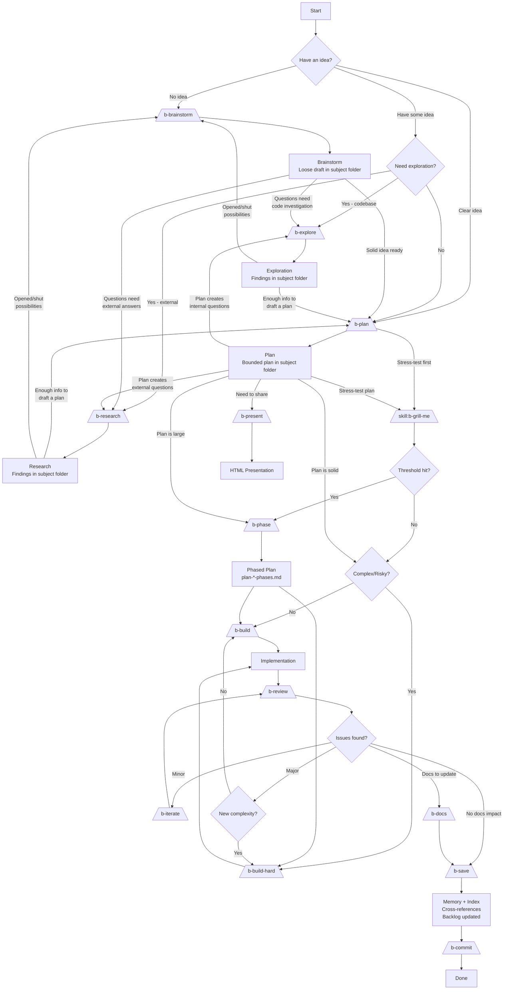
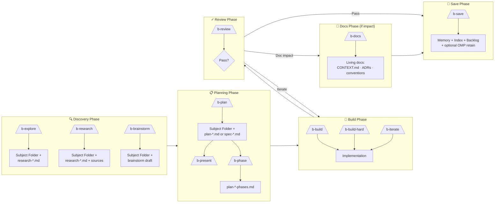

# Buck Workflow

A structured, discoverable workflow for AI-assisted software development with durable context management.

## Philosophy

The Buck workflow is built on one principle: **don't lose work**. It separates **intent** (plans in subject folders) from **record** (history in memory), creating a durable paper trail that survives chat context limits.

**Key Concepts:**
- **Subject Folders**: Group related work (research, plans, specs) by topic and date
- **Cross-References**: Link artifacts so agents can cold-start with full context
- **Prompt/Command Mirrors**: Pi reads `prompts/`; OMP reads `commands/` — mostly symlinks to the same prompt bodies, with eight real-file exceptions documented in [docs/extension-loading.md](extension-loading.md#the-commands-vs-prompts-discrepancy)
- **Composed Runtime Extension**: One manifest entry (`extensions/index.ts`) wires model auto-switch, TPS tracking, the deterministic `*-improved` commands, `/buck-loop`, and an opt-in plan-artifact bridge
- **b-prefix Discoverability**: Type `/b-` to find Buck workflow prompt commands in Pi or OMP

### Subject lifecycle authority

`skills/_shared/scripts/subject-lifecycle.ts` is the only supported writer for
subject lifecycle fields in `.context/<subject>/index.md`. Callers use four
intents: `initialize` (missing → draft), `activate` (draft → active),
`close-verified` (active → completed after plan-scoped evidence verification),
and confirmed `reopen` (completed → active with a reason). `inspect` reports
canonical and legacy provenance plus the effective state used for selection.

Plan, phase, iterate, spec, memory, and backlog `status:` fields are separate
artifact contracts. Callers may update those fields directly; they must not
emulate a subject lifecycle transition. `npm run subject-lifecycle:check`
enforces this policy across shipped TypeScript and workflow instructions. The
Codex bundle carries a byte-identical `_shared` authority copy.

## Runtime package mapping

Pi and OMP discover slash commands differently. This package keeps one
source of truth for command bodies and mirrors only the registration surface:

| Buck concept | Pi primitive | OMP primitive | Current implementation |
|---|---|---|---|
| Most `/b-*` workflow entrypoints | Prompt templates | Slash commands | `prompts/b-*.md`; `commands/b-*.md` symlinks |
| Reusable helper capabilities | Skills | Skills | `skills/*/SKILL.md` |
| Runtime hooks | Extension | Extension | `extensions/index.ts` |
| `/b-save` | Prompt template | Slash command symlink | `prompts/b-save.md`; `commands/b-save.md`; `skills/b-save/SKILL.md` (+ optional OMP retain) |
| `/b-docs` | Prompt template | Slash command symlink | `prompts/b-docs.md`; `commands/b-docs.md`; `skills/b-docs/SKILL.md` |
| `/b-howto` | Prompt template | Slash command symlink | `prompts/b-howto.md`; `commands/b-howto.md`; `skills/b-howto/SKILL.md` |
| `/b-recap` | Prompt template | Slash command symlink | `prompts/b-recap.md`; `commands/b-recap.md`; `skills/b-recap/SKILL.md` (read-only session recap) |
| `/b-commit` | Prompt template | Slash command | `prompts/b-commit.md`; `commands/b-commit.md`; `skills/git-commit/SKILL.md` |
| `fix-pr` (skill-only) | Skill | Skill | `skills/fix-pr/SKILL.md` — no `prompts/`/`commands/` wrapper; invoke `/skill:fix-pr` |
| `/b-diagnose` | Prompt template | Slash command symlink | `prompts/b-diagnose.md`; `commands/b-diagnose.md`; `skills/b-diagnose/SKILL.md` |
| `codebase-design` (skill-only) | Skill | Skill | `skills/codebase-design/SKILL.md` — no `prompts/`/`commands/` wrapper; invoke `/skill:codebase-design` |
| `/b-handoff` | Prompt template | Slash command symlink | `prompts/b-handoff.md`; `commands/b-handoff.md`; `skills/b-handoff/SKILL.md` |
| `writing-for-agents` (skill-only) | Skill | Skill | `skills/writing-for-agents/SKILL.md` — no `prompts/`/`commands/` wrapper; invoke `/skill:writing-for-agents` |
| `skill-explainer` (skill-only) | Skill | Skill | `skills/skill-explainer/SKILL.md` — no `prompts/`/`commands/` wrapper; invoke by skill name |
| `/b-wizard` | Prompt template | Slash command symlink | `prompts/b-wizard.md`; `commands/b-wizard.md`; `skills/b-wizard/SKILL.md` + `template.sh` |
| `/b-init-tracker` | Prompt template | Slash command symlink | `prompts/b-init-tracker.md`; `commands/b-init-tracker.md`; `skills/b-init-tracker/SKILL.md` |
| `/b-triage` | Prompt template | Slash command symlink | `prompts/b-triage.md`; `commands/b-triage.md`; `skills/b-triage/SKILL.md` |
| `/b-pr` | Prompt template + Skill | Slash command | `prompts/b-pr.md`; `commands/b-pr.md` (thin loader real file); `skills/b-pr/SKILL.md` |
| `/b-pr-improved` | Extension command | Slash command (real file) | `commands/b-pr-improved.md`; `extensions/b-pr-improved/`; falls back to `skills/b-pr/` |
| `/b-pr-review-2-issues` | Prompt template + Skill | Slash command | `prompts/b-pr-review-2-issues.md`; `commands/b-pr-review-2-issues.md` (thin loader real file); `skills/b-pr-review-2-issues/SKILL.md` |
| `/b-eval-upstream-prs` | Prompt template + Skill | Slash command symlink | `prompts/b-eval-upstream-prs.md`; `commands/b-eval-upstream-prs.md`; `skills/b-eval-upstream-prs/SKILL.md` |
| `b-issue-create` (skill-only) | Skill | Skill | `skills/b-issue-create/SKILL.md` — no `prompts/`/`commands/` wrapper |
| `b-auto-fix` (skill-only) | Skill | Skill | `skills/b-auto-fix/SKILL.md` — consumes `ready-for-agent` issues from `b-triage` |
| `b-backlog` (skill-only) | Skill | Skill | `skills/b-backlog/SKILL.md` — backlog item authoring delegated to a subagent |
| `b-blueprint` (skill-only) | Skill | Skill | `skills/b-blueprint/SKILL.md` — single-page HTML architecture blueprint from plans/phases |
| `b-arch-qa` (skill-only) | Skill | Skill | `skills/b-arch-qa/SKILL.md` — live architecture Q&A into a durable discussion doc |
| `/b-loop` (skill-only) | Skill | Skill | `skills/b-loop/SKILL.md` — stamp `omp_execution` on phase files; advisory only |
| `/buck-loop` | Extension command | Slash command (extension) | `extensions/buck-loop/` — observably invoked existing-plan runner; not `/b-loop` |
| `b-grill` (skill-only) | Skill | Skill | `skills/b-grill/SKILL.md` — unified grill skill with `user`/`auto` modes |
| `/b-fix-rebase-conflict` | Prompt template + Skill | Slash command symlink | `prompts/b-fix-rebase-conflict.md`; `commands/b-fix-rebase-conflict.md`; `skills/b-fix-rebase-conflict/SKILL.md` |
| `b-hindsight-import-projects` (skill-only) | Skill | Skill | `skills/b-hindsight-import-projects/SKILL.md` — multi-project wrapper over `b-memory-import` |
| `/b-commit-improved` | Extension command | Slash command (real file) | `commands/b-commit-improved.md`; `prompts/b-commit-improved.md`; `extensions/b-commit-improved/`; falls back to `skills/git-commit-improved/` |
| `/b-save-improved` | Extension command | Slash command (real file) | `commands/b-save-improved.md`; `prompts/b-save-improved.md`; `extensions/b-save-improved/`; falls back to `skills/b-save-improved/` |
| `/b-kamal-release` | Extension command | Slash command (real file, OMP-only) | `commands/b-kamal-release.md`; `extensions/b-kamal-release/` |
| `/git-clean-orphans` | Skill | Slash command (real file, OMP-only) | `commands/git-clean-orphans.md`; `skills/git-clean-orphans/SKILL.md` |
| `/product-tour` | Skill | Slash command (real file, OMP-only) | `commands/product-tour.md`; `skills/product-tour/SKILL.md` |
| `/code-review` | Prompt template + Skill | Slash command symlink | `prompts/code-review.md`; `commands/code-review.md`; `skills/code-review/` |
| `/code-review-universal` | Prompt template + Skill | Slash command symlink | `prompts/code-review-universal.md`; `commands/code-review-universal.md`; `skills/code-review-universal/` |

Practical translation rules:
- Use a **prompt template** when the main job is to expand a workflow prompt.
- Mirror each prompt into **`commands/`** with a symlink when it must be visible as an OMP slash command.
- Use a **skill** when the behavior is reusable helper logic, not the primary workflow entrypoint.
- Use an **extension** only for runtime behavior that cannot be expressed as prompts or skills. Currently wired via `extensions/index.ts`: model auto-switch, TPS tracking, the deterministic `/b-pr-improved` `/b-commit-improved` `/b-save-improved` `/b-kamal-release` commands, `/buck-loop`, and the opt-in plan-artifact `turn_end` hook.

**Important:** `package.json` wires only `extensions/index.ts`, but that entry composes several subsystems — see [Runtime Extension Scope](#runtime-extension-scope). The genuinely historical/unwired extension code (`extensions/b-flow/`, `extensions/b-grill-auto/`, `grill-me-dialog.ts`, `tmux-window-status.ts`) is not imported by `index.ts`. See `docs/extension-loading.md` for the loading truth table.

---

## b-flow — Deprecated / Unwired Historical Subsystem

`extensions/b-flow/` remains in the repository as historical code and tests,
but it is **not wired by `package.json`** and should not be documented as the
current autonomous workflow surface. The deprecation lesson is deliberate:
extension-based orchestration that is not observably invoked becomes dead
weight.

Current autonomous-loop guidance lives in prompt/skill surfaces instead:

- Use `b-plan` and `b-phase` for normal phase decomposition.
- Use OMP's user-toggled primitives (`/goal set`, `orchestrate`, `workflow`)
  only when the plan/phase recommends `omp_execution`.
- Use `/b-save` as a pure prompt/skill for durable session recordkeeping.

Detailed b-flow internals are preserved in [docs/b-flow.md](b-flow.md) as an
archival reference, not as active user-facing setup.

---

## OMP Autonomous Loops

buck-workflow plans and phase files are omp-aware. When run inside an
omp session, the workflow can opt into omp's three autonomous-loop
primitives. **None of these are auto-enabled by the workflow** — the
primitives are user-toggled, and the workflow only *recommends* them.
See `skills/cross-platform-pi-omp-loading/SKILL.md` for the
package-level pattern, and `.context/2026-06-06.omp-integration-buck-workflow/`
for the decision log.

### The three primitives

| Primitive | Triggered by | Effect on the workflow |
|---|---|---|
| **`/goal set <objective>`** | User-invoked slash command — **persistent runtime state** | Adds a `goal` tool; injects `goal-mode-active.md`; tracks a token+time budget; enforces a 6-step completion-audit protocol on every active-goal turn. |
| **`orchestrate` keyword** | User types `orchestrate` as a standalone lowercase prose word | Injects a hidden `orchestrate-notice`; switches the model into the orchestrator contract (parallel `task` subagents, no-yield between phases, verify-after-every-phase). |
| **`workflow` keyword** | User types `workflow` or `workflows` as a standalone lowercase prose word | Injects a hidden `workflow-notice`; steers the model to author Python in the `eval` tool, fanning out via `agent()` / `parallel()` / `pipeline()` with a per-turn budget ceiling. |

### How buck-workflow surfaces them

- **Slash-command stubs** at `prompts/omp-orchestrate.md`,
  `prompts/omp-workflow.md`, and `prompts/omp-goal.md` (each
  symlinked into `commands/` for OMP discovery). These are observation
  only — they make the primitives discoverable in the agent's slash
  menu and document the contract.
- **`omp_execution` field on phase files.** When a phase file carries
  `omp_execution: orchestrate | workflow | goal` in its frontmatter,
  `b-phase` writes a "Per-Phase Execution Loop" expansion that
  tells the user to drop the keyword (orchestrate/workflow) or run `/goal set` (goal mode) on the first turn of the phase.
  `omp_execution: none` (the default) is omitted from frontmatter and
  means "standard / no opt-in."
- **Optional `omp_goal_budget: <tokens>` companion field.** When
  `omp_execution: goal`, this hints at the recommended `token_budget`
  to set on the `/goal` session. The user sets the actual budget when
  they run `/goal set`.
- **`b-plan` recommendation rules.** When a plan is large, multi-phase,
  or contains review/audit/sweep/migrate language, `b-plan` recommends
  the field in the plan's Execution Instructions. It does **not** auto-set
  the field.
- **`/skill:b-loop` for post-hoc stamping.** Recommends a loop from plan
  shape and stamps `omp_execution` / `omp_goal_budget` onto an existing
  phased plan's phase files (and the overview's `## Phase Summary` table)
  without re-running `b-plan`. Advisory only — it never runs the loop.
- **Eval-cell template for `workflow` plans.** When
  `omp_execution: workflow` is selected, `b-plan` writes a starter
  `.context/<subject>/eval-<topic>.py` (Python) that fans one
  `agent()` per phase. The cell is a **deliverable artifact** the user
  edits before invoking the keyword.
- **`b-review` 6-step completion audit.** The goal-mode completion-audit
  protocol (see `prompts/omp-goal.md`) is mirrored by `b-review`'s
  completion matrix — every unchecked acceptance criterion requires
  direct current-state evidence, uncertainty is treated as not-achieved.

### What the workflow does NOT do

- **Does not auto-insert the magic keywords.** omp's `agent-session.ts:4274`
  guards `if (!options?.synthetic)` — synthetic / agent-initiated turns
  never trigger the notices. The user must say the keyword.
- **Does not auto-`/goal set` for the user.** Goal mode is a
  user-toggled runtime state. The plan can recommend, not enable.
- **Does not hide a new orchestrator.** The b-flow deprecation (2026-06-01, see `.context/2026-06-01.deprecate-b-flow/`) still stands for *uninvoked* XState machines. `/buck-loop` is the one observably invoked exception: an existing-plan runner with a pure table, nested isolated sessions, and artifact postconditions. It does not auto-plan, inject into the main session, or enable OMP loop keywords. `/skill:b-loop` remains the advisory stamper. See [ADR 0002](adr/0002-observably-invoked-happy-path-loop.md).
- **Does not break on non-OMP harnesses.** Each OMP slash-command stub
  (`prompts/omp-*.md`) opens with a "Harness note" blockquote that
  declares itself a no-op on Pi / Claude Code / OpenCode / Codex. The
  `b-plan` "OMP Execution Recommendation" table has a top-row guard
  that returns `none` on non-OMP, and the eval-cell template prelude
  is wrapped in `try / except ImportError` so the cell degrades to a
  no-op instead of crashing when the omp prelude is missing. Together
  these are the cross-harness safety net — the workflow stays
  authoritative-looking on OMP and silent on every other harness.

### Recommended workflow variations

```
# Standard phased plan with no omp opt-in (default)
/b-explore or /b-research → /b-plan → /skill:b-phase → /b-build → /b-review → /b-docs → /b-save → /b-commit
#                                                            ↺ (repeat per phase)

# Large multi-phase plan that should fan out parallel work
/b-explore or /b-research → /b-plan → /skill:b-phase (omp_execution: orchestrate)
#                                       → drop "orchestrate" on phase 1 turn
#                                       → /b-build / /b-review / /b-docs / /b-save

# Audit / review / migration plan that benefits from eval-cell fan-out
/b-plan → set omp_execution: workflow → b-plan writes eval-<topic>.py
#       → edit cell → drop "workflow" → review outputs

# Single persistent objective across an entire plan
/b-plan → set omp_execution: goal → /goal set "<plan User Goal>" --budget <omp_goal_budget>
#       → b-build works under the active goal → b-review 6-step audit on completion
```

### Cross-references

- **In-repo skill**: `skills/cross-platform-pi-omp-loading/SKILL.md` —
  cross-platform package loading (Pi + OMP), slash-command mirror
  pattern, extension API shim gaps.
- **In-repo skill**: `skills/cross-platform-pi-omp-loading/slash-command-mirror/SKILL.md` —
  the `prompts/` ↔ `commands/` per-file symlink pattern.
- **Research**: `.context/2026-06-06.omp-integration-buck-workflow/research-omp-integration.md` —
  full source-verified analysis of the three primitives.
- **Decision log**: `.context/2026-06-06.omp-integration-buck-workflow/follow-ups.md` —
  follow-ups F1–F9 with the "do not" list and open decisions.
- **Stubs**: `prompts/omp-orchestrate.md`, `prompts/omp-workflow.md`,
  `prompts/omp-goal.md`.


---

## Visual Workflow Overview

### Complete Flow Diagram

**All transitions are loose and context-dependent. The paths shown represent likely transitions, but the workflow is intentionally flexible.**


```mermaid
flowchart TD
    A[Start] --> B{Have an idea?}
    B -->|No idea| C[/b-brainstorm\]
    B -->|Have some idea| D{Need exploration?}
    B -->|Clear idea| E[/b-plan\]
    
    C --> F[Brainstorm<br/>Loose draft in subject folder]
    
    D -->|Yes - codebase| G[/b-explore\]
    D -->|Yes - external| G2[/b-research\]
    D -->|No| E
    
    G --> H[Exploration<br/>Findings in subject folder]
    G2 --> H2[Research<br/>Findings in subject folder]
    
    E --> I[Plan<br/>Bounded plan in subject folder]

    %% Grill sessions can happen before or after planning
    E -->|Stress-test first| GR[/skill:b-grill-me\]
    I -->|Stress-test plan| GR
    GR --> G3{Threshold hit?}
    G3 -->|Yes| X
    G3 -->|No| J

    %% Iterative loops between brainstorm/research/plan
    F -->|Questions need<br/>code investigation| G
    F -->|Questions need<br/>external answers| G2
    F -->|Solid idea ready| E
    
    I -->|Plan creates<br/>internal questions| G
    I -->|Plan creates<br/>external questions| G2
    
    H -->|Enough info to<br/>draft a plan| E
    H -->|Opened/shut<br/>possibilities| C
    H2 -->|Enough info to<br/>draft a plan| E
    H2 -->|Opened/shut<br/>possibilities| C
    
    I -->|Plan is solid| J{Complex/Risky?}
    J -->|No| K[/b-build\]
    J -->|Yes| L[/b-build-hard\]
    I -->|Need to share| M[/b-present\]
    I -->|Plan is large| X[/b-phase\]

    X --> Y[Phased Plan<br/>plan-*-phases.md]
    Y --> K
    Y --> L

    K --> IMP[Implementation]
    L --> IMP
    M --> PR[HTML Presentation]

    IMP --> RV[/b-review\]
    RV --> IS{Issues found?}

    IS -->|Minor| P[/b-iterate\]
    IS -->|Major| Q{New complexity?}
    Q -->|No| K
    Q -->|Yes| L

    P --> RV
    IS -->|No docs impact| R[/b-save\]
    IS -->|Docs to update| DOC[/b-docs\]
    DOC --> R

    R --> S[Memory + Index<br/>Cross-references<br/>Backlog updated]
    S --> CM[/b-commit\]
    CM --> T[Done]
```

### Ideation Phase Transitions

**Brainstorm → Research**
When brainstorming reveals questions that need real-world answers before continuing.

**Brainstorm → Plan**
When the brainstorm solidifies into a clear idea that can be turned into a plan (even a first draft).

**Research → Plan**
When research has answered enough questions to form a plan or draft plan.

**Research → Brainstorm**
When research opens up or shuts down possibilities, requiring more ideation.

**Plan → Research**
When the plan surfaces new questions that need investigation before hardening.

**Plan → Build**
When the plan is solid enough to implement.

**Plan → Present**
When you need a human-shareable explanation of the plan for stakeholder review or handoff.

### Command-Only Flow


```mermaid
flowchart LR
    subgraph Research["🔍 Discovery Phase"]
        R1[/b-explore\] --> R2[Subject Folder +<br/>research-*.md]
        R1b[/b-research\] --> R2b[Subject Folder +<br/>research-*.md + sources]
        R3[/b-brainstorm\] --> R4[Subject Folder +<br/>brainstorm draft]
    end
    
    subgraph Planning["📋 Planning Phase"]
        P1[/b-plan\] --> P2[Subject Folder +<br/>plan-*.md or spec-*.md]
        P2 --> P3[/b-present\]
        P2 --> P4[/b-phase\]
        P4 --> P5[plan-*-phases.md]
    end
    
    subgraph Build["🔨 Build Phase"]
        B1[/b-build\] --> B2[Implementation]
        B3[/b-build-hard\] --> B2
        B4[/b-iterate\] --> B2
    end
    
    subgraph Review["✓ Review Phase"]
        V1[/b-review\] --> V2{Pass?}
    end
    
    subgraph Docs["📝 Docs Phase (if impact)"]
        D1[/b-docs\] --> D2[Living docs:<br/>CONTEXT.md · ADRs · conventions]
    end
    
    subgraph Save["💾 Save Phase"]
        S1[/b-save\] --> S2[Memory + Index + Backlog<br/>+ optional OMP retain]
    end
    
    Research --> Planning
    Planning --> Build
    Build --> Review
    Review -->|Pass| Save
    Review -->|Doc impact| Docs
    Docs --> Save
    Review -->|Iterate| Build
```

### Pi Implementation Matrix

**Core loop only.** The [Quick Reference Table](#quick-reference-table) is the authoritative catalog of every command, skill, and extension backing file; this diagram shows the primary plan→build→review→save wiring.


```mermaid
flowchart TD
    subgraph Commands["User Commands (/b-*)"]
        C0["/b-explore"]
        C1["/b-research"]
        C2["/b-brainstorm"]
        C3["/b-plan"]
        C4["/b-build"]
        C5["/b-build-hard"]
        C6["/b-iterate"]
        C7["/b-review"]
        C13["/b-docs"]
        C12["/b-commit"]
        C8["/b-save"]
        C9["/skill:b-phase"]
        C10["/skill:b-grill-me"]
        C11["/skill:b-grill-with-docs"]
    end

    subgraph PiPrimitives["Pi Package Primitives"]
        P0["prompts/b-explore.md"]
        P1["prompts/b-research.md"]
        P2["prompts/b-brainstorm.md"]
        P3["prompts/b-plan.md"]
        P4["prompts/b-build.md"]
        P5["prompts/b-build-hard.md"]
        P6["prompts/b-iterate.md"]
        P7["prompts/b-review.md"]
        P13["prompts/b-docs.md<br/>+ skills/b-docs/SKILL.md"]
        P8["skills/b-phase/SKILL.md"]
        P9["skills/b-grill-me/SKILL.md"]
        P10["skills/b-grill-with-docs/SKILL.md"]
        P11["prompts/b-save.md<br/>+ skills/b-save/SKILL.md"]
        P12["prompts/b-commit.md<br/>+ skills/git-commit/SKILL.md"]
    end

    C0 --> P0
    C1 --> P1
    C2 --> P2
    C3 --> P3
    C4 --> P4
    C5 --> P5
    C6 --> P6
    C7 --> P7
    C13 --> P13
    C8 --> P11
    C9 --> P8
    C10 --> P9
    C11 --> P10
    C12 --> P12
```

---

## Workflow Components Reference

### Quick Reference Table

| Component | Runtime primitive | Slash entrypoint | Backing file | Purpose |
|-----------|-------------------|------------------|--------------|---------|
| [**b-explore**](#1-discovery-phase) | Prompt template | `/b-explore` | `prompts/b-explore.md` | Explore codebases, trace architecture, map data flows |
| [**b-research**](#1-discovery-phase) | Prompt template | `/b-research` | `prompts/b-research.md` | External/web research, source collection, evidence capture |
| [**b-capture**](#b-capture--note-taking-mode) | Prompt template + Skill | `/b-capture` | `prompts/b-capture.md` + `skills/b-capture/SKILL.md` | Note-taking mode — dump as we go via subagent; no polish until told |
| [**b-brainstorm**](#b-brainstorm--interview-style-intake) | Prompt template | `/b-brainstorm` | `prompts/b-brainstorm.md` | Interview-style intake, loose draft plan |
| [**b-grill-me**](#b-grill-me--complexity-tracked-grilling) | Skill | `/skill:b-grill-me` | `skills/b-grill-me/SKILL.md` | Stress-test plan via interview, track complexity for phasing |
| [**b-grill-with-docs**](#b-grill-with-docs--domain-aware-grilling) | Skill | `/skill:b-grill-with-docs` | `skills/b-grill-with-docs/SKILL.md` | Grill against domain docs (CONTEXT.md, ADRs), track complexity |
| [**b-init-guardrails**](#b-init-guardrails--quality-guardrails-init) | Prompt template | `/b-init-guardrails` | `prompts/b-init-guardrails.md` + `skills/b-init-guardrails/SKILL.md` | One-shot, idempotent initialization of quality guardrails (lint, unit tests, functional tests, coverage, cyclomatic complexity) with a brownfield ratchet |
| [**b-init-factory**](#b-init-factory--nested-agent-software-factory) | Prompt template + Skill | `/b-init-factory` | `prompts/b-init-factory.md` + `skills/b-init-factory/SKILL.md` | Initialize a nested agent software factory: write factory-scoped AGENTS.md in a told path, project default, or asked choice — never assume `.claude/` |
| [**b-guardrails-check**](#b-guardrails-check--guardrails-measurement) | Prompt template | `/b-guardrails-check` | `prompts/b-guardrails-check.md` + `skills/b-guardrails-check/SKILL.md` | Resolve the check contract by the resolution chain, run lint/unit/functional/coverage/complexity gates, return structured verdict. Measures only — never edits |
| [**b-nasa-prd**](#b-nasa-prd--nasa-standard-prd-authoringaudit) | Prompt template + Skill | `/b-nasa-prd` | `prompts/b-nasa-prd.md` + `skills/b-nasa-prd/` | Write or audit a PRD to NASA's requirement-quality standard (SEH Appendix C, bundled locally) |
| [**b-plan**](#2-planning-phase) | Prompt template | `/b-plan` | `prompts/b-plan.md` | Create bounded implementation plan |
| [**b-plan-update**](#b-plan-update--update-existing-plan) | Prompt template + Skill | `/b-plan-update` | `prompts/b-plan-update.md` + `skills/b-plan-update/` | Apply new context, artifacts, and scope changes to an existing plan in place |
| [**b-phase**](#b-phase--plan-phasing) | Skill | `/skill:b-phase` | `skills/b-phase/SKILL.md` | Break large plans into sequential phases |
| [**b-present**](#b-present--presentation-package) | Prompt template + Skill | `/b-present` | `prompts/b-present.md` + `skills/b-present/` | Generate async-readable presentation package from plan/phase/brainstorm/spec/grill-session |
| [**b-build**](#3-build-phase) | Prompt template | `/b-build` | `prompts/b-build.md` | Standard implementation + model auto-switch |
| [**b-commit**](#b-commit--final-commit) | Prompt template | `/b-commit` | `prompts/b-commit.md` + `skills/git-commit/SKILL.md` | Final commit — backed by `git-commit` skill |
| [**b-build-hard**](#b-build-hard--complexrisky-implementation) | Prompt template | `/b-build-hard` | `prompts/b-build-hard.md` | Complex, ambiguous, or risky implementation |
| [**b-iterate**](#b-iterate--quick-follow-up-fixes) | Prompt template | `/b-iterate` | `prompts/b-iterate.md` | Quick fixes, polish, review-loop edits |
| [**b-diagnose**](#b-diagnose--diagnosing-hard-bugs) | Prompt template + Skill | `/b-diagnose` | `prompts/b-diagnose.md` + `skills/b-diagnose/` | Diagnosis loop for hard bugs — red-capable loop gate before any hypothesis |
| [**codebase-design**](#codebase-design--deep-module-vocabulary) | Skill | `/skill:codebase-design` | `skills/codebase-design/SKILL.md` | Deep-module design vocabulary; seam/depth/adapter language for design and testability (no slash wrapper) |
| [**b-handoff**](#b-handoff--portable-session-handoff) | Prompt template + Skill | `/b-handoff` | `prompts/b-handoff.md` + `skills/b-handoff/` | Portable seed doc for a different agent/harness/machine (OS temp dir, redacted secrets) |
| [**writing-for-agents**](#writing-for-agents--writing-documents-agents-consume) | Skill | `/skill:writing-for-agents` | `skills/writing-for-agents/SKILL.md` | Reference for authoring skills/AGENTS.md/CLAUDE.md (no slash wrapper) |
| [**b-wizard**](#b-wizard--interactive-setup-wizards) | Prompt template + Skill | `/b-wizard` | `prompts/b-wizard.md` + `skills/b-wizard/` | Generates a bash wizard for human-only setup steps; `template.sh` does the work |
| [**b-init-tracker**](#b-init-tracker--issue-tracker-config-init) | Prompt template + Skill | `/b-init-tracker` | `prompts/b-init-tracker.md` + `skills/b-init-tracker/` | Configure this repo's issue tracker + triage labels (idempotent managed AGENTS.md block) |
| [**b-triage**](#b-triage--inbound-issue-triage) | Prompt template + Skill | `/b-triage` | `prompts/b-triage.md` + `skills/b-triage/` | Triage inbound issues/PRs into the ready-for-agent state b-auto-fix consumes |
| [**fix-pr**](#skillfix-pr--validate-and-act-on-pr-review-comments) | Skill | `/skill:fix-pr` | `skills/fix-pr/SKILL.md` | Fix PR review findings on the real head branch; push, poll, and repeat until settled (no slash wrapper) |
| [**b-review**](#4-review-phase) | Prompt template | `/b-review` | `prompts/b-review.md` | Review + model auto-switch for phased plans |
| [**b-docs**](#b-docs--living-documentation-sync) | Prompt template + Skill | `/b-docs` | `prompts/b-docs.md` + `skills/b-docs/SKILL.md` | Update living docs (CONTEXT.md, ADRs, conventions) when b-review flags impact |
| [**b-howto**](#b-howto--how-to-guides) | Prompt template + Skill | `/b-howto` | `prompts/b-howto.md` + `skills/b-howto/SKILL.md` | Diátaxis how-to guides in `docs/howto/` when b-review flags how-to impact |
| [**b-recap**](#b-recap--session-recap) | Prompt template + Skill | `/b-recap` | `prompts/b-recap.md` + `skills/b-recap/SKILL.md` | Summarize current session in one scan-friendly page (<500 words) — read-only orientation |
| [**b-save**](#b-save--session-recordkeeping) | Prompt template + Skill | `/b-save` | `prompts/b-save.md` + `skills/b-save/SKILL.md` | Write session memory, stitch cross-references, update backlog/spec state; optional OMP retain + optional non-OMP memory-skill re-index |
| [**b-memory-import**](#b-memory-import--hindsight-backfill) | Skill + Bun script | `/skill:b-memory-import` | `skills/b-memory-import/` | One-shot/backfill `.context/memory` → Hindsight retain (not every `/b-save`) |
| [**b-arch-qa**](#b-arch-qa--architecture-qa-session) | Skill | `/skill:b-arch-qa` | `skills/b-arch-qa/SKILL.md` | Live architecture/codebase Q&A that builds a durable discussion doc (skill-only) |
| [**b-blueprint**](#b-blueprint--architecture-blueprint) | Skill | `/skill:b-blueprint` | `skills/b-blueprint/SKILL.md` | Single-page HTML architecture blueprint from plans/phases/brainstorms (skill-only) |
| [**b-grill**](#b-grill--unified-grilling) | Skill | `/skill:b-grill` | `skills/b-grill/SKILL.md` | Unified grilling — `user` mode interviews the user, `auto` mode grills another model via RPC (skill-only) |
| [**b-loop**](#b-loop--execution-loop-stamping) | Skill | `/skill:b-loop` | `skills/b-loop/SKILL.md` | Set/change/clear `omp_execution` loop on an existing phased plan (advisory + stamp only) |
| [**b-backlog**](#b-backlog--backlog-item-capture) | Skill | `/skill:b-backlog` | `skills/b-backlog/SKILL.md` | Delegate backlog-item authoring + `todo.md` registration to a subagent (skill-only) |
| [**b-fix-rebase-conflict**](#b-fix-rebase-conflict--semantic-conflict-resolution) | Prompt template + Skill | `/b-fix-rebase-conflict` | `prompts/b-fix-rebase-conflict.md` + `skills/b-fix-rebase-conflict/SKILL.md` | Resolve large rebase/merge conflicts via semantic merge over commit messages, diffs, `.context/` artifacts |
| [**b-pr**](#b-pr--pull-request-creation) | Prompt template + Skill | `/b-pr` | `prompts/b-pr.md` + `skills/b-pr/SKILL.md` | Create a GitHub PR from the current feature branch — base-branch resolution, rebase, diff-generated description, `gh` create |
| [**b-pr-review-2-issues**](#b-pr-review-2-issues--pr-comments-to-plan) | Prompt template + Skill | `/b-pr-review-2-issues` | `prompts/b-pr-review-2-issues.md` + `skills/b-pr-review-2-issues/SKILL.md` | Ingest PR review comments → classify, group by theme, produce a plan artifact (no issues created) |
| [**b-issue-create**](#b-issue-create--plan-to-github-issue) | Skill | `/skill:b-issue-create` | `skills/b-issue-create/SKILL.md` | Turn the active plan/spec/research context into an AFK-ready GitHub issue (skill-only) |
| [**b-auto-fix**](#b-auto-fix--issue-autofix-pipeline) | Skill | `/skill:b-auto-fix` | `skills/b-auto-fix/SKILL.md` | Auto-fix a `ready-for-agent` GitHub issue via b-research → b-plan → b-build → b-review (skill-only) |
| [**b-eval-upstream-prs**](#b-eval-upstream-prs--upstream-pr-evaluation) | Prompt template + Skill | `/b-eval-upstream-prs` | `prompts/b-eval-upstream-prs.md` + `skills/b-eval-upstream-prs/SKILL.md` | Triage/evaluate a fork's upstream PRs (importance/friction/risk, isolated validation, merge order); local-only |
| [**code-review**](#code-review--release-pr-review) | Prompt template + Skill | `/code-review` | `prompts/code-review.md` + `skills/code-review/` | Release-candidate PR review — parallel agents over high-risk areas, per-PR review files |
| [**code-review-universal**](#code-review-universal--universal-pr-review) | Prompt template + Skill | `/code-review-universal` | `prompts/code-review-universal.md` + `skills/code-review-universal/` | Language-agnostic PR review; posts one atomic severity-tagged GitHub review with inline comments |
| [**skill-explainer**](#skill-explainer--skill-walkthrough-reports) | Skill | `/skill:skill-explainer` | `skills/skill-explainer/SKILL.md` | Explain a skill/command and produce a visual HTML report of its flow and effects (skill-only) |
| [**git-clean-orphans**](#git-clean-orphans--stale-git-cleanup) | Skill | `/git-clean-orphans` (OMP) | `commands/git-clean-orphans.md` + `skills/git-clean-orphans/SKILL.md` | Inventory/remove stale worktrees and remote-gone branches; destructive steps gated on confirmation |
| [**product-tour**](#product-tour--guided-product-tours) | Skill | `/product-tour` (OMP) | `commands/product-tour.md` + `skills/product-tour/SKILL.md` | Design and ship a first-run guided product tour over real UI, stack-agnostic |
| [**b-hindsight-import-projects**](#b-hindsight-import-projects--multi-project-import) | Skill | `/skill:b-hindsight-import-projects` | `skills/b-hindsight-import-projects/SKILL.md` | Bulk-import many projects' `.context/memory` into Hindsight in one pass (skill-only) |
| [**Deterministic extension commands**](#deterministic-extension-commands) | Extension commands | `/b-pr-improved` `/b-commit-improved` `/b-save-improved` `/b-kamal-release` | `extensions/{b-pr-improved,b-commit-improved,b-save-improved,b-kamal-release}/` | Code-driven counterparts with skill fallbacks; wired via `extensions/index.ts` |

**Implementation note:** this package exposes `/b-*` primarily through prompt templates. OMP discovers the same commands through the `commands/` mirror — one symlink per `prompts/*.md`, zero physical-file exceptions, enforced by `scripts/commands-mirror.test.ts` (see [docs/extension-loading.md](extension-loading.md#the-commands-vs-prompts-discrepancy)). The wired extension (`extensions/index.ts`) registers the deterministic `/b-pr-improved`, `/b-commit-improved`, `/b-kamal-release`, and `/b-save-improved` commands, plus the opt-in plan-artifact `turn_end` hook; it does not register `/b-save`, `/b-commit`, `/b-mode`, `/b-flow`, or `/b-next`. See [Runtime Extension Scope](#runtime-extension-scope).

**[↑ Back to Quick Reference Table](#quick-reference-table)**


---

## Detailed Component Documentation

---

## Runtime Extension Scope

`package.json` wires exactly one extension entry: `extensions/index.ts`.
Its default export composes every wired subsystem:

1. **Model auto-switch** — Reads `buckModelMapping` (or OMP role mapping via
   `extensions/omp-models.ts`), detects the active phased-plan difficulty,
   switches model tier for `/b-build`, `/b-build-hard`, `/b-iterate`, and
   `/b-review`, then switches back after `agent_end` unless the user manually
   changed models.
2. **TPS tracker** — Token-per-second generation metrics
   (`extensions/tps-tracker.ts`).
3. **`/b-pr-improved`** — Deterministic, code-driven PR creation
   (`extensions/b-pr-improved/`); code-driven counterpart to `/b-pr`.
4. **`/b-commit-improved`** — Deterministic Conventional Commits
   (`extensions/b-commit-improved/`); counterpart to `/b-commit`.
5. **`/b-kamal-release`** — Deterministic kamal deploy/release pipeline
   (`extensions/b-kamal-release/`).
6. **`/b-save-improved`** — Deterministic session checkpoint: preflight,
   scribe + auditor model roles, apply (`extensions/b-save-improved/`);
   counterpart to `/b-save`, leaving the harness `retain`/`learn` step to
   the mainline agent.
7. **Plan-artifact bridge** — Opt-in (`buckPlanArtifact.enabled` or
   `BUCK_PLAN_ARTIFACT=1`) `turn_end` hook in `extensions/plan-artifact.ts`
   that detects OMP plan-mode exit and persists the plan file into the
   `.context/<YYYY-MM-DD>.<slug>/plan-<slug>.md` subject convention so
   `/b-build` subject resolution finds it.

The four `*-improved` / `b-kamal-release` commands report progress through
the shared `extensions/extension-activity.ts` helper and fall back to their
skill counterparts (`b-pr`, `git-commit-improved`, `b-save-improved` skills)
when the extension is not loaded. `extensions/subprocess.ts` and
`extensions/omp-models.ts` are shared libraries, not standalone subsystems.

The following older subsystems are **not** wired by the package manifest:

| Subsystem | Current state |
|---|---|
| `/b-save` extension command | Removed; `/b-save` is a pure prompt + skill |
| `/b-mode` and plan-mode write guards | Removed from the wired extension |
| `/b-flow` / `/b-next` orchestration | Historical code in `extensions/b-flow/`; not an active command |
| `b-grill-auto` extension command | Historical/unwired (`extensions/b-grill-auto/`); the skill remains available |
| Session-state injection / tmux status | Removed/unwired (`extensions/tmux-window-status.ts`, `grill-me-dialog.ts` kept as unused code) |

The durable-artifact behavior now comes from AGENTS.md instructions and
prompt/skill workflows, not from an always-on session-state supervisor.
See [docs/extension-loading.md](extension-loading.md) for the package loading
truth table.
---

### 1. Discovery Phase

#### `/b-explore` — Codebase Exploration

**[↑ Back to Quick Reference Table](#quick-reference-table)**

**Purpose**: Explore unfamiliar codebases, trace architecture and data flows, map module boundaries and dependencies.

**Pi/OMP primitive**: Prompt command (`prompts/b-explore.md` in Pi, `commands/b-explore.md` symlink in OMP)

**Behavior**:
- Creates **subject folder** automatically: `.context/YYYY-MM-DD.<subject-name>/`
- Creates `index.md` as the stable subject entrypoint
- Writes `research-<topic>.md` with `informs: []` for cross-referencing
- Uses code lookup tools for symbol search, outlines, and targeted retrieval
- Read-only outside `.context/` (no source changes)

**When to use**: Codebase investigation, architecture tracing, dependency mapping, blast-radius analysis.

**Output Structure**:
```yaml
---
status: active
date: YYYY-MM-DD
subject: YYYY-MM-DD.subject-name
topics: [keyword, list]
informs: []  # Plans/specs this exploration fed into
---
```

**Next Steps**: `/b-plan` (findings → plan), `/b-research` (if external info needed), `/b-build` (if already clear)

---

#### `/b-research` — External/Web Research

**[↑ Back to Quick Reference Table](#quick-reference-table)**

**Purpose**: Investigate external sources — APIs, libraries, documentation, web resources — and capture findings into durable, incrementally updated research artifacts.

**Pi/OMP primitive**: Prompt command (`prompts/b-research.md` in Pi, `commands/b-research.md` symlink in OMP)

**Behavior**:
- Creates **subject folder** automatically: `.context/YYYY-MM-DD.<subject-name>/`
- Creates `index.md` as the stable subject entrypoint
- Writes incremental notes in `research/` subdirectory during long sessions
- Consolidates into `research-<topic>.md` as the canonical summary
- Uses the **Research Source Dictionary** (`docs/research-source-dictionary.md`) for source selection
- Optional: invokes the `crawl4ai` skill for deep website crawling
- Graceful degradation when web tools are unavailable

**Delegation & Execution**:
- **Always delegate to a subagent.** `b-research` is multi-source and noisy — offload it to a subagent so the main context stays clean.
- **Run asynchronously when helpful.** During planning, brainstorming, or architecture discussion, dispatch in the background; keep working and surface findings when it returns. Don't block the conversation waiting on it.

**When to use**: API lookup, library research, comparing approaches, verifying standards, any investigation beyond the local codebase.

**Output Structure**:
```yaml
---
status: active
date: YYYY-MM-DD
subject: YYYY-MM-DD.subject-name
topics: [keyword, list]
informs: []  # Plans/specs this research fed into
---
```

**Next Steps**: `/b-plan` (findings → plan), `/b-explore` (if internal investigation needed), `/b-build` (if already clear)

---

#### `/b-capture` — Note-Taking Mode

**[↑ Back to Quick Reference Table](#quick-reference-table)**

**Purpose**: How we take notes. The user dumps thoughts (often dictated). The agent is the scribe. Write messy durable notes *this turn* via a subagent. Do not tidy until the user says so. Topic-agnostic.

**Pi/OMP primitive**: Prompt command (`prompts/b-capture.md` in Pi, `commands/b-capture.md` symlink in OMP)

**Behavior**:
- Creates **subject folder** automatically: `.context/YYYY-MM-DD.<subject-name>/` (or a path the user named)
- Scaffolds `index.md` (`status: draft`), `notes/raw-capture-log.md`, `notes/entries/`, `glossary.md`, `open-questions.md`
- Every dump is an immutable `notes/entries/<NNN>.md`; the log holds pointers only. Written the turn it arrives by a subagent — never batched
- Claim tags: `[verified]` `[unverified]` `[inference]` `[conflict]` `[question]`
- Speech-to-text garble is repaired by context; two plausible readings are both recorded
- Contradictions are recorded, not resolved. Wrong turns are struck through, not deleted

**When to use**: Live note-taking, word-vomit dictation, "write the notes as we go", "I'll tell you when to tidy".

**When not to use**: Agent should investigate (`/b-research`, `/b-explore`); user wants a plan (`/b-plan`); user asked to tidy *now*.

**Next Steps**: Stay in note-taking mode until the user says tidy / refine / synthesize. Then polish from the notes tree. `/b-save` records the session; it does not synthesize.

---

#### `/b-brainstorm` — Interview-Style Intake

**[↑ Back to Quick Reference Table](#quick-reference-table)**

**Purpose**: Capture initial thinking through one-question-at-a-time interview, save loose first-draft plan.

**Pi/OMP primitive**: Prompt command (`prompts/b-brainstorm.md` in Pi, `commands/b-brainstorm.md` symlink in OMP)

**Behavior**:
- **Creates subject folder immediately**: `.context/YYYY-MM-DD.<subject-name>/`
- Maintains sidecar state: `.context/YYYY-MM-DD.<subject>/brainstorm-state-<slug>.json`
- Asks ~4 questions max before drafting
- Saves loose draft (not formal plan)
- Never auto-invokes `/b-plan` — user must explicitly ask to formalize

**Resume Behavior**:
- Detects matching subject folders
- Checks sidecar hash for external edits
- Summarizes changes if draft was edited outside the agent

**Output**: Brainstorm draft in subject folder (e.g., `brainstorm-add-oauth-login.md`)

**Next Step**: `/b-plan` to formalize into bounded plan

---

#### `/skill:b-arch-qa` — Architecture Q&A Session

**[↑ Back to Quick Reference Table](#quick-reference-table)**

**Purpose**: Run a live Q&A exploration session about architecture, codebase structure, or technology choices. Answers questions by searching the web and/or exploring the codebase and builds a durable discussion document as the session progresses.

**Pi/OMP primitive**: Skill only (`skills/b-arch-qa/SKILL.md`) — no `prompts/`/`commands/` wrapper.

**Behavior**:
- At session start, asks where to keep the discussion doc (default `.context/discussions/{subject}.md`; Obsidian vault and custom paths supported)
- Read-only — does not edit application code; hands implementation off to `/b-build`

**When to use**: Understanding how something works, comparing approaches, exploring tradeoffs through back-and-forth conversation.

---

#### `/b-nasa-prd` — NASA-Standard PRD Authoring/Audit

**[↑ Back to Quick Reference Table](#quick-reference-table)**

**Pi/OMP primitives**: Prompt command (`prompts/b-nasa-prd.md` / `commands/b-nasa-prd.md`) + Skill (`skills/b-nasa-prd/SKILL.md`)

**Source**: NASA Systems Engineering Handbook, Appendix C ("How to Write a Good Requirement") — bundled verbatim at `skills/b-nasa-prd/references/nasa-appendix-c.md`; the skill never refetches it.

**Two modes**:

- **Author mode** — converts gathered need/goals/scope/constraints/flows/assumptions into a requirements artifact. Requirement grammar: `The <product> shall <verb> <object> <qualifier with tolerance>.` Uniquely numbered rows (`REQ-NNN`) with rationale, verification method (test / demo / inspection / analysis), and trace to a goal.
- **Review mode** — audits an existing PRD/spec against the distilled checklist (`references/requirement-quality-checklist.md`, citable rule IDs). Emits a findings table with severities and suggested rewrites; does not silently rewrite.

**Core rules enforced**: `shall`=requirement / `will`=fact / `should`=goal (C.1); active voice, tolerances on every value, WHAT-not-HOW (C.2); positive statements, TBR register instead of scattered TBDs, rationale per requirement (C.3); one thought per requirement, traceable, verifiable, banned-word scan (`user-friendly`, `fast`, `robust`, `etc.`, …) (C.4).

**Output**: PRD with need/goals, scope, user flows, constraints, assumptions, requirements table, TBR register, and traceability matrix.

**Workflow position**: after discovery (`/b-research`), before `/b-plan` — the plan traces to the PRD's requirements. Also hardens an existing `spec-*.md` in place.

---

### 2. Planning Phase

#### `/skill:b-grill-me` — Complexity-Tracked Grilling

**[↑ Back to Quick Reference Table](#quick-reference-table)**

**Purpose**: Interview the user relentlessly about a plan, tracking decision-tree complexity. When questions exceed a configurable threshold (default 20), identifies natural break points for phasing.

**Pi/OMP primitive**: Skill (`skills/b-grill-me/SKILL.md`)

**When to Use**: Before or after `/b-plan`, when the user wants to stress-test a plan or design through rapid-fire questions.

**Behavior**:
- Asks questions one at a time, walking the decision tree
- Tracks: question count, decision domains, question types, resolutions
- Creates `grill-session-<topic>.md` in the subject folder
- When threshold exceeded: pauses, identifies break points, recommends `/skill:b-phase`
- Model determines break points based on decision tree shape

**Output**: `grill-session-<topic>.md` with frontmatter metadata:
- `total_questions`, `threshold`, `phasing_recommended`
- `decision_domains` with question ranges and resolution counts
- `break_points` at natural domain boundaries

**Next Steps**: `/b-plan` (to formalize findings), `/skill:b-phase` (if phasing recommended)

---

#### `/skill:b-grill-with-docs` — Domain-Aware Grilling

**[↑ Back to Quick Reference Table](#quick-reference-table)**

**Purpose**: Same as `b-grill-me`, but also challenges the plan against existing domain documentation (CONTEXT.md, ADRs). Updates documentation inline as decisions crystallize.

**Pi/OMP primitive**: Skill (`skills/b-grill-with-docs/SKILL.md`)

**When to Use**: When the project has domain documentation (CONTEXT.md, ADRs) and the user wants to stress-test a plan against established terminology and decisions.

**Additional Behavior** (beyond `b-grill-me`):
- Challenges terms against CONTEXT.md glossary
- Proposes precise canonical terms for fuzzy language
- Updates CONTEXT.md inline when terms are resolved
- Offers ADRs for hard-to-reverse, surprising, trade-off-driven decisions
- Cross-references user claims with actual code

**Output**: Same `grill-session-<topic>.md` plus inline updates to CONTEXT.md and new ADRs.

**Next Steps**: `/b-plan` (to formalize), `/skill:b-phase` (if phasing recommended)

---

#### `/skill:b-grill` — Unified Grilling

**[↑ Back to Quick Reference Table](#quick-reference-table)**

**Purpose**: Single entrypoint for plan stress-testing. Mode `user` interviews the user directly (equivalent to `b-grill-me`); mode `auto` sends the questions to a different AI model via RPC (equivalent to `b-grill-auto`). Same complexity tracking and phasing-threshold behavior as the specialized variants.

**Pi/OMP primitive**: Skill only (`skills/b-grill/SKILL.md`) — no `prompts/`/`commands/` wrapper.

**When to use**: You want grilling without choosing the variant up front; pass the mode or let the skill ask. Prefer `b-grill-with-docs` when the project has CONTEXT.md/ADRs to challenge against.

**Note**: the `b-grill-auto` *extension command* is historical/unwired; the `b-grill-auto` *skill* and `b-grill` mode `auto` remain available.

---
#### `/b-init-guardrails` — Quality Guardrails Init

**[↑ Back to Quick Reference Table](#quick-reference-table)**

**Purpose**: Initialize lint, unit tests, functional tests, coverage, and cyclomatic-complexity guardrails in greenfield or brownfield repos without failing existing debt on day one.

**Pi/OMP primitive**: Prompt command (`prompts/b-init-guardrails.md` in Pi, `commands/b-init-guardrails.md` symlink in OMP) backed by `skills/b-init-guardrails/SKILL.md`.

**Behavior**:
- Detects the repo stack and existing quality tooling.
- Resolves `lint_cmd`, `functional_test_cmd`, and `test_runner` per ecosystem via the resolution chain; Phase 2 proposes-then-approves; user can decline any tool to record it as `null`.
- Measures the current coverage, complexity, and lint baseline; runs unit and functional suites once.
- Writes `guardrails.json` v2 with patch gate, global ratchet, base lint mode, per-ecosystem lint/functional/test commands, and an explicit `enforcement` block (`required` / `advisory` / `disabled` per gate — see `skills/b-init-guardrails/docs/ratchet-protocol.md` § Enforcement States; promotion is monotonic, demotion needs recorded approval).
- Installs a managed `AGENTS.md`/`CLAUDE.md` block for ongoing checks.

**Deterministic verdict engine**: gate computation lives in one executable — `skills/b-guardrails-check/scripts/check.mjs`, exposed as `npm run guardrails:check` and run in the PR CI `guardrails` job. `b-guardrails-check` and CI both invoke it; verdicts are identical by construction, and it exits nonzero only when a **required** gate fails.

**Next Steps**: `/b-guardrails-check` to verify the initialized guardrails; `/b-save` after review passes. Each phase's contract is the blocking v2 completion gate (see `GLOBAL_OR_PROJECT-AGENTS.md` § Deterministic Check Contract).

#### `/b-init-tracker` — Issue-Tracker Config Init

**[↑ Back to Quick Reference Table](#quick-reference-table)**

**Purpose**: Configure the per-repo issue-tracker config that `b-issue-create`, `fix-pr`, and `b-triage` assume — where issues live (GitHub/GitLab/local markdown/other) and the label vocabulary for the five canonical triage roles (`needs-triage`, `needs-info`, `ready-for-agent`, `ready-for-human`, `wontfix`). Sections A + B of the upstream `setup-matt-pocock-skills` port only — domain docs (Section C) are `b-docs` + `CONTEXT.md`'s job, not this skill's.

**Pi/OMP primitive**: Prompt command (`prompts/b-init-tracker.md`, `commands/b-init-tracker.md` symlink) + Skill (`skills/b-init-tracker/SKILL.md` + seed templates `issue-tracker-github.md` / `issue-tracker-gitlab.md` / `issue-tracker-local.md` / `triage-labels-seed.md`).

**Idempotent**: detects `docs/agents/issue-tracker.md` / `triage-labels.md` if they already exist and never overwrites them — only refreshes the summary in an idempotent `<!-- BEGIN b-init-tracker -->` managed `AGENTS.md`/`CLAUDE.md` block, mirroring `b-init-guardrails`'s pattern as a sibling block (never nested). Re-running against an unchanged repo produces an empty diff.

**Next Steps**: `/b-triage` and `/b-issue-create` now read a resolved tracker config.

#### `/b-init-factory` — Nested Agent Software Factory

**[↑ Back to Quick Reference Table](#quick-reference-table)**

**Purpose**: Treat a harness folder as its own project — a generic software factory that builds portable skills and commands — and write a simplistic factory-scoped `AGENTS.md` there. Factory-local `docs/` is created empty; documenting the factory is a later pass.

**Pi/OMP primitive**: Prompt command (`prompts/b-init-factory.md` / `commands/b-init-factory.md`) + Skill (`skills/b-init-factory/SKILL.md`).

**Other harnesses**: Claude Code / OpenCode / Grok via `buck-workflow install` (`/b-init-factory`); Codex `$b-init-factory` from the plugin bundle; Goose Summon / skill load; Cursor loads `SKILL.md` from project rules.

**Behavior**:
- Resolve factory root in order: told path → wrapping `factory_root` / `.factory-root` / exactly one well-known harness dir → ask. Never default to `.claude/`.
- Write `<root>/AGENTS.md` from `references/factory-agents.md` (agent-agnostic, not wrapping-project context). Idempotent unless `refresh`.
- Ensure `<root>/docs/` exists; do not populate it.
- Always use `AGENTS.md` even under `.claude/` — do not substitute `CLAUDE.md`.

**Next Steps**: Document the factory inside `<root>/docs/`; then start producing portable skills and thin per-harness wrappers.

#### `/b-guardrails-check` — Guardrails Measurement

**[↑ Back to Quick Reference Table](#quick-reference-table)**
**Purpose**: Resolve the check contract by the chain in `skills/b-guardrails-check/docs/contract-resolution.md` (durable → ephemeral → suggested → none), then run lint, unit tests, functional tests, coverage, and complexity gates against the resolved contract. Returns a structured verdict with `contract` and `contract_version` fields. Measures only; never edits.

**Pi/OMP primitive**: Prompt command (`prompts/b-guardrails-check.md` in Pi, `commands/b-guardrails-check.md` symlink in OMP) backed by `skills/b-guardrails-check/SKILL.md`.

**Behavior**:
- Resolves the contract by the chain (`guardrails.json` → managed block → `detect-stack.ts` → README suggestions → none). Never writes a file.
- Runs lint (diff-scoped when `lint_accepts_paths: true`; whole-repo-enforced only when `baseline_lint_clean: true`; otherwise advisory).
- Runs unit tests and functional tests (exit-code binary; `null` → `skipped`).
- Runs coverage and complexity gates only when a durable `guardrails.json` is present (ephemeral/suggested/none contracts skip these — they need a recorded baseline).
- Applies the patch gate, global ratchet, and baseline-aware complexity gate.
- Reports pass/fail gates plus proposed ratchet updates for the caller to apply at a coherent point. A `fail` verdict is the blocking completion gate; a `contract: "none"` or `contract: "suggested"` is a review finding (the repo needs `/b-init-guardrails`).

**Next Steps**: Fix failing gates, apply approved ratchet improvements, then re-run `/b-guardrails-check`.

#### `/b-plan` — Create Bounded Plan

**[↑ Back to Quick Reference Table](#quick-reference-table)**

**Purpose**: Turn research or task request into bounded implementation plan with scope, risks, verification.

**Pi/OMP primitive**: Prompt command (`prompts/b-plan.md` in Pi, `commands/b-plan.md` symlink in OMP)

**Behavior**:
- **Creates subject folder**: `.context/YYYY-MM-DD.<subject-name>/`
- Writes either:
  - `plan-<topic>.md` — tactical, single-session work
  - `spec-<milestone>-<topic>.md` — strategic, multi-session epic/PRD

**Cross-Reference Stitching**:
1. Checks for existing `research-*.md` in subject folder
2. If found: populates plan's `research:` field + back-fills research's `informs:` field
3. If implementing a spec: populates plan's `spec:` field

**Plan Frontmatter**:
```yaml
---
status: active
date: YYYY-MM-DD
subject: YYYY-MM-DD.subject-name
topics: [keyword, list]
research: [research-file.md]  # If research informed this plan
spec: spec-file.md            # If this plan implements a spec
memory: []                    # Filled by b-save after execution
---
```

**Plan Contents**:
- Goal
- Scope / Out of scope
- Affected files
- Implementation steps
- Verification
- Risks

**Next Steps**: `/b-build` (straightforward), `/b-build-hard` (complex), `/b-review` (critique plan first), `/b-present` (shareable presentation)
- **Also**: `/skill:b-phase` if plan exceeds ~8 steps, ~5 files, or multiple domains

---

#### `/b-plan-update` — Update Existing Plan

**[↑ Back to Quick Reference Table](#quick-reference-table)**

**Purpose**: Apply new context, new prompts, and new artifacts (mockups, screenshots, research) to an existing plan in place — interweaving additions, removing features with warning and review when implicit, and appending a revision log.

**Pi/OMP primitive**: Prompt command (`prompts/b-plan-update.md` in Pi, `commands/b-plan-update.md` symlink in OMP)

**Behavior**:
- **Subject resolution + plan target selection**: follow the shared subject-resolution protocol; scan the subject folder for `plan-*.md`, exclude `plan-*-phases.md` (owned by `b-phase`), prefer formal plans over `plan-draft-*.md`. One → use silently; multiple → numbered menu; zero → stop with "no plan to update".
- **Three input channels**: explicit request/`$ARGUMENTS`; established session context; new artifacts (mockups, screenshots, briefs, research). Artifacts outside the subject folder are copied in (binaries to `assets/`, markdown to subject root) and referenced by relative path.
- **Interweave, do not append**: additions and modifications land inside the plan's existing sections (User Goal, Goal, Scope, Out of scope, Affected files, Implementation steps, Acceptance criteria, Verification, Risks). Implementation steps get renumbered when insertions land mid-sequence. Never produce a separate "delta" section.
- **Removal gates**:
  - **Explicit** removals (user said "drop X") → remove immediately, log `Removed: … (explicit)`.
  - **Implicit** removals (new info invalidates a feature) → present a numbered removal-review list with evidence; never remove silently. Confirmed → remove + log `(reviewed: confirmed)`. Rejected → keep and record the tension under assumptions/open questions. Deferred → flag inline with `⚠️ pending removal review — <reason>` + log `(reviewed: deferred)`.
- **Structural consistency**: re-scan the plan body for references to removed features and prune their acceptance criteria, verification items, and affected-files entries in the same update.
- **Frontmatter**: set `updated: YYYY-MM-DD`; keep original `date`; append new entries to `research:` / `iterations:` when new artifacts informed the update; back-fill `informs:` on newly referenced research files.
- **Revision log**: append a single entry to `## Revision Log` (create if absent) with shape `### YYYY-MM-DD — <summary>` plus Added/Modified/Removed/Inputs bullets.
- **User goal handling**: rewrite `## User Goal` if the update changes it. If the plan lacks `## User Goal`, ask once; on refusal mark it as a soft gap in the output (do not block).
- **Spec guard**: if the plan's frontmatter sets `spec:` and the update diverges from that spec, flag the conflict in the output and recommend resolving at spec level first. Never silently diverge.
- **Phase drift**: if `plan-*-phases.md` or `phase-N-*.md` exist, never edit them; emit a prominent warning that phases are stale and recommend re-running `/skill:b-phase` (phrased conditionally on loader discoverability).

**When to Use**:
- New design context (mockups, screenshots) arriving mid-implementation.
- Spec or requirement changes that touch existing features.
- Re-scoping after discovery (`/b-explore` or `/b-research` findings).
- Pre-build revision before `/b-phase` or `/b-build`.
- Implicit conflicts surfaced by research the plan did not anticipate.

**Next Steps**: `/b-build` (default), `/b-build-hard` (if update added ambiguity/risk), `/skill:b-phase` re-run when drift was flagged. All conditional on the active loader's slash-command catalog.

---

#### `/skill:b-backlog` — Backlog Item Capture

**[↑ Back to Quick Reference Table](#quick-reference-table)**

**Purpose**: When a piece of work is identified (from conversation, a plan, a review finding, or an explicit description), delegate to a subagent to author a buck-workflow backlog item — `items/<slug>.md` with required frontmatter plus the linked-checkbox entry in `.context/backlog/todo.md`.

**Pi/OMP primitive**: Skill only (`skills/b-backlog/SKILL.md`) — no `prompts/`/`commands/` wrapper.

**When to use**: Any time work needs durable tracking without derailing the current session. The subagent owns the file mechanics; the mainline keeps going.

---

#### `/skill:b-phase` — Plan Phasing

**[↑ Back to Quick Reference Table](#quick-reference-table)**

**Purpose**: Break large plans into sequential, independently-verifiable phases when a single session would be risky or cramped.

**Pi/OMP primitive**: Skill (`skills/b-phase/SKILL.md`)

**Trigger**: Manual (`/skill:b-phase`) or recommended by `/b-plan` when the plan is large.

**When to Phase**:
- More than ~8 implementation steps
- Touches more than ~5 distinct files or directories
- Spans multiple architectural layers (DB + API + UI)
- Involves high-risk paths (auth, billing, migrations)
- Contains significant unknowns or research spikes
- Verification alone would exhaust a single session

**Behavior**:
- Reads the most recent `plan-*.md`
- Maps dependencies between plan steps (HARD, SOFT, NONE)
- Groups steps into phases (~equal size, vertical slices)
- Assigns each phase a simple difficulty/model hint: `easy`, `medium`, or `hard`
- Flags parallel opportunities (phases with NO dependency)
- Creates:
  - `plan-<topic>-phases.md` — **overview/index** with summary table, dependency matrix, and links to discrete phase files
  - `phase-N-<slug>.md` — **one per phase** with full implementation details, acceptance criteria, and status tracking

**Dependency Types**:
- **HARD**: Phase N cannot start until Phase N-1 completes
- **SOFT**: Phase N can start with stubs/mocks
- **NONE**: Phases are independent, could be parallel

**Difficulty / Model Hint Rubric**:
- **easy** — bounded, local, mostly mechanical work; smaller/faster general model is fine; usually `/b-build`
- **medium** — some cross-file reasoning or moderate verification; capable general model preferred; usually `/b-build`
- **hard** — ambiguous, failure-sensitive, or architecture-touching work; strongest reasoning model available; use `/b-build-hard`

**Output**: Two types of files:

1. **Phases overview** (`plan-<topic>-phases.md`): lightweight index with:
   - Summary table: phase name, status, difficulty, link to phase file
   - Dependency matrix and diagram
   - Parallel opportunities section
   - Execution order notes

2. **Discrete phase files** (`phase-N-<slug>.md`): one per phase with:
   - Frontmatter: `status`, `phase`, `difficulty`, `depends_on`, `acceptance_criteria`, `completed_at`
   - Body: implementation details, context, risks, verification steps
   - Status flow: `pending` → `in-progress` → `completed`

**Resume Behavior**:
Any b-* command can pick up where work left off:
1. Read the phases overview → find the first non-completed phase in the summary table
2. Read that discrete phase file → get full implementation details
3. Execute

This works even with zero conversation history — a cold-start agent gets full context from the phase file.

**Backwards Compatibility**: Legacy single-file `plan-*-phases.md` plans (without `format: discrete` frontmatter) continue to work. The extension and b-build/b-build-hard prompts detect format automatically.

**Next Steps**: Execute Phase 1 via `/b-build` or `/b-build-hard`, guided by the phase's difficulty/model hint

---

#### `/skill:b-loop` — Execution-Loop Stamping

**[↑ Back to Quick Reference Table](#quick-reference-table)**

**Purpose**: Set, change, or clear the autonomous execution loop on an *existing* phased plan. Recommends `none | orchestrate | workflow | goal` from plan shape, then stamps `omp_execution` / `omp_goal_budget` onto the chosen phase files (and the matching cell in the phases-overview `## Phase Summary` table) so the user knows which keyword to drop on the first turn of each phase.

**Pi/OMP primitive**: Skill only (`skills/b-loop/SKILL.md`) — no `prompts/`/`commands/` wrapper.

**Behavior**: Advisory + stamp only. Does not run or drive a loop — the user still types the keyword or runs `/goal set` themselves (see [OMP Autonomous Loops](#omp-autonomous-loops)).

**When to use**: After `/skill:b-phase`, when you want to opt individual phases into OMP's loop primitives without re-running `b-plan`.

---

#### `/b-present` — Presentation Package

**[↑ Back to Quick Reference Table](#quick-reference-table)**

**Purpose**: Generate an async-reading-first presentation package (small static site) from plans, phases, brainstorms, specs, grill sessions, or research. The package includes a primary overview page, optional detail pages, rendered source views, and a manifest.

**Pi/OMP primitives**: Prompt command (`prompts/b-present.md` / `commands/b-present.md`) + Skill (`skills/b-present/SKILL.md`)

**Supported Sources**:
- Plans (`plan-*.md`)
- Phased plans (`plan-*-phases.md` + `phase-N-*.md`)
- Brainstorms (`brainstorm-*.md`)
- Specs (`spec-*.md`)
- Grill sessions (`grill-session-*.md`)
- Research (`research-*.md`)

**Input Resolution Order**:
1. Explicit path argument
2. Phased plan overview
3. Single plan in active subject folder
4. Brainstorm output
5. Spec
6. Grill session
7. Research
8. If multiple plausible sources at same precedence, stop and ask
9. Newest artifact in subject folders
10. Fail with clear error if nothing found

**Output Location**:
```
presentations/<slug>/
├── index.html          # Primary overview (required)
├── architecture.html   # Optional detail page
├── phases.html         # Optional detail page
├── verification.html   # Optional detail page
├── appendix.html       # Optional detail page
├── assets/             # CSS, JS, shared resources
├── sources/            # Copied markdown source artifacts
└── manifest.json       # Semi-public package metadata
```

**Package Features**:
- Primary overview page with sticky sidebar navigation (responsive)
- Optional detail pages for phases, architecture, verification, or appendix
- Rendered source views via client-side markdown renderer
- Mermaid diagrams generated from source content (never invented)
- Tiered styling: overview most polished, detail pages simpler, source views utilitarian
- manifest.json for regeneration cleanup
- Local preview server started automatically

**Detail Page Rules**:
- `phases.html` — when phased plan adds significant detail or complexity would clutter overview
- `architecture.html` — when architecture needs more than a compact overview
- `verification.html` — when detailed checks would distract from main narrative
- `appendix.html` — non-essential supporting material, never core narrative

**Typical Next Step**: `/b-review` for accuracy review, `/b-build` after approval

---

#### `/skill:b-blueprint` — Architecture Blueprint

**[↑ Back to Quick Reference Table](#quick-reference-table)**

**Purpose**: Generate a single-page architecture blueprint as HTML from Buck workflow plans, brainstorms, and phases — a visually rich synopsis with code snippets, Mermaid diagrams, file-change maps, before/after diffs, and data-flow visualizations.

**Pi/OMP primitive**: Skill only (`skills/b-blueprint/SKILL.md`) — no `prompts/`/`commands/` wrapper.

**When to use**: After `/b-plan`, `/skill:b-phase`, or `/b-brainstorm`, when you need a quick-to-scan technical overview of proposed architecture and code changes. Lighter-weight than `/b-present` (one page vs a multi-page package).

---

#### Session-scoped model persistence

`/b-build`, `/b-iterate`, and `/b-review` can persist model selection within a session. Behavior:

- First use in a fresh session uses the default model.
- Manual model changes made during the active Buck session become sticky for later runs.
- Starting a new session clears overrides and restores defaults.
- Overrides are session-scoped only.

---

### Model Auto-Switch Configuration

Buck can automatically switch the active model based on the difficulty of the current phased plan phase. When a mismatch is detected between the active model's tier and the phase's difficulty, it switches to the mapped model and switches back after the phase completes.

**Triggers**: `/b-build`, `/b-build-hard`, `/b-iterate`, `/b-review`

**Configuration**: Add `buckModelMapping` to your Pi settings file:

```json
// Global: ~/.pi/agent/settings.json
// Project override: .pi/settings.json (takes precedence)
{
  "buckModelMapping": {
    "easy":   "zai-glm/glm-4.7-flash",
    "medium": "anthropic/claude-sonnet-4-6",
    "hard":   "anthropic/claude-opus-4-7"
  }
}
```

**Model IDs**: Use the `provider/model-id` format shown in Pi's model selector (e.g., `zai-glm/glm-4.7-flash`, `anthropic/claude-opus-4-7`).

**Behavior without mapping configured**:
- First trigger fires an **interactive model picker** built with Pi's custom TUI components — shows all available models (those with API keys configured), groups them by tier (easy/medium/hard based on current config), and prompts the user to pick one model per tier
- Picks are written directly to `~/.pi/agent/settings.json` as `buckModelMapping`
- Picker shows explicit controls on screen: `↑↓ navigate • Enter select • Esc cancel`
- User is notified to run `/reload` to activate
- If user cancels the picker, the offer is skipped for the rest of that session
- For non-phased plans after setup: sends a soft info notification suggesting a model tier based on plan complexity

**Behavior with mapping configured**:
- Reads the active phase's `**Difficulty**` label from `plan-*-phases.md`
- Compares current model tier to required tier
- If mismatched → auto-switches to the mapped model
- After the agent turn ends → switches back to the original model
- If the user manually switches models mid-phase → respects the change and cancels the switch-back

**Phase difficulty tiers** (from `/skill:b-phase`):
- **easy** — bounded, mechanical work → mapped `easy` model
- **medium** — moderate cross-file reasoning → mapped `medium` model
- **hard** — ambiguous, architecture-touching → mapped `hard` model

**Non-phased plans** (no `plan-*-phases.md` found): a soft info notification suggests a tier based on complexity heuristics. No auto-switch.

### 3. Build Phase

#### `/b-build` — Standard Implementation

**[↑ Back to Quick Reference Table](#quick-reference-table)**

**Purpose**: Implement well-defined work with smallest safe code change.

**Pi/OMP primitive**: Prompt command (`prompts/b-build.md` in Pi, `commands/b-build.md` symlink in OMP)

**Resolution Order** (for finding plans):
1. Active subject folder: `.context/YYYY-MM-DD.[:subject]/plan-*.md`, `spec-*.md`
2. All subject folders: `.context/*/plan-*.md`, `*/spec-*.md`
3. Flat directories (legacy): `.context/plans/*.md`, `.context/specs/active/*.md`
4. Backlog: `.context/backlog/todo.md` (legacy fallback: `.context/backlog.md`)

**Cross-Reference Following**:
- Reads plan's `research:` files for context
- Reads plan's `spec:` file to verify requirements
- If building ad-hoc (no subject folder), `b-save` will create one at session end

**Session Awareness Protocol**:
1. Read `.context/workflow/current-session.json` at start
2. Optional: OMP `recall` for subject/user-goal decisions (background only)
3. Update living memory file at each natural stop
4. Tell user "Run /b-save to finalize" at completion (on OMP, save also `retain`s when tools exist)

**Model Routing + Auto-Switch** (b-build):
- If no `buckModelMapping` configured → soft suggestion notification (based on plan step/file count)
- If `buckModelMapping` configured:
  - Phased plan active phase → auto-switch to mapped model for that difficulty tier
  - Mismatch detected → switches automatically, switches back after agent_end
  - User manually switches mid-phase → respects the change, cancels switch-back
- Without phased plan → uses default model

**Escalate To**: `b-build-hard` if task becomes ambiguous, architectural, or spreads beyond expected files — or if the active phase is rated **hard**.

**Next Step**: `/b-review` for validation

---

#### `/b-build-hard` — Complex/Risky Implementation

**[↑ Back to Quick Reference Table](#quick-reference-table)**

**Purpose**: Handle ambiguous, multi-file, or higher-risk implementation work.

**Pi/OMP primitive**: Prompt command (`prompts/b-build-hard.md` in Pi, `commands/b-build-hard.md` symlink in OMP)

**Same resolution order and cross-reference following as b-build.**

**Key Differences from b-build**:
- Think through trade-offs before editing
- Break changes into safe steps
- Preserve behavior unless change is required
- Surface risks and migration concerns clearly
- Run stronger verification
- **Phased plan awareness**: if a `plan-*-phases.md` exists, read it, surface the active phase's difficulty/model hint, and scope work to that phase only

**Escalation Trigger**: When `/b-build` encounters ambiguity, architectural changes, or scope growth.

**Next Step**: `/b-review` for validation

---

#### `/b-iterate` — Quick Follow-Up Fixes

**[↑ Back to Quick Reference Table](#quick-reference-table)**

**Purpose**: Handle review feedback, polish, cleanup — keep momentum without reopening full implementation cycle.

**Pi/OMP primitive**: Prompt command (`prompts/b-iterate.md` in Pi, `commands/b-iterate.md` symlink in OMP)

**Context Resolution**:
1. **Explicit argument** — user-provided path or description
2. **Iteration artifact** — scans for `iterate-*.md` in subject folders; auto-picks if exactly one exists
3. **Review findings in memory** — checks most recent memory file
4. **User request** — falls back to inline description

**Best For**:
- Rename and string fixes
- Lint or formatting cleanup
- Small follow-up edits from review
- Lightweight diagnostics or logging

**Behavior**:
- Prefer tiny, focused changes
- Escalate to `b-build` if work spreads
- Re-run lightweight verification
- Hand back to `b-review` when done
- When working from an `iterate-*.md` artifact, marks it `status: completed` on finish

**Model Routing** (b-iterate):
- Fresh session → default model
- Manual model change during active Buck session → sticky session override
- New session → reset to default

**Escalation Trigger**: When fix grows beyond "small iteration" scope.

**Next Step**: `/b-review` to re-check changes

---

#### `/b-fix-rebase-conflict` — Semantic Conflict Resolution

**[↑ Back to Quick Reference Table](#quick-reference-table)**

**Purpose**: Resolve large rebase or merge conflicts by reasoning over commit messages, diffs, and `.context/` artifacts to produce semantic merges that preserve both sides' functionality.

**Pi/OMP primitive**: Prompt command (`prompts/b-fix-rebase-conflict.md`, `commands/b-fix-rebase-conflict.md` symlink) + `skills/b-fix-rebase-conflict/SKILL.md`.

**Behavior**: Detects conflict state, gathers structured context (commit intent on both sides, relevant subject-folder artifacts), resolves in batch, stages results, and **stops at a manual gate** — the human runs `git rebase --continue` / `git commit` after reviewing the staged merge.

**Next Step**: `git rebase --continue`, then `/b-review`.

---

#### `/b-diagnose` — Diagnosing Hard Bugs

**[↑ Back to Quick Reference Table](#quick-reference-table)**

**Purpose**: Own the gap between "it's broken and we don't know why" and a written-down defect. Six-phase diagnosis loop for hard bugs and performance regressions: (1) build a tight, red-capable feedback loop — **blocking gate**, the skill refuses to hypothesize before a named command has gone red on the reported bug; (2) reproduce + minimise; (3) 3–5 ranked, falsifiable hypotheses; (4) instrument with tagged logs; (5) fix + regression test at a correct seam; (6) cleanup.

**Pi/OMP primitive**: Prompt command (`prompts/b-diagnose.md` in Pi, `commands/b-diagnose.md` symlink in OMP) + `skills/b-diagnose/SKILL.md`

**Load-bearing rule**: Phase 1 is the skill. No red-capable command, no hypotheses. Ten ranked loop constructions (failing test → curl/HTTP → CLI fixture → headless browser → trace replay → throwaway harness → property/fuzz → bisection → differential → HITL script), cheapest first.

**Seam vocabulary**: links to `skills/codebase-design/SKILL.md` — never restates it.

**Exits**: `b-iterate` (fix in place), `b-plan` (architectural finding), `code-smells` (Phase 5 "no correct seam exists" is itself the finding).

**Use when**: user says "diagnose"/"debug this", or reports something broken/throwing/failing/slow and the cause is unknown. Not for known fixes (`b-build`) or already-written-down defects (`b-iterate`).

---

### 4. Review Phase

#### `/b-review` — Implementation Validation

**[↑ Back to Quick Reference Table](#quick-reference-table)**

**Purpose**: Review implementation changes for correctness, scope adherence, regressions, and workflow compliance.

**Pi/OMP primitive**: Prompt command (`prompts/b-review.md` in Pi, `commands/b-review.md` symlink in OMP)

**Important**: `b-review` is **read-only**. It should not modify files.

**Use After**:
- `/b-build` — standard implementation review
- `/b-build-hard` — complex implementation review
- `/b-iterate` — small follow-up changes review

**Scope Review** (same resolution order as build agents):
1. Active subject folder → plan-*.md, spec-*.md
2. All subject folders
3. Flat directories (legacy)
4. Backlog

**Cross-Reference Following**:
- Read plan's `research:` files for context
- Read plan's `spec:` file to verify requirements
- Read spec's `plans:` array to verify coverage

**What It Reviews**:
- Implementation changes (staged or committed code)
- **Not plans** — plan review happens implicitly during build when builder reads plan
- Correctness, edge cases, regressions
- Security issues and risky assumptions

**Model Routing + Auto-Switch** (b-review):
- Triggers the same auto-switch logic as build agents when working with phased plans
- If reviewing a `hard` phase → auto-switches to the mapped hard-tier model
- Soft suggestion notification for non-phased plans when mapping is configured

**Output Structure**:
```text
Summary
Critical issues
Warnings
Suggested next step
```

**Iteration Artifact** (when issues are found):
- Writes `iterate-<subject>.md` to the active subject folder
- Captures critical issues, warnings, file paths, and proposed fixes
- Enables fresh-session iteration: run `/b-iterate` to pick up where review left off
- Only written when there are actual issues — clean reviews skip this

**Recommendations**:
- `/b-iterate` — for small follow-up fixes
- `/b-build` — for normal-sized revisions
- `/b-build-hard` — for larger or riskier rework

**History Check**: After accepted work, recommends `/b-save` to record completed work in history.


#### `/skill:fix-pr` — Validate and Act on PR Review Comments

**[↑ Back to Quick Reference Table](#quick-reference-table)**

**Purpose**: Resolve GitHub PR review feedback end to end. Validate every comment against current code, fix every valid finding by default in a worktree on the PR's real head branch, commit and push, then poll for independent re-review and repeat until settled or the loop cap is reached.

**Pi/OMP primitive**: Skill only (`skills/fix-pr/SKILL.md`). **No** `prompts/fix-pr.md` and **no** `commands/fix-pr.md` symlink — invoke via `/skill:fix-pr` (or description match / skill-by-name on other harnesses).

**Harness posture**: OMP-first tooling (`pr://`, GitHub helpers) with universal `gh` + `git` fallbacks. Procedure is agent-agnostic.

**Exploration orchestration**: On OMP, `fix-pr` orchestrates parallel read-only `task` subagents to fetch and normalize feedback and validate independent finding groups. They return compact evidence records instead of raw payloads; the mainline owns worktree and Git/GitHub mutation, final verification, disposition, polling, and settlement. Harnesses without task subagents run the same contracts inline.

**Not the same as**:
- `code-review` / `code-review-universal` — *author* a review (read-only on product code except posting the review)
- `b-pr-review-2-issues` — ingest comments into a **plan** artifact only (no code mutation, no issues)
- `b-iterate` — small follow-ups from an `iterate-*.md` after `/b-review` of *your* implementation

**Use when**:
- A PR has review comments that need actioning
- User says "fix the PR comments", "address review feedback", or passes a PR URL/number for fixes

**Behavior**:
1. Resolve the PR head repository, branch name, and immutable head/base OIDs
2. Reuse or create a worktree whose local branch is exactly the PR `headRefName`
3. Inventory review bodies, inline threads, and conversation comments using stable IDs
4. Validate every claim against current HEAD
5. Fix all valid findings by default; `--issues-only` is the explicit handoff path
6. Verify, stage, commit, and push to the PR head repository and branch
7. Poll for new review at 2, 2, 2, 2, 2, 5, 5, and 10 minute intervals
8. Repeat fixes when a new review finds valid issues, capped at 10 loops by default
9. Finish `settled` only after an independent post-push review confirms resolution; otherwise record `review_pending` or `max_loops_reached`

**Flags**: `--max-loop=<n>` (default 10; fix mode only), `--issues-only`, `--dry-run`

**Next Steps**: `review_pending` resumes from polling on the next invocation; `max_loops_reached` requires an explicit new budget. Run `/b-save` if more session bookkeeping remains.

---

#### `/b-pr-review-2-issues` — PR Comments to Plan

**[↑ Back to Quick Reference Table](#quick-reference-table)**

**Purpose**: Ingest all comments from a GitHub PR (URL or number), classify them (actionable / question / nit / duplicate / context_skip), group by semantic theme with user approval, and produce a buck-workflow **plan artifact** (single or phased) in `.context/`.

**Pi/OMP primitive**: Prompt command + skill (`prompts/b-pr-review-2-issues.md`, `commands/b-pr-review-2-issues.md` — thin loader real file, `skills/b-pr-review-2-issues/SKILL.md`).

**Key rule**: **stops at the plan** — it never creates GitHub issues (despite the historical name) and is read-only on source code. For acting on comments, use `/skill:fix-pr`.

**Next Steps**: `/b-build` on the produced plan; `/b-issue-create` if you do want issues filed from it.

---

#### `/code-review` — Release PR Review

**[↑ Back to Quick Reference Table](#quick-reference-table)**

**Purpose**: Production-readiness review of a release-candidate PR (typically `dev → main`). Fans out parallel agents across the highest-risk change areas, traces every finding back to the originating PR and author, and writes per-PR review files that can be handed directly to each contributor.

**Pi/OMP primitive**: Prompt command + skill (`prompts/code-review.md`, `commands/code-review.md` symlink, `skills/code-review/`).

**Contrast**: `code-review-universal` reviews one PR and posts a single atomic GitHub review; `code-review` reviews a *release* PR as a set of contributing PRs and writes local per-PR files.

---

#### `/code-review-universal` — Universal PR Review

**[↑ Back to Quick Reference Table](#quick-reference-table)**

**Purpose**: Language-agnostic PR review with severity-tagged feedback. Ships reference guides for 23 languages/frameworks (React, Vue, Angular, Rust, TS, Python, Go, Ruby/Rails, and more), cross-cutting patterns (security, performance, N+1, async), and `scripts/pr-analyzer.py` for triaging large diffs. Posts the result as **one atomic GitHub review** with inline comments (reusing `code-review`'s pr-context/submit-review plumbing) and writes a durable report artifact to `.context/`.

**Pi/OMP primitive**: Prompt command + skill (`prompts/code-review-universal.md`, `commands/code-review-universal.md` symlink, `skills/code-review-universal/`).

---

#### `/b-eval-upstream-prs` — Upstream PR Evaluation

**[↑ Back to Quick Reference Table](#quick-reference-table)**

**Purpose**: Evaluate open pull requests from an upstream repository (a fork's parent or another vendor project). Triages each PR on Importance / Friction / Risk, runs an isolated per-PR validation pass (worktree + build + tests + coverage + complexity + diff-scoped lint), and produces a written evaluation plan with bucket rankings and a conflict-avoiding merge order.

**Pi/OMP primitive**: Prompt command + skill (`prompts/b-eval-upstream-prs.md`, `commands/b-eval-upstream-prs.md` symlink, `skills/b-eval-upstream-prs/SKILL.md`).

**Key rule**: local-only — no remote comments, no upstream pushes.

---

#### `/b-triage` — Inbound Issue Triage

**[↑ Back to Quick Reference Table](#quick-reference-table)**

**Purpose**: Move an inbound issue (or, when the tracker config opts in, an external PR) through a state machine of triage roles — the only missing *inbound* stage in this repo's skill set; every other issue-facing skill (`b-issue-create`, `b-pr`, `fix-pr`, `b-pr-review-2-issues`) points outward.

**Pi/OMP primitive**: Prompt command (`prompts/b-triage.md`, `commands/b-triage.md` symlink) + Skill (`skills/b-triage/SKILL.md` + reference docs `AGENT-BRIEF.md`, `OUT-OF-SCOPE.md`).

**Reads config from**: `docs/agents/issue-tracker.md` + `triage-labels.md` (written by `/b-init-tracker`).

**Procedure**: (1) redundancy check + prior-rejection check against `.out-of-scope/*.md`; (2) recommend category + state; (3) verify the claim (reproduce a bug, check out and test a PR); (4) grill if the request needs fleshing out; (5) apply the outcome — `ready-for-agent` (durable, **behavioural** agent brief — no file paths, no line numbers), `ready-for-human`, `needs-info`, or `wontfix` (with an `.out-of-scope/` entry only for rejected enhancements, never for already-implemented ones).

**Output state**: `ready-for-agent` is the exact input state `b-auto-fix` consumes, using the label vocabulary in `docs/agents/triage-labels.md`.

**Next Steps**: `ready-for-agent` issues feed `b-auto-fix`; `ready-for-human` and `needs-info` stay with the maintainer.

---

#### `/skill:b-issue-create` — Plan to GitHub Issue

**[↑ Back to Quick Reference Table](#quick-reference-table)**

**Purpose**: Create a GitHub issue from the active buck-workflow plan/spec/research context. Produces an AFK-ready handoff issue, records subject-local and backlog artifacts, pushes the branch when needed, and links the issue back into `.context/`.

**Pi/OMP primitive**: Skill only (`skills/b-issue-create/SKILL.md`) — no `prompts/`/`commands/` wrapper.

**Reads config from**: `docs/agents/issue-tracker.md` + `triage-labels.md` (written by `/b-init-tracker`).

**Next Steps**: `/b-triage` on the receiving repo; `b-auto-fix` once the issue is labeled `ready-for-agent`.

---

#### `/skill:b-auto-fix` — Issue Auto-Fix Pipeline

**[↑ Back to Quick Reference Table](#quick-reference-table)**

**Purpose**: Auto-fix a single GitHub issue by running the pipeline `b-research → b-plan → b-build → b-review` against it. This is the consumer of the `ready-for-agent` state that `/b-triage` produces.

**Pi/OMP primitive**: Skill only (`skills/b-auto-fix/SKILL.md`) — no `prompts/`/`commands/` wrapper.

**When to use**: An inbound issue carries the `ready-for-agent` label and a behavioural agent brief; you want the full workflow run against it without hand-holding.

---

#### `/skill:codebase-design` — Deep-Module Vocabulary

**[↑ Back to Quick Reference Table](#quick-reference-table)**

**Purpose**: Shared vocabulary for designing deep modules — a lot of behaviour behind a small interface, placed at a clean seam, testable through that interface. Defines the seven terms (**module, interface, depth, seam, adapter, leverage, locality**), depth-as-leverage, the deletion test, and "one adapter is hypothetical, two is real."

**Pi/OMP primitive**: Skill only (`skills/codebase-design/SKILL.md`). **No** `prompts/` or `commands/` wrapper — invoke via `/skill:codebase-design` (precedent: `fix-pr`). Model-invoked reference: other skills (`b-diagnose` Phase 5, `b-build`'s seams gate) link to it rather than restating the definitions.

**Fan-out files**: `DEEPENING.md` (dependency categories, seam discipline, replace-don't-layer testing), `DESIGN-IT-TWICE.md` (parallel sub-agent pattern for exploring radically different interfaces).

**Use when**: designing or improving a module's interface, finding deepening opportunities, deciding where a seam goes, making code more testable or AI-navigable.

#### `/skill:writing-for-agents` — Writing Documents Agents Consume

**[↑ Back to Quick Reference Table](#quick-reference-table)**

**Purpose**: Reference for writing any document an agent consumes — a skill, `AGENTS.md`/`CLAUDE.md`, or a doc reached by a context pointer. Covers context load vs cognitive load, the information hierarchy (in-file step / in-file reference / disclosed reference), completion criteria (clarity + demand), leading words, the no-op test, and prompt-the-positive (state the target behavior instead of negating the unwanted one).

**Pi/OMP primitive**: Skill only (`skills/writing-for-agents/SKILL.md` + `SKILL-MECHANICS.md`). **No** `prompts/` or `commands/` wrapper — invoke via `/skill:writing-for-agents` (precedent: `fix-pr`, `codebase-design`).

**Use when**: creating or editing a skill, modifying `AGENTS.md`/`CLAUDE.md`, or restructuring agent-facing docs.

---

#### `/skill:skill-explainer` — Skill Walkthrough Reports

**[↑ Back to Quick Reference Table](#quick-reference-table)**

**Purpose**: Explain what a skill or slash-command actually does and produce a visual HTML report of it — the step-by-step flow, where deterministic code stops and model judgment begins, the inputs it needs, what it returns, and what it changes on disk.

**Pi/OMP primitive**: Skill only (`skills/skill-explainer/SKILL.md`) — invoke by skill name.

**Use when**: someone points at a skill folder or command file and asks what it does, how it works, whether it's safe to run, or asks for a walkthrough — including for teammates, junior engineers, PMs, or stakeholders.

---

#### `/b-wizard` — Interactive Setup Wizards

**[↑ Back to Quick Reference Table](#quick-reference-table)**

**Purpose**: Generate an interactive bash wizard that walks a **human** through steps only they can perform (credentials, third-party dashboards, one-off migrations/cutovers). The wizard opens each URL, states what to click/copy, captures values, writes them where they belong (`.env`, GitHub secrets), confirms at every stage, and reports how many stages remain.

**Pi/OMP primitive**: Prompt command + skill (`prompts/b-wizard.md`, `commands/b-wizard.md`, `skills/b-wizard/SKILL.md` + `skills/b-wizard/template.sh`)

**Load-bearing implementation**: `template.sh` does the work — staged progress, confirmation gates, cross-platform URL open (`open`/`xdg-open`/`wslview`/`explorer.exe`/`cmd.exe /c start` for WSL), hidden secret entry (`read -s`), **idempotent `.env` upsert** (replace-in-place, never blind append), and `gh secret`/`gh variable` writes. `SKILL.md` is thin — scope the procedure, author stages, verify statically (`bash -n`, `shellcheck`); never hand-edit the library above the `STAGES` marker.

**Use when**: provisioning infrastructure, setting up credentials/CI secrets, walking an unfamiliar third-party dashboard, or running a one-off migration. Not for steps the agent can perform itself.

#### `/b-docs` — Living-Documentation Sync

**[↑ Back to Quick Reference Table](#quick-reference-table)**

**Purpose**: Keep the project's living documentation in sync with what was implemented — domain language, architecture decisions, conventions, and architecture narrative. Records *meaning* (what the code now is); `/b-save` records the *event* (what happened this session). The two are complementary.

**Pi/OMP primitive**: Prompt command + skill (`prompts/b-docs.md`, `commands/b-docs.md`, `skills/b-docs/SKILL.md`)

**Conditional**: `/b-docs` runs only when `/b-review` flags documentation impact. Most changes need no doc update and skip it.

**Canonical doc locations** (the writer's surface — reuse existing formats, never invent parallel docs):
- Domain language → `CONTEXT.md` (or `CONTEXT-MAP.md` + per-context) — format in `skills/b-grill-with-docs/CONTEXT-FORMAT.md`
- Architecture decisions → `docs/adr/0001-slug.md` (sequential) — format in `skills/b-grill-with-docs/ADR-FORMAT.md`
- Agent/dev conventions → idempotent managed block in `AGENTS.md` / `CLAUDE.md`
- Architecture narrative → `docs/`
- `README.md` → read-only (flag only)

**ADR gate**: an ADR is written only when the decision is hard to reverse, surprising without context, and the result of a real trade-off.

**Sibling:** `/b-howto`. If a user-facing action now needs a how-to, `b-docs` loads and follows `b-howto` in the same session. It does not write `docs/howto/` itself. Once-each: if `b-howto` started this run, do not follow back.

#### `/b-howto` — How-to Guides

**[↑ Back to Quick Reference Table](#quick-reference-table)**

**Purpose**: Write Diátaxis how-to guides — task-oriented steps for someone already at work. One action per file, numbered steps, last step **Eat** (the check that it worked). Records *how*; `/b-docs` records *why*.

**Pi/OMP primitive**: Prompt command + skill (`prompts/b-howto.md`, `commands/b-howto.md`, `skills/b-howto/SKILL.md`)

**Conditional**: `/b-howto` runs only when `/b-review` flags how-to impact (a new or changed user-facing action with no how-to). Most changes skip it.

**Canonical location**: `docs/howto/` — format in `skills/b-howto/HOWTO-FORMAT.md`. Not tutorials. Not ADRs.

**Sibling:** `/b-docs`. If the sequence depends on an unwritten decision, `b-howto` loads and follows `b-docs` first (why before how), then writes the how-tos so they can link the ADR. Once-each: if `b-docs` started this run, do not follow back.

**Read-only on `.context/`**: writes only to living docs; session memory is `/b-save`'s job.

**Recommendations**: run before `/b-save` so doc changes land in the commit; then `/b-save` → `/b-commit`.

### `/b-recap` — Session Recap

**[↑ Back to Quick Reference Table](#quick-reference-table)**

**Purpose**: Summarize the current session in one scan-friendly page (<500 words) for immediate orientation: initial purpose, why it mattered, work covered, direction changes, important files, and latest user request.

**Pi/OMP primitive**: Prompt command + skill (`prompts/b-recap.md`, `commands/b-recap.md`, `skills/b-recap/SKILL.md`)

`/b-recap` is **read-only** and produces chat output only. It never writes files, alters memory, or modifies workflow state. Use it mid-session or when returning to an existing session to quickly orient yourself before continuing work or running `/b-save`.

**Key Differences from `/b-save`**:

| Dimension | `/b-recap` | `/b-save` |
|---|---|---|
| **Role** | Immediate orientation | Durable checkpoint |
| **Output** | Chat output only (<500 words) | Durable files in `.context/` (+ optional LTM retain) |
| **Mutation** | Strictly read-only | Writes memory, updates backlog, updates index |
| **Timing** | Anytime mid-session or at resumption | At session end or when closing significant work |

**Usage**:
```
/b-recap
```

**Synthesis Rules**:
1. **Initial Purpose & Why** — Earliest substantive request and motivation.
2. **Work Covered** — Grouped into 2–4 objective-level areas, emphasizing the latest focus.
3. **Direction Changes** — Note material pivots, or state that work progressed along the initial plan.
4. **Important Files** — 3–6 representative session-attributable paths with significance notes.
5. **Latest Request & Current State** — Last substantive user request before `/b-recap` and current progress.

#### `/b-handoff` — Portable Session Handoff

**[↑ Back to Quick Reference Table](#quick-reference-table)**

**Purpose**: Compact the current conversation into a portable handoff doc for a **different agent, harness, or machine** to pick up. Writes to the **OS temp dir** (`$TMPDIR`/`%TEMP%`), never the workspace or `.context/` — a handoff is transient and cross-directory.

**Pi/OMP primitive**: Prompt command + skill (`prompts/b-handoff.md`, `commands/b-handoff.md`, `skills/b-handoff/SKILL.md`)

**Routing vs `b-recap` / `b-save`**:

| Skill | Output | Use when |
|---|---|---|
| `b-recap` | Chat text only, no artifact | Orienting mid-session or on return; read-only |
| `b-save` | Historical record in `.context/` + memory | Persisting what happened for this repo's future sessions |
| **`b-handoff`** | **Portable seed doc in the OS temp dir** | **A different agent/harness/machine picks the work up** |

**Content**: emits a `## Suggested skills` section naming what the next agent should load, references artifacts by path/URL instead of duplicating their content, and redacts secrets (API keys, passwords, PII) before writing.

### 5. Save Phase

#### `/b-save` — Record History

**[↑ Back to Quick Reference Table](#quick-reference-table)**

**Purpose**: Checkpoint session state and record completed work to the canonical history ledger. On OMP, also mirror durable facts into harness LTM when `retain`/`learn` tools exist.

**Pi/OMP primitive**: Prompt command + skill (`prompts/b-save.md`, `commands/b-save.md`, `skills/b-save/SKILL.md`)

`/b-save` is a **pure prompt/skill command**. There is no extension handler.
The model executes the prompt instructions directly, reads
`.context/workflow/current-session.json` when it exists, and writes durable
files under `.context/`. Step 8 may call harness memory tools (`retain` /
`learn`) when present — that is intentional, not a second HTTP client.

**Usage**:
```
/b-save
```

**12 Core Responsibilities**:

1. **Read Session State** — Read `.context/workflow/current-session.json` for context
2. **Subject Folder** — Create if missing; consolidate loose artifacts
3. **Memory Creation** — Create/update session memory file with proper frontmatter
4. **Cross-Reference Stitching** — Back-fill `memory:` arrays in plan/spec files
5. **Backlog Update** — Mark completed tasks (remove from `todo.md`, archive item file), add deferred items (create item file + `todo.md` entry). Legacy fallback: `.context/backlog.md`
6. **Spec Status Updates** — Set `status: completed` (no file moves)
7. **Index Update** — Update `.context/memory/index.md`
8. **Native agent memory (OMP only)** — If `retain`/`learn` tools exist, mirror durable session facts into harness LTM; skip otherwise. Not a Hindsight HTTP client; bulk seed uses `b-memory-import`
9. **Memory skill re-index (non-OMP, optional)** — Best-effort when a memory skill is configured in non-OMP agents; never required
10. **Phase State Consolidation** — Verify discrete phase file states match reality; update overview table if stale
11. **Iterate Artifact Consolidation** — Scan for `iterate-*.md` files; verify completion, update status if work was done, include in memory `artifacts:` list, back-fill plan with `iterations:` reference
12. **User Goal Check** — Warn when active plan/brainstorm artifacts lack `## User Goal` and have no `Technical chore — <reason>` waiver

**Memory layers**:

| Layer | Required | Role |
|-------|----------|------|
| `.context/memory/*.md` | Yes | Git-portable, multi-harness session record |
| OMP `retain` / `learn` | No | Harness LTM mirror for next-session recall |
| Memory skill (non-OMP) | No | Optional configured local search/index |
| `b-memory-import` | No | One-shot/backfill of existing markdown into Hindsight |

**Memory Frontmatter**:
```yaml
---
date: YYYY-MM-DD
domains: [tooling, refactor]
topics: [b-save, session-persistence]
subject: YYYY-MM-DD.subject-name        # Subject folder linkage
artifacts: [plan-oauth.md]              # Files touched this session
related: []
priority: high
status: active
---
```

**When to Use**:
- After completing any significant work
- Before `/new` to start fresh
- Before context compaction
- End of work session
- Switching tasks mid-session

**Key Principle**: Plans live in subject folders (intent). History lives in `.context/memory/` (record). Harness LTM is a mirror for agent recall — not a replacement for git-portable markdown. `/b-save` turns intent into record, then optionally mirrors.

**Related**: `skills/b-memory-import` for bulk seeding an existing `.context/memory` tree into Hindsight.

#### `b-memory-import` — Hindsight backfill

**Purpose**: Deterministic one-shot/backfill of project `.context/memory/**/*.md` into the configured Hindsight bank. Not part of the every-session loop.

**Run** (from the target project root, or pass `--root`):

```bash
bun path/to/buck-workflow-pi/skills/b-memory-import/scripts/import-context-memory.ts --dry-run
bun path/to/buck-workflow-pi/skills/b-memory-import/scripts/import-context-memory.ts
```

Credentials: CLI → `HINDSIGHT_*` env → `~/.omp/agent/config.yml` `hindsight.*`. Idempotent via stable `document_id` + local `.omp-hindsight-import-manifest.json` (gitignored).

#### `b-hindsight-import-projects` — Multi-Project Import

**[↑ Back to Quick Reference Table](#quick-reference-table)**

**Purpose**: Bulk-import Buck `.context/memory` from many projects into OMP Hindsight in one pass. Wraps `b-memory-import` with multi-project discovery (e.g. `~/projects/*`), per-project isolation, and aggregate reporting.

**Pi/OMP primitive**: Skill only (`skills/b-hindsight-import-projects/SKILL.md`).

**When to use**: Seeding Hindsight across a whole workspace, resuming a partial run, or running the same pipeline on a different machine. Like `b-memory-import`, this is one-shot/backfill — not part of the every-session loop.

### 6. Commit Phase

#### /b-commit — Final Commit

**[↑ Back to Quick Reference Table](#quick-reference-table)**

**Purpose**: Create a Conventional Commits message from staged changes and commit immediately. The final Buck workflow step after `/b-save` has recorded durable context.

**Pi/OMP primitive**: Prompt command (`prompts/b-commit.md` in Pi, `commands/b-commit.md` symlink in OMP), backed by `skills/git-commit/SKILL.md`.

**Usage**:
```
/b-commit          # Normal commit
/b-commit force    # Override protected-branch restriction
```

**When to use**:
- After `/b-save` has recorded memory and updated artifacts
- Each completed phase or body loop unit should produce its own commit
- Execution sessions: run `/b-commit` before yielding the turn

**Phase/body commit invariant**: One completed unit = one commit. Do not batch multiple completed phases into a single commit.

**Workflow completion sequence**:
```
/b-build → /b-review → /b-iterate if in-plan issues → /b-docs if doc impact → /b-save → /b-commit
```

**Out-of-plan findings** (new scope beyond the plan) do not iterate — close accepted work (`/b-save` → `/b-commit`), then start a separate `/b-plan` → `/b-build` cycle. `/b-iterate` is for in-plan defects only.

**Safety**: Protected branches (main, master, develop) are guarded — use `force` only for hotfixes.

---

#### `/b-pr` — Pull Request Creation

**[↑ Back to Quick Reference Table](#quick-reference-table)**

**Purpose**: Create a GitHub pull request from the current feature branch, with a two-part description — human-scannable impact summary plus agent-actionable technical detail.

**Pi/OMP primitive**: Prompt command + skill (`prompts/b-pr.md`, `commands/b-pr.md` — thin loader real file, `skills/b-pr/SKILL.md` + `scripts/pr-preflight.ts`).

**Behavior**:
1. Runs the preflight script to detect base-branch candidates and asks which to target
2. Auto-rebases against the chosen base, resolving conflicts in line
3. Generates the description from the implementation diff — `.context/**` artifacts are treated as the *research that informed the work*, never as part of the PR
4. Optional parallel-subagent polish, then `gh pr create` with no confirmation gate

**When to use**: after `/b-commit`, when the branch is ready for review.

**Deterministic variant**: `/b-pr-improved` (extension command) runs the same flow as a code path when the extension is loaded.

---

#### Deterministic Extension Commands

**[↑ Back to Quick Reference Table](#quick-reference-table)**

Four slash commands are backed by **code, not prompt-following**. Each is wired through `extensions/index.ts`, reports live progress via `extensions/extension-activity.ts`, and has a prompt/skill fallback when the extension is not loaded.

| Command | Backing | What it does | Skill fallback |
|---|---|---|---|
| `/b-commit-improved` | `extensions/b-commit-improved/` | Reads `draft-commit.md` (or drafts via the model), commits in line, cleans up the draft, verifies. Flags: `--force`, `--no-draft`, `--dry-run`, `--model` | `skills/git-commit-improved/` |
| `/b-save-improved` | `extensions/b-save-improved/` | Deterministic session-record checkpoint: preflight → scribe + auditor model roles → apply. Leaves step 8 (`retain`/`learn`) to the mainline agent | `skills/b-save-improved/` |
| `/b-pr-improved` | `extensions/b-pr-improved/` | Deterministic PR creation: preflight, base resolution, rebase with bounded model-assisted conflict resolution, `gh pr create` | `skills/b-pr/` |
| `/b-kamal-release` | `extensions/b-kamal-release/` | Kamal deploy/release pipeline with ring-buffered output (last ~20 lines kept only on failure) | — |

**Relationship to the prompt commands**: the improved variants trade the model's judgment for determinism and progress visibility. `/b-commit`, `/b-save`, and `/b-pr` remain the portable, every-harness path; the `*-improved` variants require the wired extension (Pi/OMP).

---

### 7. Utilities & Housekeeping

#### `/git-clean-orphans` — Stale Git Cleanup

**[↑ Back to Quick Reference Table](#quick-reference-table)**

**Purpose**: Inventory and remove stale local git artifacts — merged worktrees, worktrees whose remote is gone, and local branches whose remote is gone (merged or not). Surfaces unmerged tips and reflog for user decision before any destructive action.

**Pi/OMP primitive**: Skill + OMP-only command (`commands/git-clean-orphans.md` real file; `skills/git-clean-orphans/SKILL.md`). No `prompts/` entry, so Pi exposes it via `/skill:git-clean-orphans` only.

**Behavior**: read-only by default; destructive steps are gated on explicit user confirmation.

---

#### `/product-tour` — Guided Product Tours

**[↑ Back to Quick Reference Table](#quick-reference-table)**

**Purpose**: Design and ship a first-run guided product tour over real UI — onboarding tours, walkthroughs, spotlight tips, demo-event guided flows. Stack-agnostic.

**Pi/OMP primitive**: Skill + OMP-only command (`commands/product-tour.md` real file; `skills/product-tour/SKILL.md`). No `prompts/` entry, so Pi exposes it via `/skill:product-tour` only.

**Use when**: adding onboarding tours or teaching the user a flow ("tour", "walkthrough", "guided onboarding").

---


## Subject Folder System

### Folder Structure

```
.context/
├── YYYY-MM-DD.subject-name/           # Subject folder (date-prefixed)
│   ├── index.md                        # Subject entrypoint (links all artifacts)
│   ├── research-<topic>.md             # Research findings (canonical summary)
│   ├── research/                       # Incremental research notes (optional)
│   │   ├── notes-<topic>.md
│   │   └── sources-<topic>.md
│   ├── plan-<topic>.md                 # Implementation plan
│   ├── plan-<topic>-phases.md          # Phases overview (if phased)
│   ├── phase-1-<slug>.md               # Discrete phase files (if phased)
│   ├── phase-2-<slug>.md
│   ├── spec-<milestone>-<topic>.md    # Strategic spec (multi-session)
│   ├── iterate-<subject>.md            # Review findings + proposed fixes
│   └── brainstorm-state-<slug>.json     # Sidecar state (if brainstormed)
│
├── memory/                             # Session history
│   ├── index.md                        # History ledger
│   └── <topic>-YYYY-MM-DD.md           # Session notes
│
├── workflow/                           # Optional prompt-read session state
│   └── current-session.json            # Read by /b-save if present
│
├── backlog/                         # Active queue + per-item detail
│   ├── todo.md                       # Active items (linked checkboxes)
│   ├── items/<slug>.md              # Per-item detail
│   └── archive/                      # Completed items
├── plans/                              # Legacy (backward compat)
└── specs/                              # Legacy (backward compat)
    ├── active/
    └── archive/
```

### Naming Convention

**Subject Folders**: `YYYY-MM-DD.<kebab-case-subject>/`
- Date prefix keeps folders chronologically sortable
- Subject name describes the work
- Example: `2026-04-08.auth-feature/`

**Files Within**:
- `research-<topic>.md` — Research artifacts
- `plan-<topic>.md` — Tactical plans
- `spec-<milestone>-<topic>.md` — Strategic specs
- `iterate-<subject>.md` — Review findings and proposed fixes

### Resolution Order

All b-* agents search for artifacts in this order:

1. **Subject `index.md`** (if present): `.context/YYYY-MM-DD.[:subject]/index.md` — read first for fast artifact discovery
2. **Active subject folder** (from session context): `.context/YYYY-MM-DD.[:subject]/`
3. **All subject folders**: `.context/*/{plan,spec,research}-*.md`
4. **Flat directories** (legacy): `.context/plans/`, `.context/specs/active/`
5. **Backlog**: `.context/backlog/todo.md` (legacy fallback: `.context/backlog.md`)

This ensures **zero breaking changes** for existing projects.

---

## Cross-Reference System

### Link Map

```
                    ┌─────────────┐
                    │   Memory    │
                    │ (session)   │
                    └──────┬──────┘
                           │ subject: → folder
                           │ artifacts: → [plan, spec, research]
                           │
        ┌──────────────────┼──────────────────┐
        ▼                  ▼                  ▼
  ┌───────────┐    ┌─────────────┐    ┌─────────────┐
  │ Research   │    │    Plan     │    │    Spec     │
  │            │───▶│             │───▶│             │
  │ informs:[] │    │ research:[] │    │ plans:[]    │
  └───────────┘    │ spec:       │    │ memory:[]   │
                   │ memory:[]   │    └─────────────┘
                   └─────────────┘
```

### Frontmatter Link Fields

| Entity | Field | Points To | Example |
|--------|-------|-----------|---------|
| **Research** | `informs:` | Plans/specs this research fed into | `[plan-oauth-login.md]` |
| **Plan** | `research:` | Research files that informed this plan | `[research-oauth-providers.md]` |
| **Plan** | `spec:` | Spec this plan implements | `spec-v1-auth-mvp.md` |
| **Plan** | `memory:` | Memory files recording execution | `[auth-impl-2026-04-08.md]` |
| **Spec** | `plans:` | Plans that implement this spec | `[plan-oauth-login.md]` |
| **Spec** | `memory:` | Memory files recording work on this spec | `[auth-research-2026-03-15.md]` |
| **Memory** | `subject:` | Subject folder this session relates to | `2026-04-08.auth-feature` |
| **Memory** | `artifacts:` | Specific files touched this session | `[plan-oauth-login.md, research-oauth-providers.md]` |

### Link Rules

- Links use **filenames only** (not full paths) for files within the same subject folder
- Links to memory files use the memory filename
- All link fields are arrays (except `spec:` which is single file)
- Empty arrays `[]` are valid
- **b-save is responsible for stitching**: back-fills `memory:` links after creating memory files

---

## Runtime Extension

### Purpose

The wired extension is operational support, not the source of workflow
truth. Durable context comes from AGENTS.md plus prompt/skill commands.

### Current hooks and commands

Lifecycle hooks (model auto-switch + TPS tracker):

| Hook | Purpose |
|-------|---------|
| `session_start` | Capture current working directory for model-switch lookups |
| `input` | Detect model-switch-eligible `/b-*` commands |
| `before_agent_start` | Run model-switch setup/check before build/review commands |
| `model_select` | Detect user-initiated model changes and respect them |
| `agent_end` | Switch back to the original model after phase-scoped work; TPS wrap-up |
| `agent_start`, `message_start` / `message_update` / `message_end` | TPS tracker generation metrics |

Registered commands (deterministic code paths, each with a prompt/skill
fallback when the extension is absent):

| Command | Backing extension | Purpose |
|---|---|---|
| `/b-pr-improved` | `extensions/b-pr-improved/` | Deterministic PR creation — code-driven counterpart to `/b-pr` |
| `/b-commit-improved` | `extensions/b-commit-improved/` | Deterministic Conventional Commit from `draft-commit.md` or model draft |
| `/b-save-improved` | `extensions/b-save-improved/` | Deterministic session checkpoint (preflight + scribe/auditor + apply) |
| `/b-kamal-release` | `extensions/b-kamal-release/` | Deterministic kamal release pipeline |

Opt-in hook:

| Hook | Purpose |
|-------|---------|
| `turn_end` (plan-artifact) | When `buckPlanArtifact.enabled` (or `BUCK_PLAN_ARTIFACT=1`), infer OMP plan-mode exit and persist the plan into `.context/<date>.<slug>/plan-<slug>.md` |

### Git pre-push security-audit hook (opt-in)

Buck Workflow ships a 696-line repository security scanner
(`scripts/security-audit.sh`) that is **not wired anywhere by default**. The
`buck-workflow hooks` CLI makes it an explicit, repository-scoped pre-push
gate. Normal package installation never configures git hooks.

| Command | Effect |
|---|---|
| `buck-workflow hooks install [--repo <path>] [--profile full\|fast]` | Installs a managed `pre-push` launcher into the repository's actual hooks directory (honours `core.hooksPath`) |
| `buck-workflow hooks status [--repo <path>]` | Reports hooks dir, install state, pinned source, profile, and audit-script path |
| `buck-workflow hooks remove [--repo <path>]` | Removes the managed launcher; foreign hooks are never touched |

**Coexistence guarantees:** a pre-existing `pre-push` that is not
buck-workflow-managed is never overwritten or removed — install and remove
both refuse with an actionable diagnostic describing how to chain the two
audits manually. Reinstalling is idempotent (content and mtime unchanged).

**Profiles:** `full` (default) scans tracked files plus the full git history,
preserving the audit's default contract — measured ≈46s on this repository.
`fast` passes `--skip-history` — measured ≈45s here (no local win; the
working-tree scan dominates), but far cheaper on long-history repositories.
Pick `fast` consciously: it trades history coverage for push latency.

**Exit behavior:** the launcher `exec`s the audit and propagates its exits
unchanged — `0` clean (push proceeds), `1` findings detected (push blocked),
`2` usage error (push blocked; fix the invocation). Verified by smoke-push to
a local bare remote: a clean push succeeds, a seeded AWS-key finding blocks
with exit 1, and `hooks remove` restores the prior push behavior exactly.

**Calibration note:** repositories with pre-existing pattern matches (test
fixtures, documentation examples) will fail every push until a
`--whitelist-file` is curated; this repository itself currently has 13
working-tree matches inside `.context/` audit documentation. Run
`bash scripts/security-audit.sh --repo .` once before enabling.

### Model auto-switch

The extension reads `buckModelMapping` from Pi settings (or OMP role mapping
via `extensions/omp-models.ts`), finds the active
phase difficulty in `.context/`, switches to the mapped model for
`/b-build`, `/b-build-hard`, `/b-iterate`, and `/b-review`, and switches back
after the agent turn unless the user manually selected a different model.

### What is no longer extension-owned

- `/b-save` is pure prompt/skill recordkeeping (the deterministic variant is `/b-save-improved`).
- `/b-commit` is a prompt wrapping the `git-commit` skill (the deterministic variant is `/b-commit-improved`).
- There is no wired `/b-mode` command or plan-mode write guard.
- There is no wired `/b-flow` or `/b-next` command.
- Session-state injection and idle warnings are not part of the current
  package surface.

---

## Historical Reference: OpenCode Configuration

The Buck workflow was originally developed for OpenCode. The configuration model differed significantly from Pi. This section is retained for historical context only.

### OpenCode Config Model (Historical)

| Concept | OpenCode | Pi equivalent |
|---------|----------|---------------|
| Custom commands | `command/b-*.md` files | Prompt templates (`prompts/b-*.md`) |
| Agent definitions | `opencode.json` agent blocks | N/A (prompt templates serve this role) |
| Agent roles | `primary` / `subagent` modes | N/A |
| Agent persona files | `agent/*.md` / `agents/*.md` | N/A (prompt content is inline) |
| Plugin system | `plugins/buck-workflow.ts` | Extension (`extensions/index.ts`) |
| Model configuration | Per-agent in `opencode.json` | Per-project in Pi config |

### OpenCode File Locations (Historical)

These paths were used in the OpenCode deployment (managed via chezmoi):

| Config | Deployed Path |
|--------|---------------|
| Main config | `~/.config/opencode/opencode.json` |
| Buck workflow plugin | `~/.config/opencode/plugins/buck-workflow.ts` |
| Commands | `~/.config/opencode/command/b-*.md` |
| Prompts | `~/.config/opencode/prompts/b-*.md` |
| Agent personas | `~/.config/opencode/agent/*.md` |

---

## Recommended Workflows

### New Work (Standard)

```
/b-explore or /b-research → /b-plan → /b-present → /b-build → /b-review → /b-docs → /b-save → /b-commit → /b-pr
```

(`/b-pr` is optional — run it when the branch is ready for review. Deterministic variants: `/b-save-improved`, `/b-commit-improved`, `/b-pr-improved`.)

### New Work (with brainstorming)

```
/b-brainstorm → /b-plan → /b-present → /b-build → /b-review → /b-docs → /b-save → /b-commit → /b-pr
```

### Complex/Risky Work

```
/b-explore or /b-research → /b-plan → /b-build-hard → /b-review → /b-docs → /b-save → /b-commit → /b-pr
```

### Large Plan (Multi-Session)

```
/b-explore or /b-research → /b-plan → /skill:b-phase → /b-build → /b-review → /b-docs → /b-save → /b-commit
                                              ↺ (repeat per phase)
```

### Quick Fix Loop

```
/b-iterate → /b-review
```

### Review Fix Loop (in-plan issues only)

```
/b-review → /b-iterate → /b-review → (repeat until pass) → /b-docs → /b-save → /b-commit
```

This loop fixes **in-plan defects** — work the plan specified that is broken or incomplete. Out-of-plan findings (new scope) are not iterated; they become a follow-up `/b-plan` → `/b-build`.

### PR Review Feedback (validate → fix → re-review)

```text
/skill:fix-pr <pr-number-or-url> [--max-loop=<n>]
# default → fix every valid finding on the real head branch, push, then poll
# new valid review findings → repeat; default cap 10 loops
# explicit handoff → --issues-only
```

OMP-first; works on any agent with `gh` + `git`. Skill-only — no `/fix-pr` slash wrapper.

### Issue Lifecycle (outbound → inbound)

```
/skill:b-issue-create            # plan/spec/research → AFK-ready GitHub issue
→ /b-triage <issue>              # inbound: redundancy check → verify → grill → agent brief
→ /skill:b-auto-fix <issue>      # ready-for-agent: b-research → b-plan → b-build → b-review
```

`/b-triage` and `/skill:b-auto-fix` read the tracker config written by `/b-init-tracker`. To turn PR review comments into a plan instead of fixes, use `/b-pr-review-2-issues`.

### Large Rebase / Merge Conflicts

```
/b-fix-rebase-conflict → (manual gate: git rebase --continue) → /b-review
```

### Fork Maintenance

```
/b-eval-upstream-prs             # triage upstream PRs, isolated validation, merge-order plan
```

Local-only — never comments on or pushes to the upstream repo.


### Ad-Hoc Work (no planning)

```
/b-build → /b-review → /b-docs → /b-save → /b-commit
(Subject folder created automatically by b-save)
```

---

## Discoverability

Type `/b-` in Pi or OMP to see Buck workflow commands. Full catalog, grouped by phase:

**Discovery & Planning**
- `/b-brainstorm` — interview-style intake
- `/b-explore` — codebase exploration
- `/b-research` — external/web research
- `/b-capture` — live note-taking mode
- `/b-arch-qa` *(skill-only)* — architecture Q&A with durable discussion doc
- `/b-nasa-prd` — NASA-standard PRD authoring/audit
- `/b-plan` — bounded implementation plan
- `/b-plan-update` — revise an existing plan in place
- `/b-phase` — break a large plan into phases
- `/b-present` — presentation package
- `/b-blueprint` *(skill-only)* — single-page HTML architecture blueprint
- `/skill:b-grill` / `/skill:b-grill-me` / `/skill:b-grill-with-docs` / `/skill:b-grill-auto` *(skill-only)* — plan stress-testing variants
- `/b-init-guardrails` + `/b-guardrails-check` — quality gate init and measurement
- `/b-init-factory` — nested agent software factory
- `/b-init-tracker` — issue tracker + triage label config

**Build & Diagnose**
- `/b-build` / `/b-build-hard` — implementation
- `/b-iterate` — quick follow-up fixes
- `/b-diagnose` — hard-bug diagnosis loop
- `/b-fix-rebase-conflict` — semantic rebase/merge conflict resolution

**Review, Issues & PRs**
- `/b-review` — implementation review
- `/b-triage` — inbound issue triage → `ready-for-agent`
- `/skill:b-issue-create` *(skill-only)* — plan/spec → GitHub issue
- `/skill:b-auto-fix` *(skill-only)* — auto-fix a `ready-for-agent` issue
- `/b-pr` — create a GitHub PR from the current branch
- `/b-pr-review-2-issues` — PR comments → grouped plan artifact
- `/skill:fix-pr` *(skill-only)* — fix PR review findings in a head-branch worktree; push, poll, and repeat until settled
- `/b-eval-upstream-prs` — triage a fork's upstream PRs (local-only)
- `/code-review` / `/code-review-universal` — release PR review / universal atomic PR review

**Save & Commit**
- `/b-recap` — read-only session recap
- `/b-handoff` — portable cross-harness handoff doc
- `/b-docs` / `/b-howto` — conditional living-doc and how-to updates
- `/b-save` — session recordkeeping (run before `/b-commit`)
- `/b-commit` — Conventional Commit, backed by the `git-commit` skill
- `/skill:b-backlog` *(skill-only)* — delegate backlog-item capture
- `/skill:b-memory-import` / `/skill:b-hindsight-import-projects` *(skill-only)* — Hindsight backfill (one project / many projects)
- `/skill:b-loop` *(skill-only)* — stamp `omp_execution` on a phased plan

**Deterministic extension commands** (wired via `extensions/index.ts`; Pi/OMP only)
- `/b-commit-improved` — code-driven Conventional Commit
- `/b-save-improved` — code-driven session checkpoint
- `/b-pr-improved` — code-driven PR creation
- `/b-kamal-release` — kamal release pipeline (OMP slash command only)

**OMP-only slash commands** (real files in `commands/`, no `prompts/` twin): `/b-kamal-release`, `/b-pr-improved`, `/git-clean-orphans`, `/product-tour`. On Pi, invoke the underlying skills by name instead.

**Reference skills** (no slash wrapper): `codebase-design`, `writing-for-agents`, `skill-explainer`, `code-smells`, `crawl4ai`, `design-brief`, `run-in-idle-pane`, `pi-rpc`, `llm-wiki-vault`, `rails-app`, `manage-herdr-panes`, `cross-platform-pi-omp-loading`.

**OMP autonomous-loop primitives** (user-toggled; buck-workflow only *recommends* them — see [OMP Autonomous Loops](#omp-autonomous-loops) above):
- `/omp-orchestrate` — Document the `orchestrate` keyword contract. User must type the keyword on the relevant turn.
- `/omp-workflow` — Document the `workflow` keyword contract. User must type the keyword on the relevant turn.
- `/omp-goal` — Document the `/goal` runtime state and the 6-step completion-audit protocol.

## Version
Last updated: 2026-09-16
